<div dir="rtl">

# بیانیه‌ی چارچوب نهادی گذار ایران

## طرح مجلس مهستان — نسخه‌ی بازنگری‌شده

---

## ۱. مقدمه

ایران در مقطعی تاریخی قرار دارد که تصمیمات امروز، سرنوشت نسل‌های آینده را رقم خواهد زد. نه تعلل و بی‌عملی و یا ترس از تغییر کارساز است، نه شتاب و هیجان و احساساتی شدن و یا تمامیت‌خواهی و مصادره‌ی جنبش به نفع فرد یا گروهی خاص.

برای داشتن ایرانی آزاد، آباد، متکثر و چندصدایی، به شکلی که پایه‌های مستحکم انسجام و آینده‌نگری و توسعه‌ی پایدار در آن نصب شده باشد، باید فرایند گذار را هر چه بیشتر و بهتر و بر اساس دروس آموخته‌ی ملی و بین‌المللی مهندسی کرد.

خشم و خشونت و عمل‌گرایی سریع و انقلابی تا مقطع عبور از جمهوری اسلامی و اطمینان از بازگشت‌ناپذیر بودن آن قابل درک و شاید ضروری باشد — هرچند که هنوز نباید مصداق خشونت کور و یا خارج از اندازه باشد — ولی فراتر از آن، قطعاً و طبیعتاً مانع ساختن و همکاری و همدلی مردمی خواهد بود که همه زجر کشیده و آسیب‌دیده از این نظام قهرآمیز و سرکوب‌گر بوده و هستند. مردمی که از هر قشر و گروه و طبقه هزینه‌های مختلف و گزافی را پرداخت کرده و پرداخت می‌کنند و نمی‌توان این هزینه‌ها را محدود به برخی گروه‌ها و یا افکار و جریان‌ها کرد.

تجربه‌ی جهانی — از تونس و آفریقای جنوبی تا اسپانیا و لهستان و شیلی، و همچنین ضدالگوهایی مانند لیبی، مصر و عراق — نشان داده است که **کیفیت طراحی نهادی دوران گذار** بیش از هر عامل دیگری تعیین‌کننده‌ی سرنوشت نظام سیاسی آینده است. کشورهایی که با آگاهی، فراگیری و اجماع این مرحله را طی کرده‌اند، از دام‌های هرج‌ومرج، بازگشت استبداد و جنگ داخلی گریخته‌اند.

[📥 دانلود خلاصه طرح مهستان](documents/statements/Mahestan/Mahestan_2Pages_Summary.pdf)

---

## ۲. اصول راهنمای طراحی نظام نهادی گذار

پیش از ورود به جزئیات ساختاری، لازم است اصول بنیادینی که طراحی کل نظام نهادی گذار بر مبنای آن‌ها صورت گرفته، به‌روشنی بیان شود. این اصول برخاسته از ادبیات نظری سیاست تأسیسی (*Constituent Politics*)، تجربهی تطبیقی گذارهای دموکراتیک و ضرورتهای ویژهی ایران است.

### اصل اول: ترکیب دموکراسی مستقیم و تخصص‌گرایی (تکنوکراسی)

> **هر تصمیم سیاسی دو بُعد دارد: بُعد واقعیت (Fact) و بُعد ارزش (Value). هنر حکمرانی خوب در دوران گذار، جدا کردن و سپس ترکیب درست این دو بُعد است.**

- **بُعد واقعیت و تخصص (What is)**: داده‌ها، حقایق علمی-تجربی، تحلیل‌های فنی، پیامدهای اقتصادی، حقوقی و اجتماعی هر تصمیم. این بُعد از **تکنوکرات‌ها، متخصصان، مراکز پژوهشی و مشاوران** دریافت می‌شود.

- **بُعد ارزش و خواست ملی (What ought to be)**: تمایلات، ارزش‌ها، آرزوها، ترجیحات و حق تعیین سرنوشت مردم. این بُعد **فقط و فقط** از طریق **مراجعه‌ی مستقیم به آرای مردم** (رفراندوم، نظرسنجی، مشاوره‌ی عمومی) قابل تعیین است.

**مبنای نظری**: این تفکیک ریشه در اندیشه‌ی دیوید هیوم (تفکیک «هست» از «باید»)، یورگن هابرماس (دموکراسی مشورتی و کنش ارتباطی)، و فیلیپ پتیت (جمهوری‌خواهی و آزادی به‌مثابه عدم سلطه) دارد. در ادبیات معاصر طراحی نهادی، آرکند لیپهارت (*Patterns of Democracy*) نشان داده جوامع متکثر نیاز به سازوکارهایی دارند که هم تخصص را وارد تصمیم‌گیری کنند و هم از سلطه‌ی اکثریت بر اقلیت جلوگیری نمایند.

**تجربه‌ی جهانی**:

- **ایرلند (۲۰۱۶-۲۰۱۹)**: مجمع شهروندان (*Citizens' Assembly*) ترکیبی از شهروندان عادی (انتخاب تصادفی) و متخصصان بود. شهروندان داده‌ها و تحلیل‌ها را از متخصصان دریافت کرده و سپس بر اساس ارزش‌های خود تصمیم می‌گرفتند. نتیجه: اصلاحات قانون اساسی (از جمله اصلاح قانون سقط جنین) که از طریق رفراندوم تأیید شد.
- **فرانسه (۲۰۱۹-۲۰۲۰)**: کنوانسیون شهروندی اقلیم (*Convention Citoyenne pour le Climat*) — ۱۵۰ شهروند تصادفی با کمک متخصصان اقلیمی، پیشنهاداتی تدوین کردند.
- **آفریقای جنوبی**: فرایند تدوین قانون اساسی ۱۹۹۶ شامل مشاوره‌ی عمومی گسترده (بیش از ۲ میلیون نظر مردمی) + کمیته‌های فنی تخصصی بود.

**اجرا در طرح مهستان**: مجلس مهستان برای هر تصمیم مهم، موظف است:

1. ابتدا گزارش فنی-تخصصی را از مرکز تحقیقات و کمیسیون‌های تخصصی دریافت کند
2. سپس خلاصه‌ی ساده‌شده‌ی گزینه‌ها و پیامدهای هر کدام را به‌صورت عمومی منتشر کند
3. از طریق واحد ارتباط مردمی و بستر دموکراسی مستقیم، نظر مردم را جویا شود
4. تصمیم نهایی را با در نظر گرفتن هر دو بُعد اتخاذ کند

### اصل دوم: نمایندگی نسبتی (Proportional Representation)

> **در جامعه‌ای به تنوع و تکثر ایران، هیچ صدایی نباید نشنیده بماند.**

سیستم انتخاباتی نسبی-فهرستی تضمین می‌کند که ترکیب مجلس مهستان آینه‌ی واقعی جامعه‌ی ایران باشد. تجربه‌ی جهانی (لیپهارت، ۱۹۹۹؛ رینولدز، ۲۰۱۱) نشان داده که سیستم‌های نسبی در جوامع متکثر:

- نمایندگی عادلانه‌تر اقلیت‌ها را تضمین می‌کنند
- ائتلاف‌سازی و مذاکره را تشویق می‌کنند
- ریسک انحصار قدرت توسط یک گروه را کاهش می‌دهند
- مشارکت سیاسی را افزایش می‌دهند

### اصل سوم: قانون اساسی‌گرایی دو مرحله‌ای

> **خلأ قانونی خطرناک‌ترین تهدید دوران گذار است.**

مدل دو قانون اساسی (موقت + نهایی) — بر اساس تجربه‌ی موفق آفریقای جنوبی — تضمین می‌کند که:

- از روز اول چارچوب حقوقی وجود داشته باشد (قانون اساسی موقت)
- فشار زمانی برای تصمیمات سرنوشت‌ساز حذف شود
- اصول غیرقابل‌نقض از ابتدا تثبیت شوند
- فرصت کافی برای بحث عمومی درباره‌ی ساختار نهایی وجود داشته باشد

### اصل چهارم: اصلاح نه تخریب

> **تجربه‌ی عراق نشان داد: انحلال کامل نهادها = فاجعه.**

ساختارهای اداری، نظامی و خدماتی کشور با **رهبری جدید و اصلاح‌شده** حفظ می‌شوند. نیروهای حرفه‌ای و غیرمتخلف جذب ساختار جدید شده و فقط ساختارهای ایدئولوژیک و عاملان جنایات کنار گذاشته می‌شوند.

### اصل پنجم: شفافیت و پاسخ‌گویی حداکثری

> **قدرت بدون نظارت، فاسد می‌شود.**

تمام جلسات مجلس مهستان علنی خواهد بود. تمام تصمیمات مستند و عمومی خواهند شد. تمام مقامات دوران گذار ملزم به شفافیت مالی هستند. نهادهای نظارتی مستقل (آمبودزمان، کمیسیون رسانه‌ها، هیأت نظارت بر انتخابات) از ابتدا تشکیل خواهند شد.

### اصل ششم: فراگیری و تعهد به حقوق بنیادین

> **ایران برای همه‌ی ایرانیان.**

هیچ گروه، قوم، جنسیت، مذهب یا ایدئولوژی از فرایند گذار حذف نخواهد شد. اصول بنیادین حقوق بشر — شامل برابری جنسیتی، حقوق اقلیت‌ها، آزادی عقیده و ممنوعیت شکنجه — **غیرقابل‌نقض** هستند و هیچ نهادی، حتی مجلس مهستان، حق تعلیق آن‌ها را ندارد.

---

## ۳. چارچوب گذار: مجلس مهستان

> **📌 یادداشت مهم درباره‌ی اعداد و نسبت‌های این سند:** تمام اعداد، نسبت‌ها، آستانه‌ها و زمان‌بندی‌های مشخصی که در این سند ذکر می‌شوند (مانند ۳۰۰ نماینده، ۳٪ آستانه، ۱۰۰,۰۰۰ امضا، ۲ ماه مهلت، و غیره) **پیشنهادی برای بحث و شروع گفتگو** هستند. منظور اصلی این سند، **نشان دادن نیاز به تعریف چنین پارامترهایی** است — نه تثبیت خود آن اعداد. تمام ارقام توسط مجلس مهستان منتخب مردم، بر اساس شرایط واقعی و مشاوره‌ی عمومی، نهایی خواهند شد.

**نهاد محوری گذار** یک **مجلس مردم‌محور منتخب** (مجلس مهستان) است که در اسرع وقت پس از آغاز دوره‌ی گذار تشکیل خواهد شد. آمادگی و طراحی زیرساخت‌های این انتخابات از هم‌اکنون باید آغاز شود.

### ۳.۱. فرایند انتخابات و تشکیل مجلس

**بند ۱.** جریان‌ها و ائتلاف‌هایی به شکل خودجوش باید شکل گرفته و برای عضویت در این نهاد ملی گذار، اعضایی را در کل کشور (یا منطقه‌ی مورد نظر خود) به شکل فهرست کاندیداهای مورد تأیید معرفی کنند. **هر جریانی که فهرست ملی معرفی می‌کند، موظف است پیش‌نویس قانون اساسی موقت پیشنهادی خود را نیز منتشر کند.**

**بند ۲.** پس از آغاز دوره‌ی گذار، فرایند ثبت‌نام و تبلیغات رسمی‌تر آغاز می‌شود. با این وجود، تبلیغات و معرفی و ائتلاف‌ها از همین اکنون نیز قابل انجام و پیشبرد است. ثبت‌نام رسمی افراد و معرفی فهرست‌ها در وب‌سایت وزارت کشور و سایر پایگاه‌های اطلاع‌رسانی عمومی منعکس خواهد شد. معرفی محله‌محور نیز توسط خود کاندیداها و تشکیلات حامی آن‌ها صورت می‌گیرد.

**بند ۳.** اجرای انتخابات به شکل **غیرمتمرکز** توسط فرمانداری‌ها و شهرداری‌ها با کمک مدارس و آموزش‌وپرورش صورت خواهد گرفت. نظارت از طریق **ناظران جریان‌ها + ناظران بین‌المللی + ناظران جامعه‌ی مدنی** تضمین می‌شود.

**بند ۴.** انتخابات در زمان مقتضی صورت خواهد گرفت و پس از شمارش آرا و تأیید نتایج، ظرف یک هفته **مجلس مهستان دوران گذار** تشکیل خواهد شد.

### ۳.۲. ترکیب مجلس مهستان

**بند ۵.** مجلس مهستان متشکل از **۳۰۰ نماینده** خواهد بود:

- **۲۴۰ کرسی استانی**: بر اساس جمعیت هر استان، با سیستم نسبی-فهرستی (حداقل ۳ کرسی برای هر استان). آستانه‌ی ورود: ۳٪
- **۴۰ کرسی فهرست ملی**: برای جریان‌هایی که فهرست سراسری دارند. سیستم نسبی. آستانه‌ی ورود: ۵٪
- **۲۰ کرسی تضمینی اقلیت‌ها**: برای تضمین حضور صدای اقلیت‌های قومی، زبانی و مذهبی. انتخاب توسط خود اقلیت‌ها.

> **⚠️ یادداشت درباره‌ی اعداد پیشنهادی**: عدد ۳۰۰ نماینده، مانند سایر اعداد و نسبت‌های مندرج در این سند، **پیشنهادی برای بحث** است و نه مقداری ثابت و غیرقابل‌تغییر. منظور اصلی تعریف *نیاز به تعیین چنین عددی* است، نه خود عدد. اعتبارسنجی نهایی تمام ارقام پیشنهادی بر عهده‌ی مجلس مهستان خواهد بود. برای نمونه، عدد ۳۰۰ از منظر فشردگی کار و محدودیت‌های اجرایی بهینه به نظر می‌رسد، اما این مجلس می‌تواند تعداد بزرگ‌تری نیز داشته باشد.
>
> **یادداشت درباره‌ی سیستم انتخاباتی**: طرح حاضر برای مجلس مهستان از **سیستم فهرستی نسبی** استفاده می‌کند که اجرای آن در شرایط گذار ساده‌تر و سریع‌تر است. سیستم **MMP** (مختلط موازی‌جبرانی — الگوی آلمانی) که هم نمایندگی محلی و هم عدالت نسبی را فراهم می‌کند، برای قانون اساسی **نهایی** به‌عنوان گزینه‌ی برتر پیشنهاد می‌شود. دلیل این تفاوت این است که MMP نیازمند زیرساخت فنی و آموزش رأی‌دهندگان بیشتری است که در هفته‌های اول گذار فراهم نیست؛ اما در یک نظام تثبیت‌شده، ترکیب نمایندگی منطقه‌ای با جبران نسبی مزایای آشکاری دارد (→ ضمیمه‌ی ک۲).

**بند ۶.** رعایت **حداقل ۳۰٪ تنوع جنسیتی** در فهرست‌های انتخاباتی الزامی است.

**ضمانت اجرایی سهمیه‌ی جنسیتی — قاعده‌ی ۱ به ۳:** ثبت‌نام فهرست‌ها منوط به رعایت این شرط است: در میان هر سه نفر متوالی در فهرست، حداقل یک نفر باید از جنسیت کمتر‌نمایندگی‌شده باشد. ضمانت اجرایی این قاعده چنین است: اگر سه نفر اول یک فهرست همگی مرد باشند، **نفر سوم** با بالاترین رأیی که به یک زن داده شده جایگزین می‌شود. این مکانیسم تضمین می‌کند که پیروزی فهرست به معنای حضور واقعی زنان در مجلس باشد، نه صرفاً درج نام آن‌ها در رتبه‌های پایین فهرست. **فهرست‌هایی که از تنظیم خود طبق این قاعده سرباز زنند، از ثبت‌نام رسمی محروم خواهند شد.**

**بند ۶-الف. حق رأی ایرانیان خارج از کشور (دیاسپورا):** میلیون‌ها ایرانی در خارج از کشور از حقوق و آرزوهای یکسان با هموطنان داخل برخوردارند. مجلس مهستان موظف است سازوکار مشارکت دیاسپورا را در اسرع وقت تعریف کند. **پیشنهاد پایه** (که موضوع آن باز است و توسط مجلس نهایی خواهد شد): ایرانیان خارج از کشور می‌توانند **به فهرست منتخب خود در یک حوزه‌ی انتخاباتی داخلی** رأی دهند — یعنی هر ایرانی خارج از کشور یک حوزه را برمی‌گزیند و رأی وی به آن حوزه منتسب می‌شود. این روش از ایجاد حوزه‌ی جداگانه‌ی دیاسپورا که پیچیدگی‌های خاص خود را دارد اجتناب می‌کند، ضمن آنکه صدای خارج‌نشینان را وارد فرایند می‌کند. گزینه‌های جایگزین (کرسی‌های اختصاصی دیاسپورا، رأی‌گیری آنلاین مستقل) نیز قابل بررسی هستند.

### ۳.۳. هیأت رئیسه و ساختار داخلی

**بند ۷.** اگر جریانی با فهرست واحد سراسری به **اکثریت مطلق** (۵۰٪+۱) برسد، ریاست جلسه‌ی اول و تشکیل هیأت رئیسه را بر عهده خواهد داشت. در غیر این صورت، **ریاست سنی** تعیین‌کننده‌ی ریاست موقت مجلس خواهد بود.

**بند ۸.** مجلس مهستان بلافاصله **کمیسیون‌های تخصصی دائمی** زیر را تشکیل خواهد داد:

- کمیسیون قانون اساسی موقت
- کمیسیون عدالت انتقالی و حقوق بشر
- کمیسیون اصلاح بخش امنیتی و نظامی
- کمیسیون اصلاح قضایی و حقوقی
- کمیسیون اقتصاد و بودجه
- کمیسیون آموزش، علم و فرهنگ
- کمیسیون سیاست خارجی و روابط بین‌الملل
- کمیسیون حقوق اقلیت‌ها و تنوع قومی-زبانی
- کمیسیون محیط زیست و منابع طبیعی
- کمیسیون حقوق زنان و برابری جنسیتی
- کمیسیون رسانه و حقوق دیجیتال

### ۳.۴. تشکیل کابینه‌ی اجرایی موقت

**بند ۹.** در صورت وجود جریان اکثریت، این جریان مسئول تشکیل **کابینه‌ی اجرایی موقت** خواهد شد. وظیفه‌ی این کابینه اجرای دستورات و تصمیم‌های مجلس و تهیه و تدوین طرح‌ها و لوایح مورد نیاز است.

**بند ۱۰.** در صورت عدم وجود جریان اکثریت، **ائتلافی** از جریان‌ها و یا افراد مستقل به شکلی که به اکثریت قاطع برسند، تشکیل کابینه خواهند داد.

**بند ۱۱.** در صورت عدم تشکیل هیچ ائتلافی، مجلس مهستان برای هر پست کابینه به‌طور جداگانه رأی‌گیری می‌کند و **افرادی که بالاترین رأی مجلس را در هر سمت کسب کنند، به‌طور خودکار به‌عنوان وزیر آن حوزه انتخاب می‌شوند**. این سازوکار از خلأ اجرایی جلوگیری می‌کند.

پس از تشکیل این کابینه، **رئیس کابینه** می‌تواند در هر زمان از مجلس بخواهد اعضایی از آن را تغییر یا اصلاح کند، مشروط به اینکه جایگزین پیشنهادی وی **رأی اعتماد اکثریت ساده** را کسب کند. همچنین رئیس کابینه می‌تواند فردی خارج از لیست اولیه را برای یک وزارتخانه‌ی خاص پیشنهاد دهد که در صورت کسب رأی اعتماد اکثریت ساده، منصوب می‌شود. این انعطاف، امکان همکاری متخصصان مستقل را در کابینه فراهم می‌آورد.

**بند ۱۲.** کابینه به مجلس مهستان **پاسخ‌گو** است:

- رأی اعتماد اولیه: **۵۰٪+۱** نمایندگان
- استیضاح و برکناری: **۷۵٪** آرای نمایندگان
- تعویض فردی وزرا: **⅔** آرا
- بر حسب اقتضای شرایط، مجلس مهستان می‌تواند اختیارات تقنینی مشخصی را به کابینه تفویض کند.

**بند ۱۳.** وظایف و محدوده‌ی کاری و اجرایی کابینه‌ی موقت با نظر و تصمیم مجلس مهستان تعیین و مورد نظارت قرار می‌گیرد.

### ۳.۵. مأموریت‌های ویژه و نهادسازی

مجلس مهستان موظف است نهادهای تخصصی زیر را تشکیل داده، بر آن‌ها نظارت کرده و مأموریت‌های مشخصی به آن‌ها بسپارد:

---

#### الف) قانون اساسی موقت — مأموریت فوری

**بند ۱۴.** مجلس مهستان موظف است ظرف حداکثر **۲ ماه** پس از تشکیل:

1. **کمیسیون ویژه‌ی قانون اساسی موقت** را تشکیل دهد (۲۱ عضو مجلس + ۷ حقوقدان مستقل + ۳ ناظر بین‌المللی)
2. پیش‌نویس‌های جریان‌ها را بررسی و ترکیب کند
3. متن واحد را تدوین کرده و به **تصویب ⅔ مجلس** برساند
4. متن تصویب‌شده را به **رفراندوم عمومی** (نیاز به ۵۰٪+۱ آرا، با حداقل مشارکت ۴۰٪) بگذارد

**محتوای الزامی قانون اساسی موقت**: اصول بنیادین غیرقابل‌تغییر، ساختار نهادهای گذار، منشور حقوق شهروندی، چارچوب عدالت انتقالی، و مسیر رسیدن به قانون اساسی نهایی.

---

#### ب) شورای قضایی انتقالی

**بند ۱۵.** مجلس مهستان از میان اساتید رشته‌ی حقوق، اعضای کانون وکلا و قاضیان مستقل، **شورایی** را برای رهبری دستگاه قضاییه انتخاب کرده و مأموریت‌های زیر را به آن می‌سپارد:

- تصفیه و پاکسازی دستگاه قضایی از عناصر فاسد و متخلف
- بازبینی و تعلیق قوانین ناعادلانه
- تنظیم قوانین حقوقی-قضایی جدید مورد نیاز فوری
- سازمان‌دهی مجدد دادگاه‌ها و دادسراها
- تشکیل دادگاه‌های ویژه‌ی عدالت انتقالی

---

#### ج) فرماندهی نظامی-انتظامی موقت

**بند ۱۶.** مجلس مهستان شورایی را برای مدیریت نیروهای نظامی و انتظامی تعیین می‌کند. رئیس کابینه فهرستی از افراد واجد شرایط را معرفی کرده و از میان آن‌ها **فرمانده و جانشین فرمانده‌ی ستاد مشترک** مستقیماً توسط مجلس تعیین می‌شوند. هماهنگی‌های اجرایی با رئیس کابینه و برنامه‌های گسترده‌تر با تصویب مجلس اعتبار خواهد یافت.

---

#### د) کمیسیون ملی اصلاح بخش امنیتی (SSR)

**بند ۱۷.** کمیسیون تخصصی مستقل برای:

- غربال‌گری (*Vetting*) فرماندهان و نیروهای امنیتی
- انحلال نهادهای سرکوب و ساختارهای ایدئولوژیک (سازمان عقیدتی-سیاسی، دفتر نمایندگی ولی فقیه، گشت ارشاد)
- ادغام و بازسازی نیروهای واجد شرایط در ارتش واحد ملی
- واگذاری دارایی‌های اقتصادی نهادهای نظامی به صندوق ملی بازسازی
- آموزش حقوق بشر و تبعیت از مقام مدنی

---

#### ه) کمیسیون عدالت انتقالی

**بند ۱۸.** مجلس مهستان در اسرع وقت و حداکثر ظرف **۳ ماه** طرح جامع عدالت انتقالی را تدوین خواهد کرد. مجلس بر اساس مشاوره‌ی عمومی و تخصصی، یکی از مدل‌های شناخته‌شده را (مدل چهارستونی سازمان ملل، مدل پنج‌ستونی جامع، یا مدل ترکیبی) انتخاب خواهد کرد. در هر صورت، عدالت انتقالی شامل حداقل این عناصر خواهد بود:

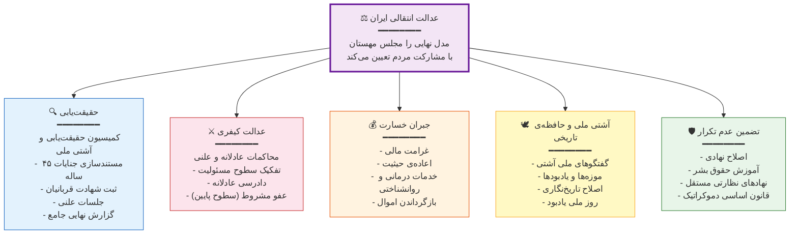

---

#### و) نهاد ناظر مستقل انتخابات

**بند ۱۹.** هیأتی مستقل متشکل از حقوقدانان، نمایندگان جامعه‌ی مدنی و ناظران بین‌المللی، مسئول نظارت بر تمام رأی‌گیری‌ها و رفراندوم‌های دوران گذار خواهد بود.

---

#### ز) آمبودزمان (نهاد حقوق شهروندی)

**بند ۲۰.** نهاد مستقل رسیدگی به شکایات شهروندان از نهادهای دولتی. ریاست آن توسط مجلس مهستان انتخاب می‌شود و مستقل از کابینه عمل می‌کند.

---

#### ح) کمیسیون ملی رسانه‌ها

**بند ۲۱.** نهاد مستقل برای:

- تبدیل صداوسیمای دولتی به رسانه‌ی عمومی مستقل (الگوی BBC/ARD)
- تضمین آزادی مطبوعات
- جلوگیری از انحصار رسانه‌ای
- رفع کامل فیلترینگ و سانسور

---

#### ط) شورای اقتصادی دوران گذار

**بند ۲۲.** شورای مستقل متشکل از اقتصاددانان برجسته‌ی داخل و خارج کشور برای مشاوره و طراحی سیاست‌های اقتصادی. این شورا گزارش‌ها و توصیه‌های خود را هم‌زمان به مجلس و کابینه ارائه می‌دهد.

---

#### ی) مرکز تحقیقات مجلس مهستان (بازوی تکنوکراتیک)

**بند ۲۳.** نهاد کنونی مرکز تحقیقات مجلس با ریاست جدید، **بازوی تخصصی و تکنوکراتیک** مجلس مهستان خواهد بود. وظایف:

- هماهنگی با متخصصان و پژوهشگران حوزه‌های مختلف
- تهیه‌ی گزارش‌های فنی-تخصصی (Fact Sheets) برای هر موضوع تصمیم‌گیری
- تحلیل پیامدهای اقتصادی، حقوقی و اجتماعی لوایح و طرح‌ها
- جمع‌آوری و تحلیل داده‌ها و آمارهای ملی
- ارائه‌ی **گزینه‌های سیاستی** (نه توصیه‌ی یکجانبه) به نمایندگان

> **نکته‌ی کلیدی**: مرکز تحقیقات **بُعد واقعیت** (What is) را تأمین می‌کند. تصمیم نهایی (What ought to be) با نمایندگان منتخب و مردم است.

---

### ۳.۶. واحد ارتباط مردمی و دموکراسی مستقیم (بازوی دموکراتیک)

**بند ۲۴.** به‌موازات بازوی تکنوکراتیک (مرکز تحقیقات)، **واحد مستقل ارتباط مردمی و دموکراسی مستقیم** تشکیل خواهد شد. این واحد زیر نظر مستقیم هیأت رئیسه‌ی مجلس مهستان فعالیت کرده و مسئولیت‌های زیر را بر عهده خواهد داشت:

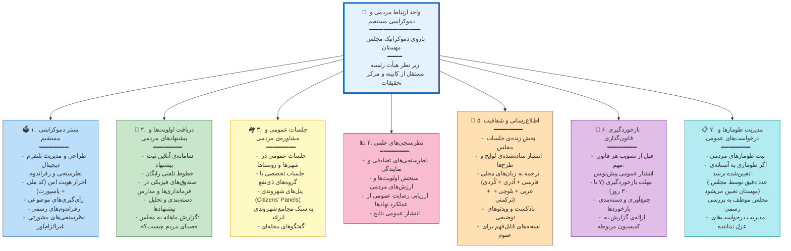

> **رابطه‌ی بازوی تکنوکراتیک و بازوی دموکراتیک**: این دو واحد مستقل از هم عمل می‌کنند ولی گزارش‌هایشان مکمل یکدیگر است. برای هر تصمیم مهم، مجلس مهستان **هر دو گزارش** را دریافت کرده و بر اساس هر دو بُعد (واقعیت + ارزش) تصمیم می‌گیرد.

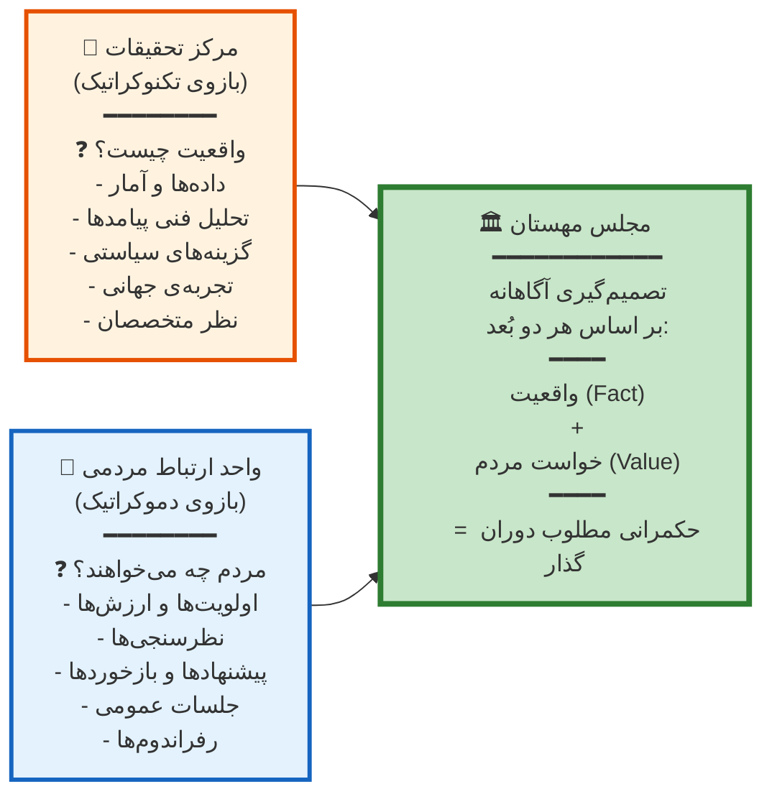

---

### ۳.۷. اولویت‌های تقنینی فاز اول (۱۰۰ روز اول)

**بند ۲۵.** مجلس مهستان در فاز اول (صد روز نخست) موظف است اقدامات تقنینی زیر را به ترتیب اولویت انجام دهد:

#### اولویت فوری (هفته‌ی اول — فرمان‌های اضطراری)

اقدامات زیر **بلافاصله** پس از تشکیل مجلس و بدون نیاز به فرایند قانون‌گذاری عادی، به‌صورت **فرمان اضطراری** (با رأی اکثریت ساده) صادر خواهند شد:

| ردیف | اقدام | دلیل فوریت |
|------|-------|-----------|
| ۱ | **آزادی فوری تمام زندانیان سیاسی و عقیدتی** | حق بنیادین؛ نمادین |
| ۲ | **لغو حجاب اجباری و کلیه‌ی قوانین کنترل پوشش** | تبعیض؛ نماد سرکوب |
| ۳ | **رفع کامل فیلترینگ و سانسور اینترنت** | حق اطلاعات؛ زیرساخت دموکراسی |
| ۴ | **تعلیق مجازات اعدام** تا بررسی نهایی | حق حیات؛ اجماع بین‌المللی |
| ۵ | **آزادی فعالیت احزاب، اتحادیه‌ها و تشکل‌ها** | آزادی تجمع و تشکل |
| ۶ | **ممنوعیت بازداشت بدون حکم قضایی** | حق دادرسی عادلانه |
| ۷ | **لغو فوری محاکم انقلاب و دادگاه‌های ویژه‌ی روحانیت** | استقلال قضایی |
| ۸ | **اعلام حق بازگشت آزادانه‌ی تبعیدیان و مهاجران سیاسی** | حق شهروندی |
| ۹ | **مسدودسازی موقت حساب‌های مشکوک و دارایی‌های نهادهای حکومتی** | حفاظت از اموال عمومی |
| ۱۰ | **دستور حفاظت از اسناد و بایگانی‌های نهادهای امنیتی** | مستندسازی عدالت انتقالی |

#### اولویت بالا (هفته‌ی ۱ تا ۴ — مصوبات فوری)

| ردیف | لایحه / طرح | کمیسیون مسئول |
|------|------------|---------------|
| ۱۱ | **قانون آزادی مطبوعات و رسانه‌ها** | کمیسیون رسانه و حقوق دیجیتال |
| ۱۲ | **قانون تشکیل احزاب و تشکل‌های مدنی** | کمیسیون قانون اساسی |
| ۱۳ | **قانون اجتماعات و تظاهرات** (اصل: آزادی بدون نیاز به مجوز) | کمیسیون قانون اساسی |
| ۱۴ | **قانون موقت مدیریت بحران اقتصادی** | کمیسیون اقتصاد |
| ۱۵ | **قانون شفافیت مالی مقامات** | کمیسیون اقتصاد |
| ۱۶ | **لغو قوانین تبعیض‌آمیز علیه زنان** (ارث، طلاق، حضانت، سفر، اشتغال) | کمیسیون حقوق زنان |
| ۱۷ | **قانون حمایت از حقوق اقلیت‌ها و آموزش به زبان مادری** | کمیسیون حقوق اقلیت‌ها |
| ۱۸ | **قانون موقت حفاظت از داده‌های شخصی** | کمیسیون رسانه و حقوق دیجیتال |

#### اولویت متوسط (هفته‌ی ۴ تا ۸ — همزمان با تدوین قانون اساسی موقت)

| ردیف | لایحه / طرح | کمیسیون مسئول |
|------|------------|---------------|
| ۱۹ | **قانون عدالت انتقالی و جرم سیاسی** | کمیسیون عدالت انتقالی |
| ۲۰ | **قانون تشکیل کمیسیون حقیقت‌یابی و آشتی ملی** | کمیسیون عدالت انتقالی |
| ۲۱ | **قانون اصلاح بخش امنیتی** (SSR) | کمیسیون اصلاح امنیتی |
| ۲۲ | **قانون موقت استقلال قوه‌ی قضاییه** | کمیسیون اصلاح قضایی |
| ۲۳ | **قانون استقلال بانک مرکزی** | کمیسیون اقتصاد |
| ۲۴ | **قانون حسابرسی ملی** (حسابرسی بنیادها، سپاه، آستان‌ها) | کمیسیون اقتصاد |

#### اولویت عادی (هفته‌ی ۸ تا ۱۴ — پس از تصویب قانون اساسی موقت)

| ردیف | لایحه / طرح | کمیسیون مسئول |
|------|------------|---------------|
| ۲۵ | **قانون جامع محیط زیست** (اقدامات اضطراری بحران آب) | کمیسیون محیط زیست |
| ۲۶ | **قانون اصلاح نظام آموزشی** (حذف محتوای ایدئولوژیک) | کمیسیون آموزش |
| ۲۷ | **قانون خصوصی‌سازی شفاف نهادهای حکومتی** | کمیسیون اقتصاد |
| ۲۸ | **قانون سرمایه‌گذاری خارجی** | کمیسیون اقتصاد |
| ۲۹ | **قانون تشکیل مجلس/کمیسیون مؤسسان** (برای قانون اساسی نهایی) | کمیسیون قانون اساسی |
| ۳۰ | **الحاق به کنوانسیون‌های بین‌المللی** (CEDAW, CAT, CRC و...) | کمیسیون سیاست خارجی |

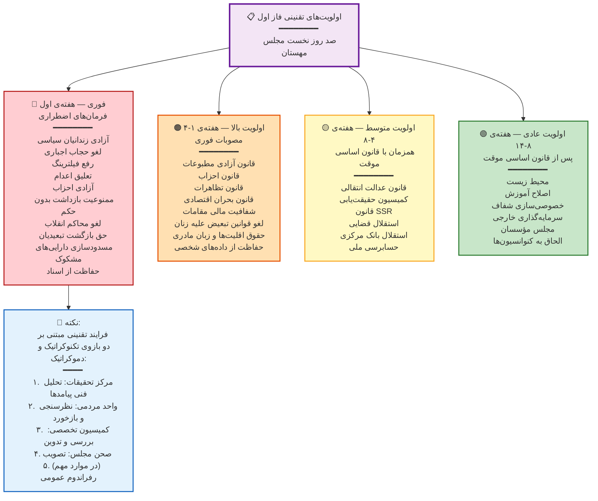

---

### ۳.۸. فرایند تقنینی — ترکیب تخصص و دموکراسی مستقیم

**بند ۲۶.** فرایند تصویب هر قانون در مجلس مهستان از الگوی زیر پیروی می‌کند:

```mermaid
flowchart TD
    STEP1["۱. طرح یا لایحه مطرح می‌شود
    ━━━━━━━━
    - طرح: از سوی نمایندگان (حداقل ۱۰ امضا)
    - لایحه: از سوی کابینه
    - درخواست مردمی: طومار با آستانه‌ی تعیین‌شده توسط مجلس"]

    STEP1 --> STEP2["۲. ارجاع به کمیسیون تخصصی
    ━━━━━━━━
    + درخواست همزمان از:"]

    STEP2 --> STEP2A["🔬 مرکز تحقیقات (بازوی تکنوکراتیک)
    ━━━━━━━━
    تهیه‌ی گزارش فنی:
    - تحلیل وضعیت موجود (داده‌ها و آمار)
    - بررسی تجربه‌ی جهانی
    - تحلیل پیامدهای اقتصادی
    - تحلیل پیامدهای حقوقی
    - تحلیل پیامدهای اجتماعی
    - ارائه‌ی گزینه‌های سیاستی
      (حداقل ۳ گزینه + مزایا و معایب هر کدام)"]

    STEP2 --> STEP2B["📢 واحد ارتباط مردمی (بازوی دموکراتیک)
    ━━━━━━━━
    تهیه‌ی گزارش مردمی:
    - انتشار عمومی خلاصه‌ی طرح
    - دوره‌ی بازخوردگیری (۷-۳۰ روز)
    - نظرسنجی عمومی
    - جمع‌آوری پیشنهادها
    - جلسات عمومی (در صورت نیاز)
    - گزارش: «مردم چه می‌خواهند؟»"]

    STEP2A --> STEP3["۳. بررسی در کمیسیون تخصصی
    ━━━━━━━━
    با در اختیار داشتن هر دو گزارش:
    - بحث و بررسی
    - دعوت از متخصصان (جلسه‌ی استماع)
    - دعوت از نمایندگان ذی‌نفعان
    - اصلاح و نهایی‌سازی متن"]
    STEP2B --> STEP3

    STEP3 --> STEP4["۴. ارائه به صحن مجلس
    ━━━━━━━━
    - ارائه‌ی گزارش کمیسیون
    - ارائه‌ی گزارش فنی (خلاصه)
    - ارائه‌ی گزارش مردمی (خلاصه)
    - بحث آزاد و پیشنهاد اصلاحیه"]

    STEP4 --> STEP5["۵. رأی‌گیری
    ━━━━━━━━
    قوانین عادی: اکثریت ساده (۵۰٪+۱)
    قوانین مهم: ⅔ آرا
    اصلاح قانون اساسی موقت: ¾ آرا"]

    STEP5 --> STEP6{"آیا قانون نیاز
    به رفراندوم دارد؟"}

    STEP6 -->|"بله
    (قانون اساسی موقت/نهایی،
    تغییر ساختار حکومت،
    موضوعات سرنوشت‌ساز)"| STEP7A["۶الف. رفراندوم عمومی
    ━━━━━━━━
    - نظارت هیأت مستقل انتخابات
    - ناظران بین‌المللی
    - نیاز به ۵۰٪+۱ آرا
    - حداقل مشارکت: ۴۰٪"]

    STEP6 -->|"خیر
    (قوانین عادی)"| STEP7B["۶ب. ابلاغ به کابینه
    برای اجرا"]

    STEP7A -->|"تأیید"| STEP8["۷. اجرا
    ━━━━━━━━
    - ابلاغ توسط هیأت رئیسه
    - اجرا توسط کابینه
    - نظارت توسط مجلس"]
    STEP7A -->|"رد"| STEP9["بازگشت به کمیسیون
    برای بازنگری اساسی"]
    STEP7B --> STEP8

    STEP8 --> STEP10["۸. نظارت بر اجرا
    ━━━━━━━━
    - گزارش‌دهی دوره‌ای کابینه
    - نظارت مجلس
    - بازخورد مردمی (واحد ارتباط مردمی)
    - ارزیابی اثربخشی (مرکز تحقیقات)"]

    STEP9 --> STEP3_2["بازنگری در کمیسیون
    + مشاوره‌ی عمومی مجدد"]
    STEP3_2 --> STEP5

    style STEP5 fill:#FFF9C4,stroke:#F9A825,stroke-width:2px
    style STEP6 fill:#F3E5F5,stroke:#6A1B9A,stroke-width:2px
    style STEP7A fill:#FCE4EC,stroke:#C62828,stroke-width:2px
    style STEP8 fill:#C8E6C9,stroke:#2E7D32,stroke-width:3px
    style STEP10 fill:#E3F2FD,stroke:#1565C0,stroke-width:2px
```

**بند ۲۷.** موارد زیر **الزاماً** نیاز به رفراندوم عمومی خواهند داشت:

- تصویب قانون اساسی موقت
- تصویب قانون اساسی نهایی
- تعیین نوع حکومت (جمهوری/مشروطه)
- تعیین ساختار حکمرانی (متمرکز/فدرال/خودمختار)
- الحاق یا واگذاری سرزمینی
- هر موضوعی که مجلس مهستان با رأی ⅔ آن را «سرنوشت‌ساز» تشخیص دهد
- هر موضوعی که **[X]** امضای مردمی برای رفراندوم جمع‌آوری شود *(عدد دقیق توسط مجلس مهستان تعیین خواهد شد)*

---

### ۳.۹. رفراندوم و دموکراسی مستقیم

**بند ۲۸.** تصمیم در خصوص رفراندوم‌های مختلف، زمان‌بندی و روش انجام آن‌ها و نوع همکاری بین‌المللی برای تأیید کیفیت دموکراتیک آن‌ها در مجلس مهستان اخذ خواهد شد.

**بند ۲۹.** مجلس مهستان از طریق **واحد ارتباط مردمی** و بستر دیجیتال دموکراسی مستقیم می‌تواند:

- نظرسنجی‌های موضوعی (مشورتی و غیرالزام‌آور) برگزار کند
- رفراندوم‌های الزام‌آور (با تصویب ⅔ مجلس) برگزار کند
- اولویت‌بندی مردمی موضوعات دستور کار مجلس را دریافت کند
- بازخورد مستقیم مردم درباره‌ی عملکرد نهادها را جمع‌آوری کند

> **هدف**: فرایند گذار تا حد ممکن به **دموکراسی مستقیم** نزدیک شود. مجلس مهستان نماینده‌ی مردم است، اما اراده‌ی مستقیم مردم در هر لحظه بالاتر از نمایندگان آن‌هاست.

---

### ۳.۱۰. سازوکارهای نظارت و پاسخ‌گویی

**بند ۳۰.** در صورت عدم رضایت مردم یک منطقه از نماینده‌ی خود، در صورت جمع‌آوری **۴۰٪ از آرای مأخوذه در آن حوزه‌ی انتخاباتی در دور قبل** (نه ۴۰٪ از کل واجدین شرایط) برای درخواست عزل، نماینده عزل و فرد بعدی در فهرست جایگزین خواهد شد. نظارت بر فرایند جمع‌آوری امضا به عهده‌ی **هیأت مستقل نظارت بر انتخابات** خواهد بود.

**بند ۳۱.** در صورت فوت یا عدم توانایی مشارکت هر نماینده، فرد بعدی در فهرست از همان ناحیه جایگزین خواهد شد.

**بند ۳۲.** مجلس مهستان در اصل **نمی‌تواند بیش از دو سال** ادامه داشته باشد. **۲ ماه قبل از اتمام دو سال**، یک رأی‌گیری درباره‌ی تمدید یا خاتمه صورت می‌گیرد:

- اگر **فرایند گذار به پایان رسیده** (قانون اساسی نهایی تصویب و انتخابات عادی برگزار شده): مجلس منحل و قدرت منتقل می‌شود.
- اگر **فرایند در جریان است** و اتمام آن نیاز به زمان بیشتری دارد: مجلس می‌تواند با **رأی ⅔ نمایندگان** دوره‌ی خود را برای **حداکثر یک بار** و به مدت **حداکثر ۶ ماه** تمدید کند.

> **نکته‌ی اجرایی**: رأی‌گیری درباره‌ی تمدید دوره می‌تواند با **رفراندوم‌های دیگری که در همان مقطع برنامه‌ریزی شده** ترکیب شود تا هزینه‌های اجرایی و بار عملیاتی کاهش یابد. این انعطاف در مدیریت رأی‌گیری‌های هم‌زمان، یکی از مزایای طرح مهستان است.

---

### ۳.۱۱. مأموریت تدوین قانون اساسی نهایی

**بند ۳۳.** مجلس مهستان پس از تصویب و اجرای قانون اساسی موقت، گروهی را مأمور تهیه و تدوین پیش‌نویس **قانون اساسی نهایی** خواهد کرد. مجلس می‌تواند این مأموریت را به یکی از دو شکل زیر انجام دهد:

- **گزینه‌ی الف**: تشکیل **مجلس مؤسسان مستقل** (انتخابات جداگانه)
- **گزینه‌ی ب**: تفویض مأموریت به **کمیسیون ویژه‌ی درون مجلس مهستان** + مشاوره‌ی عمومی گسترده

در هر دو حالت، قانون اساسی نهایی ملزم به رعایت **اصول غیرقابل‌نقض** مندرج در قانون اساسی موقت بوده و **الزاماً** از طریق **رفراندوم عمومی** تصویب خواهد شد.

---

### ۳.۱۲. حل اختلاف بین نهادی

**بند ۳۴.** در صورت بروز اختلاف جدی بین نهادهای دوران گذار (مجلس مهستان، کابینه، شورای قضایی)، **هیأت میانجی‌گری** متشکل از ۵ شخصیت مورد احترام ملی (پیشنهادی جامعه‌ی مدنی و مصوب مجلس) وارد عمل خواهد شد. در صورت عدم حل اختلاف، موضوع به **رفراندوم** گذاشته خواهد شد.

---

## ۴. نمودار جامع ساختار نهادی

```mermaid
graph TD
    PEOPLE["🗳️ مردم ایران
    ━━━━━━━━
    حاکمیت مطلق
    ━━━━
    انتخابات مستقیم
    رفراندوم‌ها
    نظرسنجی‌ها
    پیشنهادها و بازخوردها
    عزل نمایندگان"]

    PEOPLE ==>|"انتخابات مستقیم
    ۳۰۰ نماینده"| MEH["🏛️ مجلس مهستان
    ━━━━━━━━━━━━
    نهاد عالی حاکمیت دوران گذار
    حداکثر ۲ سال"]

    MEH -->|"تشکیل + نظارت"| CAB["⚙️ کابینه‌ی اجرایی موقت"]
    MEH -->|"انتخاب + نظارت"| JUD["⚖️ شورای قضایی انتقالی"]
    MEH -->|"تعیین + نظارت"| MIL["🛡️ فرماندهی نظامی-انتظامی"]
    MEH -->|"تشکیل"| SSR_N["🔄 کمیسیون اصلاح امنیتی"]
    MEH -->|"تشکیل"| TRC_N["📋 کمیسیون حقیقت‌یابی"]
    MEH -->|"تشکیل"| ELEC_N["🗳️ هیأت نظارت انتخابات"]
    MEH -->|"انتخاب"| OMB_N["👤 آمبودزمان"]
    MEH -->|"تشکیل"| MEDIA_N["📺 کمیسیون رسانه‌ها"]
    MEH -->|"تشکیل"| ECON_N["📊 شورای اقتصادی"]

    MEH -->|"مدیریت"| TECH_ARM["🔬 بازوی تکنوکراتیک
    ━━━━━━━━
    مرکز تحقیقات مجلس
    ━━━━
    واقعیت‌ها و داده‌ها
    تحلیل فنی
    گزینه‌های سیاستی
    تجربه‌ی جهانی"]

    MEH -->|"مدیریت"| DEMO_ARM["📢 بازوی دموکراتیک
    ━━━━━━━━
    واحد ارتباط مردمی
    و دموکراسی مستقیم
    ━━━━
    نظرسنجی‌ها
    بازخورد مردمی
    پیشنهادها و اولویت‌ها
    جلسات عمومی
    رفراندوم‌ها"]

    MEH -->|"تدوین ظرف ۲ ماه"| CT_N["📜 قانون اساسی موقت"]
    MEH -->|"تشکیل مجلس مؤسسان"| CF_N["📜 قانون اساسی نهایی"]

    PEOPLE ==>|"رفراندوم"| CT_N
    PEOPLE ==>|"رفراندوم"| CF_N

    TECH_ARM -->|"گزارش فنی"| MEH
    DEMO_ARM -->|"گزارش مردمی"| MEH
    DEMO_ARM <-->|"ارتباط مستقیم"| PEOPLE

    CAB -->|"پاسخ‌گویی"| MEH
    JUD -->|"گزارش‌دهی"| MEH
    MIL -->|"گزارش‌دهی"| MEH
    CAB ---|"هماهنگی اجرایی"| MIL

    CIVIL_N["🏘️ جامعه‌ی مدنی
    ━━━━━━━━
    کانون وکلا
    اتحادیه‌ها
    انجمن‌ها
    رسانه‌ها"] -.->|"نظارت + مشاوره"| MEH
    CIVIL_N -.->|"نظارت"| CAB
    CIVIL_N -.->|"نظارت"| JUD

    INTL_N["🌐 جامعه‌ی بین‌المللی
    ━━━━━━━━
    سازمان ملل
    کمیسیون ونیز
    ICTJ / IDEA"] -.->|"نظارت + حمایت فنی"| MEH
    INTL_N -.->|"حمایت اقتصادی"| CAB

    MEDIATOR_N["🤝 هیأت میانجی‌گری
    ━━━━━━━━
    ۵ شخصیت ملی
    حل اختلاف بین نهادی"] -.->|"میانجی‌گری"| MEH
    MEDIATOR_N -.->|"میانجی‌گری"| CAB
    MEDIATOR_N -.->|"میانجی‌گری"| JUD

    style PEOPLE fill:#BBDEFB,stroke:#1565C0,stroke-width:4px
    style MEH fill:#C8E6C9,stroke:#2E7D32,stroke-width:4px
    style TECH_ARM fill:#FFF3E0,stroke:#E65100,stroke-width:3px
    style DEMO_ARM fill:#E3F2FD,stroke:#1565C0,stroke-width:3px
    style CAB fill:#FFF9C4,stroke:#F9A825,stroke-width:2px
    style JUD fill:#F8BBD0,stroke:#AD1457,stroke-width:2px
    style MIL fill:#D7CCC8,stroke:#4E342E,stroke-width:2px
    style CT_N fill:#E1BEE7,stroke:#6A1B9A,stroke-width:2px
    style CF_N fill:#CE93D8,stroke:#6A1B9A,stroke-width:3px
    style CIVIL_N fill:#B2EBF2,stroke:#00838F,stroke-width:2px
    style INTL_N fill:#DCEDC8,stroke:#558B2F,stroke-width:2px
```

---

## ۵. اصول بنیادین غیرقابل‌نقض

**بند ۳۵.** مجلس مهستان و هیچ نهاد دوران گذار دیگری حق تعلیق یا نقض اصول زیر را ندارد. قانون اساسی نهایی نیز ملزم به رعایت این اصول خواهد بود:

1. **حاکمیت مردم**: تنها منبع مشروعیت سیاسی، رأی آزاد مردم است.
2. **جدایی دین از دولت**: بی‌طرفی دولت در قبال ادیان و عقاید. آزادی عبادت و عقیده برای همگان.
3. **برابری**: همه‌ی شهروندان صرف‌نظر از جنسیت، قومیت، زبان، مذهب، عقیده و گرایش جنسی در برابر قانون برابرند.
4. **آزادی‌های بنیادین**: آزادی بیان، مطبوعات، تجمع، تشکل، عقیده، مذهب و بی‌اعتقادی.
5. **ممنوعیت مطلق شکنجه**: شکنجه و مجازات‌های خشن تحت هیچ شرایطی مجاز نیست.
6. **حق دادرسی عادلانه**: حق وکیل، محاکمه‌ی علنی، فرض بی‌گناهی و حق تجدیدنظر. ممنوعیت بازداشت بدون حکم قضایی.
7. **حقوق اقلیت‌ها**: حقوق قومی، زبانی و مذهبی. حق آموزش به زبان مادری.
8. **حقوق زنان**: برابری کامل حقوقی، اجتماعی و اقتصادی.
9. **استقلال قضایی**: مستقل از قوای مجریه و مقننه.
10. **تمامیت ارضی و حق تعیین سرنوشت**: ساختار حکمرانی از طریق رفراندوم تعیین می‌شود.
11. **حاکمیت قانون**: هیچ فرد یا نهادی بالاتر از قانون نیست.
12. **عدالت نه انتقام**: عدالت از طریق سازوکارهای قانونی.
13. **آزادی اطلاعات**: ممنوعیت سانسور و فیلترینگ.
14. **تعهد به صلح**: حل مسالمت‌آمیز اختلافات بین‌المللی.

**سازوکار تضمین اصول غیرقابل‌نقض:**

در فاز اول گذار، ضمانت اجرایی این اصول عمدتاً بر **اراده و خواست مردم** استوار است که همین اصول را با رأی خود در رفراندوم قانون اساسی موقت تأیید کرده‌اند. هیچ نهادی در برابر اراده‌ی مردم نمی‌تواند این اصول را نقض کند.

علاوه بر این، پیشنهاد می‌شود **نهادهای مردم‌نهاد ناظر** برای پایش مستمر رعایت این اصول تشکیل شوند. وظایف این نهادها:

- **گزارش‌دهی شفاف** به مردم درباره‌ی هر موردی که احتمال نقض این اصول در آن مشاهده می‌شود
- **نقادی علنی و مستند** از تصمیمات نهادهای گذار
- **سنجش عملکرد** مجلس مهستان و کابینه در قبال هر یک از ۱۴ اصل
- **ایجاد کانال ارتباطی مستقیم** با مردم برای دریافت شکایات و گزارش‌ها

> در قانون اساسی نهایی، یک **دادگاه قانون اساسی مستقل** با صلاحیت ابطال قوانین مغایر با اصول بنیادین پیش‌بینی خواهد شد. در دوران گذار، نظارت مردمی و نهادهای مدنی این نقش را ایفا می‌کنند.

---

## ۶. خط زمانی جامع گذار

> **یادداشت**: این سند در اسفند ۱۴۰۴ (فوریه‌ی ۲۰۲۶) تدوین شده است. تمام زمان‌بندی‌ها **نسبی** هستند و از **روز صفر** (آغاز رسمی گذار) محاسبه می‌شوند. تاریخ دقیق آغاز گذار از پیش قابل تعیین نیست.

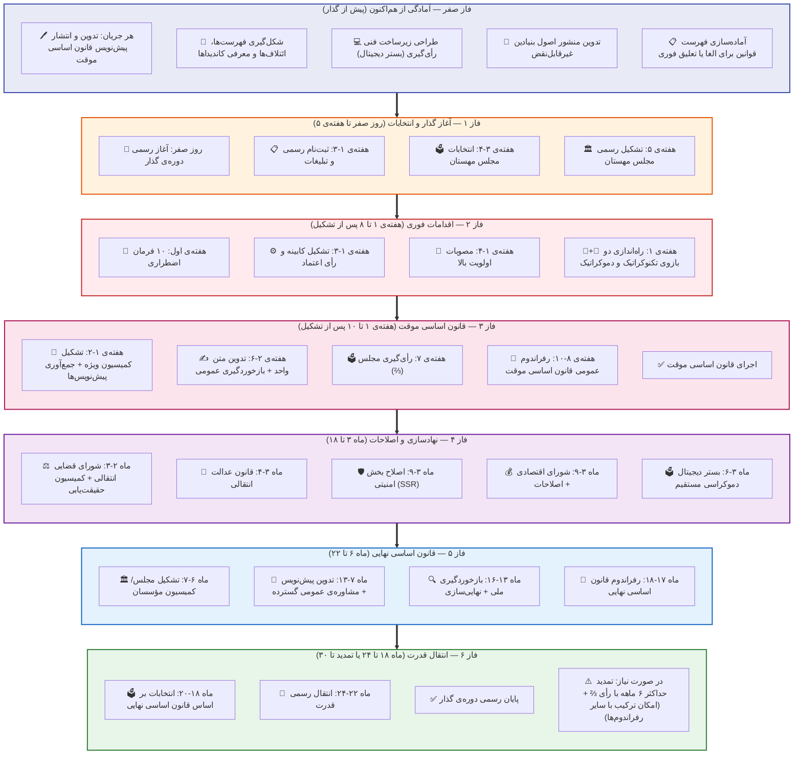

**جدول فشرده‌ی خط زمانی**

| فاز | زمان (نسبی) | مأموریت اصلی |
|-----|------------|--------------|
| **صفر** | پیش از گذار | آمادگی، تدوین پیش‌نویس‌ها، ائتلاف‌سازی |
| **۱** | روز صفر تا هفته‌ی ۵ | انتخابات و تشکیل مجلس مهستان |
| **۲** | هفته‌ی ۱-۸ | فرمان‌های اضطراری، کابینه، مصوبات فوری |
| **۳** | هفته‌ی ۱-۱۰ | قانون اساسی موقت + رفراندوم |
| **۴** | ماه ۳-۱۸ | نهادسازی، عدالت انتقالی، SSR |
| **۵** | ماه ۶-۱۸ | قانون اساسی نهایی + رفراندوم |
| **۶** | ماه ۱۸-۲۴ (+۶) | انتخابات نهایی، انتقال قدرت |

---

## ۷. فراخوان

از همه‌ی ایرانیان آزادیخواه دعوت می‌کنیم:

- **هر جریان و حزب و ائتلاف**: از هم‌اکنون پیش‌نویس قانون اساسی موقت پیشنهادی خود را تدوین و منتشر کنید.
- **هر شهروند**: مطالعه کنید، بحث کنید، مشارکت کنید. نقد سازنده‌ی این طرح و هر طرح دیگری حق و وظیفه‌ی شماست.
- **هر متخصص**: دانش و تجربه‌ی خود را در خدمت طراحی نهادی گذار بگذارید.
- **هر فعال حقوق بشر**: مستندسازی را از هم‌اکنون ادامه دهید. این اسناد، مبنای عدالت انتقالی فردا خواهند بود.

> این بیانیه دعوتی است برای اندیشیدن، تکمیل و چکش‌کاری. سند زنده‌ای است که با مشارکت همگان بهتر خواهد شد. تصمیم نهایی درباره‌ی آینده‌ی ایران فقط و فقط با **مردم ایران** است.

---

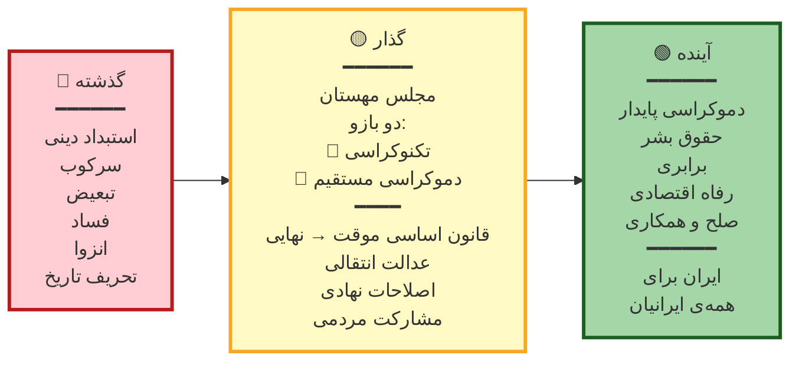

---

> **«ایران برای همه‌ی ایرانیان»**

جزئیات بیشتر در کتاب و طرح پیشنهادی **«شکوفایی: ایران از بحران تا بالندگی»** ارائه خواهد شد.

---

*این سند زنده است و به‌روزرسانی خواهد شد. آخرین ویرایش: اسفند ۱۴۰۴ / فوریه‌ی ۲۰۲۶*

*برای مشارکت در تکمیل و نقد این طرح، با ما در تماس باشید.*

---

# بخش دوم: ضمائم و گسترش

---

## پیوست نخست: مدیریت خلأ پیش از تشکیل مجلس مهستان

### چرا این پیوست؟

یکی از خطرناک‌ترین لحظات هر گذار دموکراتیک، **فاصله‌ی میان سقوط نظام پیشین و تشکیل اولین نهاد منتخب** است. این فاصله — که می‌تواند ۴ تا ۸ هفته به طول بینجامد — در صورت مدیریت نادرست می‌تواند به خلأ قدرت، هرج‌ومرج، یا مصادره‌ی فرایند توسط یک جریان خاص منجر شود.

تجربه‌ی مصر (۲۰۱۱)، لیبی (۲۰۱۱) و یمن نشان می‌دهد که نبود پاسخ آماده برای این فاصله، هزینه‌ای گاه غیرقابل‌جبران دارد.

### مدل پیشنهادی: شورای هماهنگی گذار

**تعریف:** یک نهاد **موقت، کوچک، و با مأموریت محدود** که تنها برای مدیریت این فاصله تشکیل می‌شود و پس از تشکیل مجلس مهستان، **بلافاصله منحل** می‌گردد.

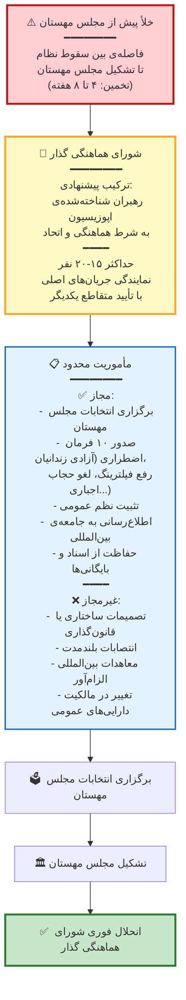

### اصول تشکیل شورای هماهنگی گذار

**اصل اول — اتحاد و هماهنگی شرط ورود است:**
شناخته‌شده‌ترین چهره‌های اپوزیسیون تنها در صورتی می‌توانند این نقش را بر عهده بگیرند که **با یکدیگر به توافق رسیده باشند**. جریانی که از همکاری سرباز زند یا ادعای انحصار داشته باشد، از ورود به این شورا محروم خواهد بود. این شرط از تبدیل شورا به میدان رقابت جلوگیری می‌کند.

**اصل دوم — نمایندگی متنوع:**
ترکیب شورا باید طیف وسیعی از جریان‌های سیاسی، قومی، و جغرافیایی را دربر بگیرد. حضور نمایندگان زنان، اقلیت‌های قومی، و جوانان الزامی است.

**اصل سوم — شفافیت کامل:**
تمام جلسات و تصمیمات شورا علنی است. هیچ تصمیمی نمی‌تواند با اکثریت کمتر از ⅔ اعضا اتخاذ شود.

**اصل چهارم — محدودیت مأموریت (ضامن اصلی):**
شورا هیچ صلاحیتی فراتر از «اداره‌ی ضروریات» و «برگزاری انتخابات» ندارد. هر نهاد یا گروهی که تلاش کند اختیارات شورا را گسترش دهد، باید با مقاومت جمعی همه‌ی اعضا روبرو شود.

**اصل پنجم — نظارت بین‌المللی:**
از همان روز اول، ناظران بین‌المللی (سازمان ملل، اتحادیه اروپا، OSCE) دعوت می‌شوند تا بر کار شورا نظارت کنند.

### چه باید از هم‌اکنون انجام شود؟

> **فراخوان به جریان‌های اپوزیسیون:** آمادگی برای این فاز باید از هم‌اکنون آغاز شود. هر جریانی که می‌خواهد نقشی در مدیریت این مرحله داشته باشد، باید:
>
> 1. **نماینده‌ی مشخص** برای مذاکره با سایر جریان‌ها معرفی کند
> 2. **خطوط قرمز** و **نقاط توافق** خود را صریحاً اعلام کند
> 3. **پیش‌نویس توافق‌نامه‌ی همکاری** را آماده کند
> 4. درباره‌ی **ترکیب شورا** و **آیین‌نامه‌ی تصمیم‌گیری** آن از هم‌اکنون مذاکره کند

---

### الف-۱. تونس (۲۰۱۱–۲۰۱۴): نزدیک‌ترین الگو

تونس موفق‌ترین نمونه‌ی گذار دموکراتیک در خاورمیانه و شمال آفریقا محسوب می‌شود و قابل‌قیاس‌ترین مورد برای ایران است.

**شباهت‌ها با طرح پیشنهادی:**

- انتخاب **مجلس مؤسسان ملی** (Assemblée nationale constituante) در اکتبر ۲۰۱۱ به‌عنوان نهاد محوری گذار
- این مجلس هم وظیفه‌ی **قانون‌گذاری موقت** و هم **تدوین قانون اساسی** را بر عهده داشت
- تشکیل **دولت تکنوکرات** تحت نظارت مجلس
- استفاده از **ائتلاف سه‌جانبه** (ترویکا) برای مدیریت تکثرگرایانه

**دروس آموخته:**

- **بحران ۲۰۱۳**: وقتی دو ترور سیاسی صورت گرفت، «چهارگانه‌ی گفتگوی ملی» (شامل اتحادیه‌ی کارگری UGTT، اتحادیه‌ی کارفرمایان، کانون وکلا و جامعه حقوق بشر) وارد عمل شد و از سقوط فرایند جلوگیری کرد. **درس: نهادهای میانجی‌گر غیردولتی حیاتی‌اند.**
- تأخیر در تدوین قانون اساسی (سه سال به جای یک سال) نشان داد که **واقع‌بینی در زمان‌بندی** ضروری است.
- عدم رسیدگی کافی به اصلاحات اقتصادی و بخش امنیتی، زمینه‌ی بازگشت استبداد را فراهم کرد (بازگشت اقتدارگرایی توسط قیس سعید در ۲۰۲۱).

**پیشنهاد بر اساس تجربه‌ی تونس:**
> مجلس مهستان باید از همان ابتدا **کمیته‌ی مستقل اصلاحات اقتصادی** و **کمیته‌ی اصلاح بخش امنیتی** را تشکیل دهد. همچنین نهادهای مستقل جامعه‌ی مدنی (اتحادیه‌های کارگری، کانون وکلا، انجمن‌های حرفه‌ای) باید نقش رسمی مشورتی و نظارتی داشته باشند.

---

### الف-۲. آفریقای جنوبی (۱۹۹۰–۱۹۹۶): مدل عدالت انتقالی

**شباهت‌ها:**

- گذار از نظامی سرکوب‌گر با سابقه‌ی طولانی نقض حقوق بشر
- تنوع قومی و اجتماعی بالا و ریسک تجزیه و خشونت
- نیاز به تعادل بین عدالت‌خواهی و آشتی ملی

**فرایند گذار:**

- **مذاکرات کادسا** (CODESA I & II) — ۱۹۹۱–۱۹۹۲
- **مجمع مذاکره‌ی چندحزبی** (MPNF) — ۱۹۹۳
- **شورای اجرایی انتقالی** (TEC) — نظارت بر انتخابات ۱۹۹۴
- **قانون اساسی موقت** ← **انتخابات** ← **مجلس مؤسسان** ← **قانون اساسی نهایی** (۱۹۹۶)
- **کمیسیون حقیقت و آشتی** (TRC) به ریاست دزموند توتو

**دروس آموخته:**

- مدل **دو مرحله‌ای قانون اساسی** (موقت + نهایی) بسیار مؤثر بود: قانون اساسی موقت با اصول غیرقابل‌تغییر، فضای مذاکره‌ی امن ایجاد کرد.
- کمیسیون حقیقت و آشتی با اعطای **عفو مشروط** (در ازای اعتراف کامل)، مسیر میانه‌ای بین انتقام و فراموشی ایجاد کرد.
- **ضمانت‌های حقوق اقلیت‌ها** در قانون اساسی موقت، ترس اقلیت سفیدپوست را کاهش داد و مقاومت آن‌ها در برابر گذار را شکست.

**پیشنهاد بر اساس تجربه‌ی آفریقای جنوبی:**
> یک **منشور اصول بنیادین غیرقابل‌نقض** باید پیش از انتخابات مجلس مهستان تدوین شود. این منشور شامل حقوق بنیادین شهروندی، ممنوعیت تبعیض، ممنوعیت شکنجه، و آزادی‌های اساسی خواهد بود و هیچ نهادی حق تعلیق آن را نخواهد داشت.

---

### الف-۳. اسپانیا (۱۹۷۵–۱۹۸۲): مدل گذار تدریجی

**ویژگی‌های کلیدی:**

- گذار **مذاکره‌شده و تدریجی** پس از مرگ فرانکو
- نقش محوری **آدولفو سوآرس** به‌عنوان اصلاح‌گر از درون سیستم
- **قانون اصلاح سیاسی** (۱۹۷۶) — استفاده از ابزارهای قانونی خود نظام قبلی برای دموکراتیزه‌کردن
- **پیمان‌های مونکلوآ** (۱۹۷۷) — توافق اقتصادی-اجتماعی بین احزاب، کارگران و کارفرمایان
- تصویب قانون اساسی ۱۹۷۸ در رفراندوم

**دروس آموخته:**

- **اجماع‌سازی** (el consenso) به‌عنوان اصل راهنما — هیچ حزب و جریانی سعی نکرد تمام خواسته‌هایش را تحمیل کند.
- **قانون فراموشی** (Pacto del Olvido) اگرچه در کوتاه‌مدت ثبات آورد، در بلندمدت مشکل‌ساز شد و نسل‌های بعدی خواستار رسیدگی به جنایات دوران فرانکو شدند. **درس: عدالت انتقالی را نمی‌توان به‌طور کامل نادیده گرفت.**
- کودتای نافرجام ۱۹۸۱ نشان داد که **اصلاح بخش نظامی** از همان ابتدا حیاتی است.

---

### الف-۴. لهستان (۱۹۸۹): مدل میز مذاکره

**ویژگی‌های کلیدی:**

- **مذاکرات میزگرد** بین جنبش همبستگی (Solidarność) و حکومت کمونیست
- **انتخابات نیمه‌آزاد** ژوئن ۱۹۸۹
- دولت ائتلافی به رهبری مازوویتسکی

**دروس آموخته:**

- سیاست **«خط ضخیم»** مازوویتسکی (جدایی از گذشته بدون انتقام‌جویی) تا حدی مؤثر بود اما بعدها مورد انتقاد قرار گرفت.
- **اصلاحات اقتصادی سریع** (شوک‌درمانی بالتسرویچ) هرچند در بلندمدت مؤثر بود، در کوتاه‌مدت درد اجتماعی شدیدی ایجاد کرد.

**پیشنهاد:**
> برنامه‌ی اقتصادی دوران گذار باید **تدریجی و با شبکه‌ی ایمنی اجتماعی** همراه باشد. شوک‌درمانی اقتصادی می‌تواند مشروعیت دموکراسی نوپا را تضعیف کند.

---

### الف-۵. شیلی (۱۹۸۸–۱۹۹۰): مدل رفراندوم و ائتلاف

**ویژگی‌ها:**

- **رفراندوم ۱۹۸۸**: «نه» به پینوشه
- **ائتلاف احزاب** (Concertación) — ۱۷ حزب با ایدئولوژی‌های متفاوت
- گذار مذاکره‌شده با اصلاحات قانون اساسی

**درس کلیدی:**

- توانایی جریان‌های مختلف برای کنار گذاشتن اختلافات و تشکیل ائتلاف فراگیر، عامل اصلی موفقیت بود.
- فرایند عدالت انتقالی **تدریجی** بود — کمیسیون حقیقت (گزارش رتیگ ۱۹۹۱) ابتدا فقط حقیقت‌یابی کرد و محاکمات بعداً صورت گرفت.

---

### الف-۶. نمونه‌های ناموفق — درس‌های منفی

| کشور | مشکل اصلی | درس برای ایران |
|-------|-----------|----------------|
| **لیبی (۲۰۱۱–)** | عدم وجود نهاد محوری مورد توافق؛ شوراهای رقیب؛ مداخله‌ی خارجی | نهاد واحد گذار با مشروعیت انتخاباتی ضروری است |
| **مصر (۲۰۱۱–۲۰۱۳)** | ارتش به‌عنوان «ضامن» گذار؛ تقابل اسلامگرا-سکولار | استقلال نهاد گذار از نیروهای نظامی و جلوگیری از دوقطبی‌سازی |
| **عراق (۲۰۰۳–)** | اشغال خارجی؛ سیستم سهمیه‌ای محاصصه‌ای (مُحاصصه)؛ انحلال ارتش | عدم انحلال کامل نهادهای اداری-نظامی؛ اصلاح به‌جای تخریب |
| **یمن (۲۰۱۱–)** | گذار مصنوعی و ظاهری؛ مذاکره‌ی بدون مشارکت عمومی | مشارکت واقعی مردم از طریق انتخابات |

---

### الف-۷. جدول مقایسه‌ای

| معیار | تونس | آفریقای جنوبی | اسپانیا | طرح مهستان |
|-------|-------|--------------|---------|-----------|
| **نهاد محوری** | مجلس مؤسسان منتخب | شورای اجرایی انتقالی → مجلس مؤسسان | پارلمان منتخب | مجلس مهستان منتخب |
| **مدت دوره‌ی گذار** | ۳ سال | ۴ سال (مذاکره) + ۲ سال (مؤسسان) | ۳ سال | حداکثر ۲ سال (تمدیدپذیر) |
| **نحوه‌ی انتخابات** | فهرستی-نسبی | فهرستی-نسبی | منطقه‌ای-نسبی | فهرستی (ترکیبی) |
| **عدالت انتقالی** | هیأت حقیقت و کرامت | کمیسیون حقیقت و آشتی | قانون فراموشی (بعدها اصلاح شد) | پیش‌بینی‌شده |
| **نقش نظامیان** | حامی گذار | مذاکره‌شده | چالش‌برانگیز (کودتای ۸۱) | تحت نظارت مجلس |
| **قانون اساسی** | مجلس مؤسسان + رفراندوم | دو مرحله‌ای | رفراندوم | تدوین + رفراندوم |

---

## ضمیمه‌ی ب: جدول زمانی پیشنهادی اجرا

> **یادداشت**: تمام زمان‌بندی‌های زیر **نسبی** هستند. «هفته‌ی ۱» یعنی هفته‌ی اول پس از **روز صفر** (آغاز رسمی گذار). این جدول یک پیشنهاد است و مجلس مهستان می‌تواند آن را بر اساس شرایط واقعی تعدیل کند.

### فاز صفر: آمادگی (از هم‌اکنون)

| هفته | اقدام |
|------|-------|
| مستمر | شکل‌گیری خودجوش جریان‌ها و فهرست‌ها |
| مستمر | تبلیغات، معرفی کاندیداها و ائتلاف‌سازی |
| مستمر | طراحی زیرساخت‌های فنی رأی‌گیری (بستر دیجیتال، فرم‌های ثبت‌نام) |
| مستمر | تدوین منشور اصول بنیادین غیرقابل‌نقض |
| مستمر | تهیه‌ی فهرست حداقلی قوانین فوری (تعلیق/الغای فوری) |

### فاز یک: تثبیت اولیه (هفته‌ی ۱ تا ۴ پس از آغاز گذار)

| هفته | اقدام |
|------|-------|
| ۱ | اعلام رسمی آغاز دوره‌ی گذار؛ انتصاب مدیران موقت فرمانداری‌ها |
| ۱-۲ | آغاز ثبت‌نام رسمی نامزدها و فهرست‌ها |
| ۱-۲ | تشکیل ستاد مرکزی انتخابات با مشارکت ناظران بین‌المللی |
| ۲-۳ | دوره‌ی تبلیغات رسمی |
| ۳-۴ | دعوت از ناظران بین‌المللی (سازمان ملل، اتحادیه اروپا، و غیره) |

### فاز دو: انتخابات و تشکیل مجلس (هفته‌ی ۴ تا ۸)

| هفته | اقدام |
|------|-------|
| ۴-۵ | برگزاری انتخابات مجلس مهستان |
| ۵-۶ | شمارش آرا و تأیید نتایج |
| ۶ | تشکیل رسمی مجلس مهستان |
| ۶-۷ | انتخاب هیأت رئیسه و تعیین کمیسیون‌ها |
| ۷-۸ | تشکیل کابینه‌ی اجرایی و رأی اعتماد |

### فاز سه: استقرار نهادی (ماه ۲ تا ۶)

| ماه | اقدام |
|-----|-------|
| ۲-۳ | تشکیل شورای قضایی انتقالی |
| ۲-۳ | انتصاب فرماندهی نیروهای نظامی و انتظامی |
| ۳-۴ | تصویب قانون عدالت انتقالی و جرم سیاسی |
| ۳-۴ | تشکیل کمیسیون حقیقت‌یاب |
| ۴-۵ | آغاز بازبینی قوانین و تعلیق قوانین تبعیض‌آمیز |
| ۴-۶ | راه‌اندازی بستر دموکراسی مستقیم (نظرسنجی‌های دیجیتال) |
| ۵-۶ | تشکیل کمیته‌ی تدوین پیش‌نویس قانون اساسی |

### فاز چهار: قانون اساسی و رفراندوم (ماه ۶ تا ۲۰)

| ماه | اقدام |
|-----|-------|
| ۶-۱۲ | تدوین پیش‌نویس قانون اساسی با مشاوره‌ی عمومی |
| ۱۲-۱۴ | انتشار عمومی پیش‌نویس و دوره‌ی بازخوردگیری ملی |
| ۱۴-۱۶ | بازنگری و نهایی‌سازی متن |
| ۱۶-۱۸ | رفراندوم قانون اساسی |
| ۱۸-۲۰ | تدارک انتخابات عمومی بر اساس قانون اساسی جدید |

### فاز پنج: انتقال قدرت (ماه ۲۰ تا ۲۴)

| ماه | اقدام |
|-----|-------|
| ۲۰-۲۲ | انتخابات پارلمانی و ریاست‌جمهوری (بر اساس قانون اساسی جدید) |
| ۲۲-۲۴ | انتقال رسمی قدرت از مجلس مهستان به نهادهای منتخب جدید |
| ۲۴ | پایان رسمی دوره‌ی گذار |

---

## ضمیمه‌ی ج: تحلیل ریسک و راهکارهای مقابله

### ج-۱. جدول ریسک‌های اصلی

| ردیف | ریسک | احتمال | شدت | راهکار پیشنهادی |
|------|------|--------|-----|-----------------|
| ۱ | **خلأ امنیتی** پس از سقوط نظام | بالا | بسیار بالا | تشکیل فوری شورای امنیتی موقت؛ حفظ ساختار پایه‌ای نیروهای انتظامی با رهبری جدید؛ کمک‌خواهی از نهادهای بین‌المللی |
| ۲ | **تجزیه‌طلبی** و درگیری‌های قومی | متوسط | بسیار بالا | تضمین حقوق قومی و زبانی در منشور اصول بنیادین؛ اختصاص کرسی‌های تضمینی در مجلس مهستان؛ فدرالیسم به‌عنوان گزینه در بحث قانون اساسی |
| ۳ | **بازگشت اقتدارگرایی** (کودتا) | متوسط | بسیار بالا | نظارت مجلس بر نیروهای نظامی؛ پراکنده‌سازی قدرت نظامی؛ حمایت بین‌المللی |
| ۴ | **بحران اقتصادی** | بالا | بالا | تشکیل فوری تیم مدیریت بحران اقتصادی؛ درخواست کمک بین‌المللی؛ تثبیت ارزی |
| ۵ | **مداخله‌ی خارجی** | متوسط | بالا | دیپلماسی فعال و متنوع؛ عدم وابستگی به یک قدرت خارجی؛ شفافیت در روابط خارجی |
| ۶ | **اختلاف درون مجلس** و بن‌بست سیاسی | بالا | متوسط | سازوکارهای حل اختلاف (میانجی‌گری، آرای اکثریت مشخص)؛ نقش ناظران جامعه‌ی مدنی |
| ۷ | **مصادره‌ی جنبش** توسط یک جریان | متوسط | بالا | سیستم فهرستی-نسبی؛ آستانه‌ی بالای تغییر قوانین (۷۵٪)؛ منشور غیرقابل‌نقض |
| ۸ | **خشونت انتقام‌جویانه** | بالا | بالا | قانون عدالت انتقالی فوری؛ محاکم قانونی؛ کمپین‌های ملی آشتی |
| ۹ | **بحران مهاجرت معکوس** و سیل بازگشت دیاسپورا | متوسط | کم-متوسط | برنامه‌ی مدیریت بازگشت؛ استفاده از تخصص‌های دیاسپورا |
| ۱۰ | **فساد** در نهادهای جدید | متوسط | متوسط | واحد بازرسی مستقل؛ شفافیت مالی نمایندگان؛ نظارت رسانه‌ای |

### ج-۲. سناریوهای بحرانی و پاسخ‌ها

**سناریو ۱: عدم تشکیل ائتلاف در مجلس**

- → فعال‌سازی سازوکار بند ۱۱ (رأی‌گیری فردی)
- → میانجی‌گری توسط شخصیت‌های مورد احترام ملی
- → در صورت عدم موفقیت، رأی‌گیری مجدد ظرف ۶۰ روز

**سناریو ۲: تلاش نظامی برای کودتا**

- → فراخوان فوری مقاومت مدنی از سوی مجلس
- → فعال‌سازی پروتکل‌های بین‌المللی (بیانیه‌ی محکومیت، تحریم)
- → جانشین فرمانده به‌عنوان فرمانده‌ی قانونی شناخته می‌شود

**سناریو ۳: بحران اقتصادی حاد**

- → تشکیل کمیته‌ی بحران اقتصادی با اختیارات ویژه
- → درخواست کمک اضطراری از صندوق بین‌المللی پول و بانک جهانی
- → اجرای برنامه‌ی یارانه‌ی مستقیم به شهروندان

---

## ضمیمه‌ی د: حکمرانی اقتصادی در دوران گذار

### د-۱. اصول راهنما

تجربه‌ی جهانی نشان می‌دهد که **بحران اقتصادی** بزرگ‌ترین تهدید برای دموکراسی‌های نوپاست. مردمی که گرسنه‌اند و کاری ندارند، به دموکراسی بی‌اعتماد می‌شوند.

1. **تثبیت اقتصادی** مقدم بر اصلاحات ساختاری است
2. **شبکه‌ی ایمنی اجتماعی** باید از همان روز اول فعال باشد
3. **شفافیت** در دارایی‌های عمومی و بودجه‌ی دولت ضروری است
4. **استفاده از تخصص** اقتصاددانان ایرانی داخل و خارج

### د-۲. اقدامات فوری (۱۰۰ روز اول)

- حسابرسی فوری بانک مرکزی و صندوق توسعه‌ی ملی
- تثبیت نرخ ارز و جلوگیری از فرار سرمایه
- ادامه‌ی پرداخت حقوق کارمندان دولت و بازنشستگان
- مذاکره با نهادهای مالی بین‌المللی برای بسته‌ی حمایتی
- آزادسازی دارایی‌های مسدودشده (پس از رفع تحریم‌ها)
- رسیدگی به دارایی‌های غیرقانونی بنیادها و نهادهای حکومتی

### د-۳. اقدامات میان‌مدت (۱۰۰ روز تا ۲ سال)

- بازسازی شفاف بودجه‌ی ملی
- اصلاح تدریجی نظام یارانه‌ای با حمایت هدفمند از اقشار آسیب‌پذیر
- بازنگری قراردادهای نفتی و بین‌المللی
- آغاز خصوصی‌سازی شفاف نهادهای اقتصادی وابسته به حکومت (سپاه، بنیادها و غیره)
- ایجاد فضای جذب سرمایه‌گذاری خارجی

---

## ضمیمه‌ی ه: چارچوب عدالت انتقالی

### مدل چهارستونی (مدل سازمان ملل / الگوی کلاسیک)

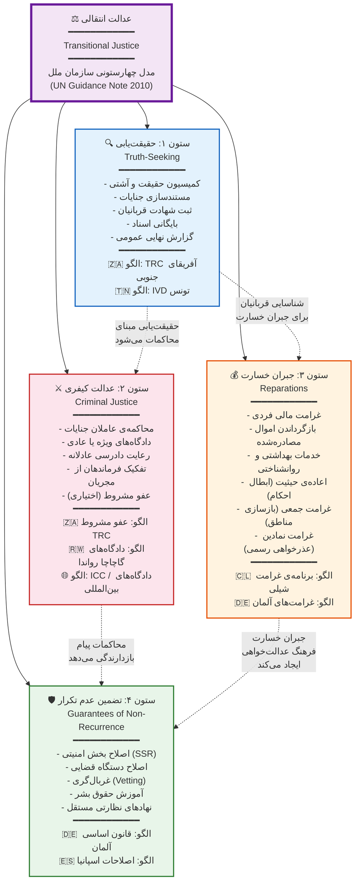

---

### مدل پنج‌ستونی (مدل جامع / Holistic Model)

مدل پنج‌ستونی با افزودن **«آشتی ملی و حافظه‌ی تاریخی»** به‌عنوان ستون مستقل، بر بُعد اجتماعی-فرهنگی عدالت انتقالی تأکید بیشتری دارد. این مدل توسط برخی پژوهشگران (از جمله Pablo de Greiff، گزارشگر ویژه‌ی سازمان ملل) و نهادهایی مانند ICTJ توسعه یافته و در کشورهایی مانند کلمبیا، سیرالئون و تیمور شرقی عناصری از آن اجرا شده است.

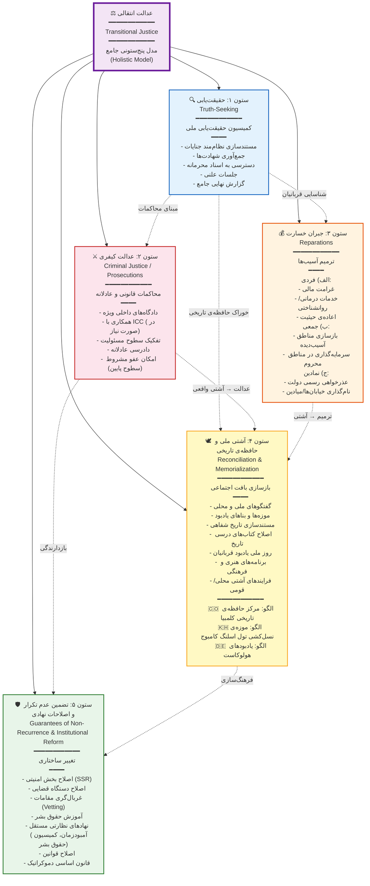

---

### مقایسه‌ی دو مدل

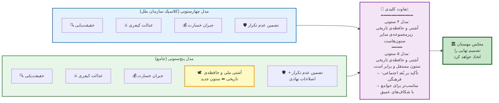

---

### جدول مقایسه‌ی تفصیلی دو مدل

| معیار | مدل ۴ ستونی (سازمان ملل) | مدل ۵ ستونی (جامع) |
|-------|---|---|
| **مرجع اصلی** | UN Guidance Note (2010)؛ گزارشگر ویژه‌ی سازمان ملل | ICTJ؛ Pablo de Greiff؛ تجربه‌ی کلمبیا، سیرالئون |
| **تعداد ستون‌ها** | ۴ | ۵ |
| **ستون‌ها** | حقیقت‌یابی، عدالت کیفری، جبران خسارت، تضمین عدم تکرار | حقیقت‌یابی، عدالت کیفری، جبران خسارت، **آشتی ملی و حافظه‌ی تاریخی**، تضمین عدم تکرار و اصلاحات نهادی |
| **جایگاه آشتی** | زیرمجموعه‌ی سایر ستون‌ها (ضمنی) | ستون مستقل و برابر (صریح) |
| **جایگاه حافظه‌ی تاریخی** | بخشی از حقیقت‌یابی | ستون مستقل — شامل موزه‌ها، یادبودها، اصلاح تاریخ‌نگاری |
| **جایگاه اصلاحات نهادی** | بخشی از تضمین عدم تکرار | صریح‌تر و جامع‌تر — ستون پنجم |
| **تأکید اصلی** | حقوقی-قانونی | حقوقی-قانونی **+ اجتماعی-فرهنگی** |
| **مناسب برای** | جوامع با شکاف‌های کمتر؛ گذارهای سریع‌تر | جوامع با شکاف‌های عمیق قومی/مذهبی/طبقاتی؛ جنایات گسترده و طولانی‌مدت |
| **نمونه‌های اجرایی** | تونس (IVD)، آفریقای جنوبی (TRC) | کلمبیا (توافق صلح ۲۰۱۶)، سیرالئون، تیمور شرقی |
| **مزیت اصلی** | سادگی، اجماع بین‌المللی، اجرای سریع‌تر | جامعیت، توجه به بُعد فرهنگی، پایداری بلندمدت |
| **ضعف اصلی** | ممکن است بُعد اجتماعی-فرهنگی نادیده گرفته شود | پیچیدگی بیشتر، نیاز به منابع و زمان بیشتر |

---

### کدام مدل برای ایران؟ — فرایند تصمیم‌گیری

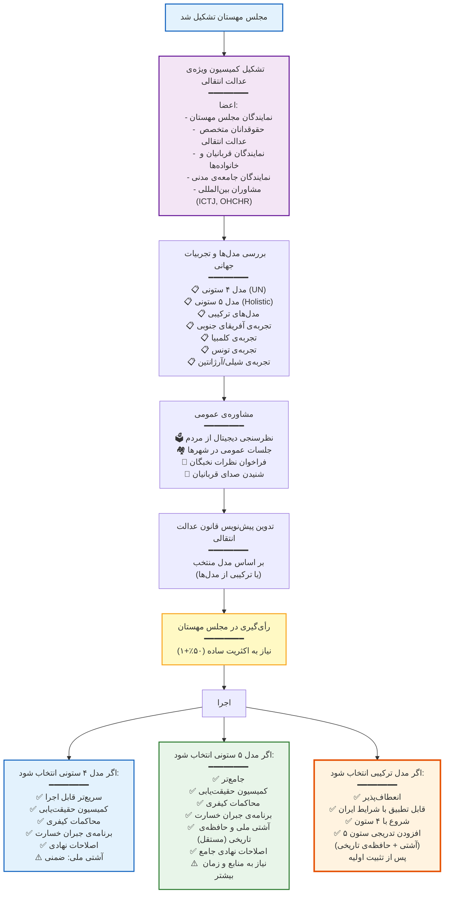

---

### پیشنهاد ویژه برای ایران: مدل ترکیبی مرحله‌بندی‌شده

با توجه به ویژگی‌های منحصربه‌فرد ایران — بیش از ۴ دهه سرکوب، تنوع قومی-مذهبی، شکاف‌های اجتماعی عمیق، و حجم بالای جنایات — پیشنهاد می‌شود مدل ترکیبی زیر مورد بحث قرار گیرد:

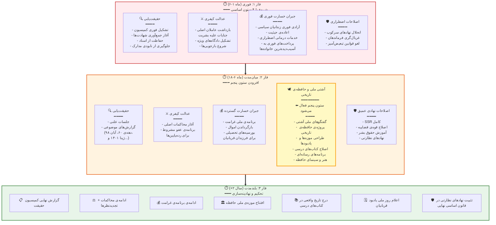

---

### ملاحظات ویژه‌ی ایران در هر دو مدل

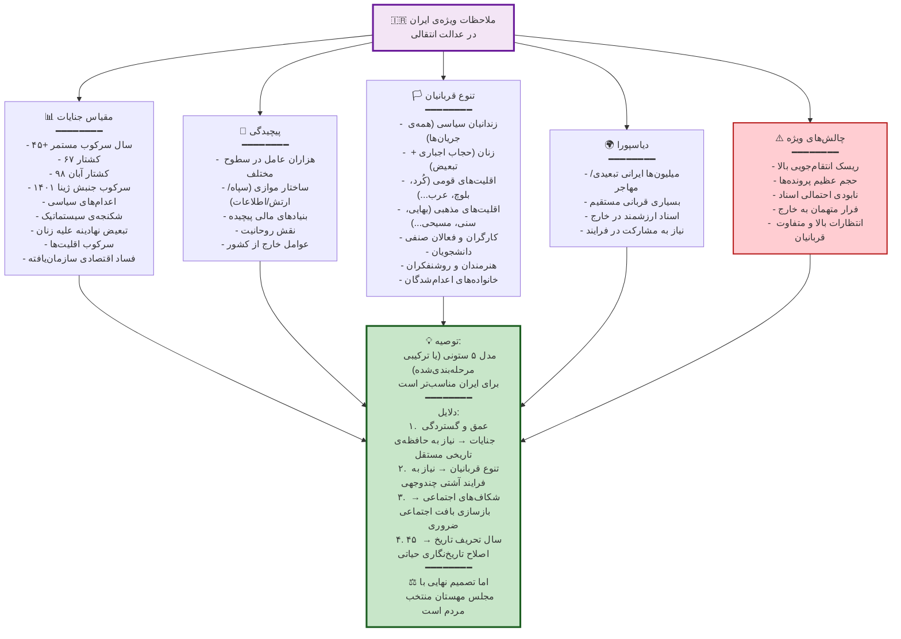

---

### نمونه‌های جهانی عدالت انتقالی — جدول مقایسه‌ای

| کشور | مدل | کمیسیون حقیقت | محاکمات | جبران خسارت | آشتی/حافظه | اصلاحات نهادی | نتیجه |
|-------|------|---------------|---------|-------------|------------|---------------|-------|
| 🇿🇦 **آفریقای جنوبی** | ≈ ۴ ستونی | ✅ TRC (1995-2002) | ⚠️ عفو مشروط + محدود | ⚠️ ناکافی | ✅ ضمنی | ⚠️ ناکافی | ☑️ آشتی نسبی اما نابرابری ادامه یافت |
| 🇨🇴 **کلمبیا** | ≈ ۵ ستونی | ✅ CEV (2018-2022) | ✅ JEP (دادگاه ویژه) | ✅ برنامه‌ی جامع | ✅ مرکز حافظه | ✅ اصلاحات نهادی | ☑️ در حال اجرا — نتایج امیدبخش |
| 🇹🇳 **تونس** | ≈ ۴ ستونی | ✅ IVD (2014-2018) | ⚠️ دادگاه‌های ویژه (محدود) | ⚠️ محدود | ❌ ناکافی | ❌ ناکافی | ❌ بازگشت استبداد (۲۰۲۱) |
| 🇨🇱 **شیلی** | تدریجی | ✅ رتیگ (1991) + والش (2004) | ✅ تدریجی (پینوشه ۱۹۹۸+) | ✅ برنامه‌ی غرامت | ✅ موزه‌ی حافظه (2010) | ⚠️ تدریجی | ✅ نسبتاً موفق |
| 🇦🇷 **آرژانتین** | عدالت‌محور | ✅ CONADEP (1984) | ✅ محاکمات گسترده | ✅ غرامت | ✅ یادبودها | ⚠️ تدریجی | ✅ الگوی محاکمات |
| 🇷🇼 **رواندا** | ترکیبی | ⚠️ محدود | ✅ ICTR + گاچاچا | ⚠️ | ⚠️ اجباری | ⚠️ | ⚠️ ثبات اما نه دموکراسی |
| 🇸🇱 **سیرالئون** | ≈ ۵ ستونی | ✅ TRC (2002-2004) | ✅ دادگاه ویژه | ⚠️ | ✅ | ⚠️ | ☑️ نسبتاً موفق |
| 🇪🇸 **اسپانیا** | فراموشی | ❌ Pacto del Olvido | ❌ (تا ۲۰۰۷ قانون حافظه) | ❌ → ⚠️ (اخیراً) | ❌ → ⚠️ | ⚠️ | ⚠️ ثبات اما زخم باز |
| 🇩🇪 **آلمان (شرقی)** | عدالت‌محور | ✅ بایگانی اشتازی | ✅ محاکمات + lustration | ✅ | ✅ موزه‌ها و یادبودها | ✅ ادغام در غرب | ✅ نسبتاً موفق |

---

### درس نهایی

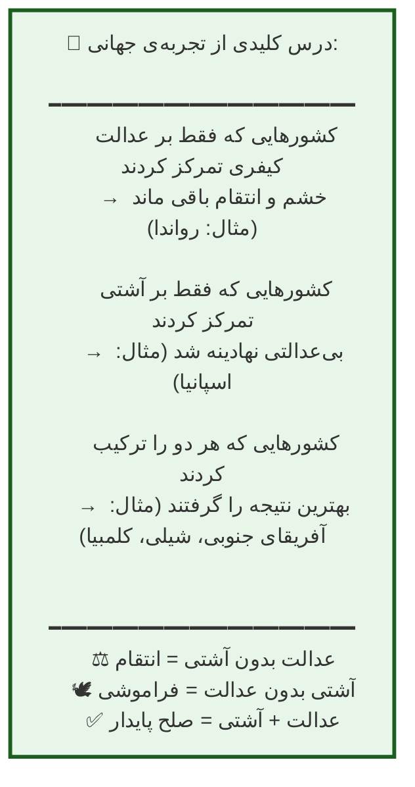

### ه-۲. سازوکارهای پیشنهادی

**۱. کمیسیون حقیقت‌یابی و آشتی ملی**

- ترکیب: حقوقدانان، فعالان حقوق بشر، نمایندگان قربانیان، شخصیت‌های مورد اعتماد ملی
- وظایف: مستندسازی جنایات ۴۵ ساله، ثبت شهادت قربانیان و خانواده‌ها، تهیه‌ی گزارش نهایی
- مدت: ۲ تا ۳ سال
- الگو: TRC آفریقای جنوبی، IVD تونس

**۲. محاکمات کیفری**

- محاکمه‌ی عاملان جنایات علیه بشریت، شکنجه، اعدام‌های غیرقانونی و فرمان‌دهندگان آن‌ها
- رعایت کامل اصول دادرسی عادلانه (حق وکیل، علنی بودن، حق تجدیدنظر)
- تفکیک بین **فرماندهان و طراحان** و **مجریان رده‌پایین**
- امکان عفو مشروط برای مجریان رده‌پایین در ازای همکاری کامل و اعتراف (الگوی آفریقای جنوبی)

**۳. جبران خسارت**

- غرامت مالی برای قربانیان و خانواده‌های آن‌ها
- بازگرداندن اموال مصادره‌شده
- خدمات بهداشتی و روانشناختی رایگان برای قربانیان
- اعاده‌ی حیثیت (ابطال احکام ناعادلانه)

**۴. تضمین عدم تکرار**

- اصلاح بخش امنیتی و قضایی
- آموزش حقوق بشر در مدارس و دانشگاه‌ها
- ایجاد نهادهای نظارتی مستقل (آمبودزمان، کمیسیون حقوق بشر)
- حفظ حافظه‌ی تاریخی (موزه‌ها، بناهای یادبود، اسناد)

### ه-۳. ملاحظات ویژه‌ی ایران

- رسیدگی به کشتارهای دهه‌ی ۶۰ (به‌ویژه ۶۷)
- رسیدگی به سرکوب اعتراضات (آبان ۹۸، ژینا/مهسا ۱۴۰۱ و غیره)
- رسیدگی به تبعیض نهادینه‌شده علیه زنان، اقلیت‌های قومی و مذهبی
- رسیدگی به فساد اقتصادی سیستماتیک

---

## ضمیمه‌ی و: راهبرد تعامل بین‌المللی

### و-۱. اصول

- **استقلال ملی**: هیچ قدرت خارجی نقش تعیین‌کننده در فرایند گذار نخواهد داشت
- **تنوع در شراکت**: همکاری متوازن با شرق و غرب
- **شفافیت**: تمام توافقات بین‌المللی علنی خواهند بود
- **منافع ملی**: دیپلماسی فعال و اصول‌گرا بر مبنای منافع بلندمدت ملت ایران

### و-۲. نقش‌های بین‌المللی مورد نیاز

| نهاد | نقش مورد انتظار |
|------|------------------|
| **سازمان ملل (UNDP، OHCHR)** | نظارت بر انتخابات؛ کمک فنی در تدوین قانون اساسی؛ حمایت از عدالت انتقالی |
| **اتحادیه اروپا** | حمایت اقتصادی؛ مشاوره‌ی فنی در اصلاحات حقوقی و قضایی؛ مذاکرات تجاری |
| **صندوق بین‌المللی پول و بانک جهانی** | بسته‌ی حمایتی اقتصادی اضطراری؛ مشاوره‌ی اصلاحات مالی و بانکی |
| **کمیسیون ونیز (شورای اروپا)** | مشاوره‌ی تخصصی حقوقی در تدوین قانون اساسی |
| **IDEA بین‌المللی** | کمک فنی در طراحی سیستم انتخاباتی |
| **دیوان بین‌المللی کیفری (ICC)** | همکاری در رسیدگی به جنایات علیه بشریت |
| **کشورهای همسایه** | تضمین امنیت مرزی؛ عدم مداخله؛ تنش‌زدایی |
| **دیاسپورای ایرانی** | مشارکت در رأی‌گیری؛ سرمایه‌گذاری؛ انتقال دانش و تخصص |

### و-۳. اولویت‌بندی دیپلماتیک

**فوری (هفته‌ی اول):**

- اعلام رسمی دوره‌ی گذار به سازمان ملل
- درخواست شناسایی بین‌المللی از نهاد گذار
- درخواست رفع تحریم‌ها از شورای امنیت
- اعلام تعهد به NPT و آژانس بین‌المللی انرژی اتمی

**کوتاه‌مدت (ماه اول):**

- آغاز مذاکرات اقتصادی با صندوق بین‌المللی پول
- دعوت رسمی از ناظران بین‌المللی انتخابات
- اعلام تعهد به کنوانسیون‌های بین‌المللی حقوق بشر
- برقراری ارتباط دیپلماتیک فعال با همه‌ی کشورهای همسایه

**میان‌مدت (۶ ماه اول):**

- الحاق رسمی به کنوانسیون‌های بین‌المللی (CEDAW، CRC، CAT و...)
- مذاکرات تجاری گسترده
- برنامه‌ی جذب سرمایه‌گذاری خارجی

---

## ضمیمه‌ی ز: مدل دو قانون اساسی — تکمیل طرح مهستان

### ز-۱. مبانی نظری

تجربه‌ی آفریقای جنوبی نشان داد که مدل **«دو قانون اساسی»** (قانون اساسی موقت + قانون اساسی نهایی) یکی از مؤثرترین سازوکارها برای مدیریت دوران گذار است. این مدل مزایای زیر را دارد:

1. **ایجاد چارچوب قانونی فوری**: بدون قانون اساسی موقت، مجلس مهستان بر اساس چه قانونی عمل می‌کند؟ خلأ حقوقی خطرناک‌ترین تهدید دوران گذار است.

2. **کاهش فشار زمانی**: اگر همه چیز به یک قانون اساسی نهایی وابسته باشد، یا عجله می‌شود و نتیجه ضعیف درمی‌آید (مصر ۲۰۱۲)، یا تأخیر رخ می‌دهد و بی‌ثباتی افزایش می‌یابد.

3. **ایجاد فضای امن برای مذاکره**: وقتی اصول بنیادین در قانون اساسی موقت تضمین شده، جریان‌ها با آرامش بیشتری می‌توانند درباره‌ی ساختار نهایی مذاکره کنند.

4. **آزمون عملی**: نهادهای تعریف‌شده در قانون اساسی موقت عملاً آزمایش شده و نقاط ضعف آن‌ها برای قانون اساسی نهایی مشخص می‌شود.

### ز-۲. نمودار فرایند دو قانون اساسی

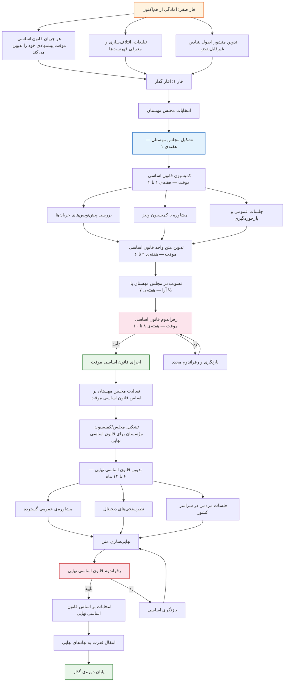

### ز-۳. فراخوان تدوین قانون اساسی موقت از هم‌اکنون

> **هر جریان، حزب، گروه، یا ائتلافی که قصد شرکت در انتخابات مجلس مهستان را دارد، موظف است از هم‌اکنون پیش‌نویس قانون اساسی موقت پیشنهادی خود را تدوین و منتشر کند.**

این اقدام دارای مزایای زیر است:

1. **شفافیت**: مردم از قبل می‌دانند هر جریان چه ساختاری را پیشنهاد می‌کند
2. **سرعت**: در لحظه‌ی آغاز گذار، پیش‌نویس‌ها آماده‌اند و مجلس مهستان نیاز به شروع از صفر ندارد
3. **کیفیت**: فرصت بیشتری برای بررسی و نقد وجود دارد
4. **اجماع‌سازی**: جریان‌ها می‌توانند نقاط مشترک را از قبل شناسایی کنند
5. **مشروعیت**: فرایند تدوین شفاف و مشارکتی خواهد بود

### ز-۴. محتوای الزامی قانون اساسی موقت

قانون اساسی موقت باید حداقل شامل موارد زیر باشد:

**فصل اول: اصول بنیادین غیرقابل‌تغییر**

- حاکمیت مردم
- جدایی دین از دولت (سکولاریسم)
- ممنوعیت شکنجه و مجازات‌های خشن
- آزادی بیان، مطبوعات، تجمع و تشکل
- برابری جنسیتی
- ممنوعیت تبعیض بر اساس قومیت، مذهب، جنسیت و عقیده
- تمامیت ارضی ایران
- حق تعیین سرنوشت از طریق رفراندوم

**فصل دوم: ساختار نهاد گذار**

- اختیارات و وظایف مجلس مهستان
- ساختار کابینه‌ی اجرایی موقت
- ساختار شورای قضایی انتقالی
- ساختار فرماندهی نظامی-انتظامی

**فصل سوم: حقوق شهروندی**

- منشور حقوق بنیادین (Bill of Rights)
- سازوکارهای حمایتی و شکایتی

**فصل چهارم: عدالت انتقالی**

- اصول کلی
- ساختار کمیسیون حقیقت‌یابی
- حدود عفو و محاکمه

**فصل پنجم: قوانین انتقالی**

- وضعیت قوانین پیشین (کدام‌ها تعلیق، کدام‌ها ادامه)
- سازوکار تصویب قوانین جدید

**فصل ششم: مسیر رسیدن به قانون اساسی نهایی**

- فرایند تشکیل مجلس/کمیسیون مؤسسان
- اصول غیرقابل‌نقضی که قانون اساسی نهایی باید رعایت کند
- فرایند رفراندوم

### ز-۵. فرایند تصویب قانون اساسی موقت در مجلس مهستان

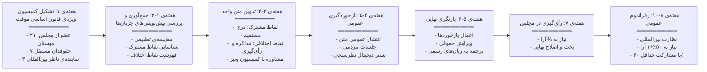

### ز-۶. مقایسه‌ی قانون اساسی موقت و نهایی

| معیار | قانون اساسی موقت | قانون اساسی نهایی |
|-------|-------------------|---------------------|
| **مرجع تدوین** | کمیسیون ویژه‌ی مجلس مهستان | مجلس/کمیسیون مؤسسان منتخب |
| **زمان تدوین** | ۶ تا ۸ هفته | ۶ تا ۱۲ ماه |
| **عمق و تفصیل** | حداقلی و عملیاتی (۴۰-۶۰ اصل) | جامع و تفصیلی (۱۵۰-۲۵۰ اصل) |
| **تصویب در مجلس** | ⅔ آرای مجلس مهستان | ⅔ آرای مجلس مؤسسان |
| **رفراندوم** | بله (۵۰٪+۱) | بله (۵۰٪+۱) |
| **قابلیت تغییر** | با رأی ⅔ مجلس مهستان | فقط با رفراندوم یا فوق‌اکثریت (⅘) |
| **نوع حکومت** | تعیین نمی‌کند (مجلس‌محور موقت) | تعیین‌کننده‌ی نوع حکومت نهایی |
| **مدت اعتبار** | تا تصویب قانون اساسی نهایی (حداکثر ۲ سال) | دائمی |
| **اصول غیرقابل‌نقض** | تعیین‌کننده‌ی خطوط قرمز | ملزم به رعایت خطوط قرمز قانون اساسی موقت |
| **سطح مشارکت عمومی** | محدود (به دلیل فوریت زمانی) | گسترده (جلسات مردمی، نظرسنجی‌ها، مشاوره‌ی عمومی) |

---

## ضمیمه‌ی ح: نمودارهای ساختاری

### ح-۱. ساختار کلی نهادهای دوران گذار

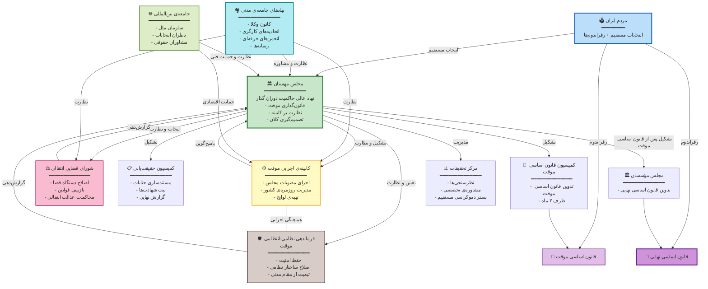

### ح-۲. خط زمانی کلی گذار

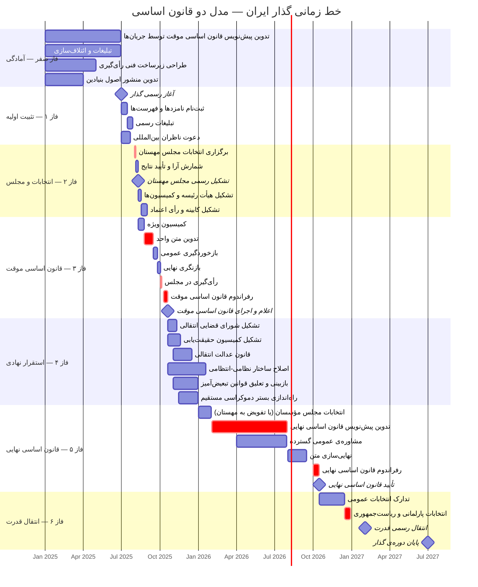

### ح-۳. فرایند تشکیل کابینه — نمودار تصمیم‌گیری

```mermaid
flowchart TD
    START["انتخابات مجلس مهستان برگزار شد"] --> Q1{"آیا یک جریان
    اکثریت مطلق
    (۵۰٪+۱) دارد؟"}

    Q1 -->|بله| PATH_A["جریان اکثریت:
    ━━━━━━━━
    ✅ ریاست جلسه‌ی اول
    ✅ تشکیل هیأت رئیسه
    ✅ مسئول تشکیل کابینه"]

    PATH_A --> CABINET_A["رئیس کابینه معرفی می‌شود
    + اعضای کابینه"]
    CABINET_A --> VOTE_A{"رأی اعتماد
    ۵۰٪+۱؟"}
    VOTE_A -->|بله| SUCCESS["✅ کابینه تشکیل شد"]
    VOTE_A -->|خیر| RETRY_A["اصلاح ترکیب و رأی مجدد"]
    RETRY_A --> VOTE_A

    Q1 -->|خیر| Q2["ریاست سنی
    جلسه‌ی اول را اداره می‌کند"]

    Q2 --> Q3{"آیا ائتلافی
    با اکثریت قاطع
    تشکیل می‌شود؟"}

    Q3 -->|بله| PATH_B["ائتلاف اکثریت:
    ━━━━━━━━
    ✅ تشکیل هیأت رئیسه
    ✅ مسئول تشکیل کابینه"]
    PATH_B --> CABINET_B["رئیس کابینه‌ی ائتلافی
    + اعضا"] --> VOTE_B{"رأی اعتماد
    ۵۰٪+۱؟"}
    VOTE_B -->|بله| SUCCESS
    VOTE_B -->|خیر| Q3

    Q3 -->|خیر| PATH_C["رأی‌گیری فردی
    برای ریاست کابینه"]

    PATH_C --> WINNER["فرد با بالاترین رأی
    = رئیس کابینه"]

    WINNER --> FORM{"تشکیل کابینه
    ظرف ۱ هفته؟"}
    FORM -->|بله| VOTE_C{"رأی اعتماد
    ۵۰٪+۱؟"}
    VOTE_C -->|بله| SUCCESS
    VOTE_C -->|خیر| FALLBACK["کاندیداهای با بیشترین رأی
    = اعضای منتخب کابینه"]
    FALLBACK --> SUCCESS

    FORM -->|خیر| FALLBACK

    SUCCESS --> OVERSIGHT["مجلس مهستان:
    ━━━━━━━━
    🔍 نظارت مستمر
    ⚖️ استیضاح با ۷۵٪ آرا
    📋 تعیین وظایف و محدوده"]

    style START fill:#E3F2FD,stroke:#1565C0
    style SUCCESS fill:#C8E6C9,stroke:#2E7D32,stroke-width:3px
    style Q1 fill:#FFF9C4,stroke:#F9A825
    style Q3 fill:#FFF9C4,stroke:#F9A825
    style FORM fill:#FFF9C4,stroke:#F9A825
```

### ح-۴. فرایند عدالت انتقالی

```mermaid
flowchart TD
    subgraph PILLAR1["ستون ۱: حقیقت‌یابی"]
        T1["تشکیل کمیسیون حقیقت‌یابی و آشتی ملی"]
        T2["جمع‌آوری شهادت‌ها و اسناد"]
        T3["برگزاری جلسات علنی"]
        T4["انتشار گزارش نهایی"]
        T1 --> T2 --> T3 --> T4
    end

    subgraph PILLAR2["ستون ۲: عدالت کیفری"]
        J1["شناسایی عاملان اصلی جنایات"]
        J2["تفکیک فرماندهان از مجریان رده‌پایین"]
        J3["محاکمات عادلانه و علنی"]
        J4["عفو مشروط رده‌پایین‌ها
        در ازای اعتراف کامل"]
        J1 --> J2 --> J3
        J2 --> J4
    end

    subgraph PILLAR3["ستون ۳: جبران خسارت"]
        R1["غرامت مالی"]
        R2["بازگرداندن اموال مصادره‌شده"]
        R3["خدمات بهداشتی و روانشناختی"]
        R4["اعاده‌ی حیثیت و ابطال احکام"]
    end

    subgraph PILLAR4["ستون ۴: تضمین عدم تکرار"]
        G1["اصلاح بخش امنیتی و قضایی"]
        G2["آموزش حقوق بشر"]
        G3["نهادهای نظارتی مستقل"]
        G4["حفظ حافظه‌ی تاریخی
        (موزه‌ها، یادبودها)"]
    end

    MEHESTAN_TJ["مجلس مهستان
    ━━━━━━━━
    قانون عدالت انتقالی"] --> PILLAR1
    MEHESTAN_TJ --> PILLAR2
    MEHESTAN_TJ --> PILLAR3
    MEHESTAN_TJ --> PILLAR4

    T4 --> J1
    T4 --> R1

    style PILLAR1 fill:#E3F2FD,stroke:#1565C0
    style PILLAR2 fill:#FCE4EC,stroke:#C62828
    style PILLAR3 fill:#FFF3E0,stroke:#E65100
    style PILLAR4 fill:#E8F5E9,stroke:#2E7D32
    style MEHESTAN_TJ fill:#F3E5F5,stroke:#6A1B9A,stroke-width:2px
```

### ح-۵. سیستم انتخاباتی مجلس مهستان

```mermaid
flowchart TD
    subgraph PREP["مرحله‌ی آمادگی — از هم‌اکنون"]
        P1["جریان‌ها و احزاب شکل می‌گیرند"]
        P2["فهرست کاندیداها تدوین می‌شود"]
        P3["قانون اساسی موقت پیشنهادی تدوین می‌شود"]
        P4["ائتلاف‌ها شکل می‌گیرد"]
        P1 --> P2 --> P3 --> P4
    end

    subgraph REG["ثبت‌نام رسمی — پس از آغاز گذار"]
        R1["ثبت‌نام در وب‌سایت وزارت کشور"]
        R2["انتشار فهرست‌ها در رسانه‌ها"]
        R3["معرفی محله‌محور توسط کاندیداها"]
        R4["معرفی ناظران توسط هر جریان"]
    end

    subgraph EXEC["اجرای انتخابات"]
        E1["فرمانداری‌ها + شهرداری‌ها
        = مجریان"]
        E2["مدارس و آموزش‌وپرورش
        = مکان‌های رأی‌گیری"]
        E3["ناظران جریان‌ها
        + ناظران بین‌المللی
        = نظارت"]
        E4["بستر دیجیتال
        = تکمیلی و دیاسپورا"]
    end

    subgraph COUNT["شمارش و اعلام"]
        C1["شمارش علنی در محل"]
        C2["ارسال نتایج به ستاد مرکزی"]
        C3["تأیید توسط هیأت نظارت"]
        C4["اعلام رسمی نتایج"]
    end

    PREP --> REG --> EXEC --> COUNT

    COUNT --> MEHESTAN_FORM["تشکیل مجلس مهستان
    ظرف ۱ هفته پس از تأیید"]

    style PREP fill:#FFF3E0,stroke:#E65100
    style REG fill:#E3F2FD,stroke:#1565C0
    style EXEC fill:#E8F5E9,stroke:#2E7D32
    style COUNT fill:#F3E5F5,stroke:#6A1B9A
    style MEHESTAN_FORM fill:#C8E6C9,stroke:#2E7D32,stroke-width:3px
```

---

## ضمیمه‌ی ط: بندهای تکمیلی طرح مهستان

بر اساس تحلیل تطبیقی و شناسایی خلأهای طرح اولیه، بندهای زیر پیشنهاد می‌شود:

### ط-۱. اصل دو قانون اساسی (بند ۲۲ و ۲۳)

**۲۲.** مجلس مهستان موظف است ظرف حداکثر **۲ ماه** پس از تشکیل، پیش‌نویس **قانون اساسی موقت دوران گذار** را تدوین و به رفراندوم عمومی بگذارد. این قانون اساسی موقت چارچوب حقوقی عملکرد تمام نهادهای دوران گذار را تعیین خواهد کرد. برای تصویب در مجلس، آرای **دو سوم** نمایندگان و برای تصویب در رفراندوم، آرای **۵۰٪+۱** شرکت‌کنندگان با حداقل مشارکت **۴۰٪** واجدین شرایط مورد نیاز است.

**۲۳.** هر جریان و ائتلافی که فهرست کاندیداهایی برای انتخابات مجلس مهستان معرفی می‌کند، **موظف است پیش از انتخابات، پیش‌نویس قانون اساسی موقت پیشنهادی خود را منتشر کند.** این پیش‌نویس‌ها مبنای کار کمیسیون ویژه‌ی قانون اساسی موقت در مجلس مهستان خواهند بود.

### ط-۲. منشور اصول غیرقابل‌نقض (بند ۲۴)

**۲۴.** مجلس مهستان و هیچ نهاد دوران گذار دیگری حق تعلیق یا نقض **اصول بنیادین زیر** را نخواهند داشت. قانون اساسی نهایی نیز ملزم به رعایت این اصول خواهد بود:

- الف) حاکمیت ملت و مبتنی بودن قدرت سیاسی بر رأی مردم
- ب) آزادی بیان، مطبوعات، تجمع، تشکل و عقیده
- ج) برابری تمام شهروندان در برابر قانون صرف‌نظر از جنسیت، قومیت، مذهب، زبان و عقیده
- د) ممنوعیت مطلق شکنجه و مجازات‌های خشن و غیرانسانی
- ه) جدایی نهاد دین از نهاد دولت
- و) استقلال قوه‌ی قضاییه
- ز) حق دادرسی عادلانه
- ح) آزادی مذهب و عقیده و بی‌اعتقادی
- ط) حقوق اقلیت‌های قومی و زبانی و مذهبی
- ی) ممنوعیت سانسور و فیلترینگ اینترنت

### ط-۳. نهادهای مکمل (بندهای ۲۵ تا ۲۹)

**۲۵. نهاد ناظر مستقل انتخابات**: مجلس مهستان یک هیأت مستقل نظارت بر انتخابات تشکیل می‌دهد که مسئول نظارت بر تمام رأی‌گیری‌ها و رفراندوم‌های دوران گذار خواهد بود. این هیأت متشکل از حقوقدانان مستقل، نمایندگان جامعه‌ی مدنی و ناظران بین‌المللی خواهد بود.

**۲۶. آمبودزمان (نهاد حقوق شهروندی)**: نهاد مستقلی برای رسیدگی به شکایات شهروندان از نهادهای دولتی تشکیل خواهد شد. ریاست آن توسط مجلس مهستان انتخاب می‌شود و مستقل از کابینه عمل می‌کند.

**۲۷. کمیسیون ملی رسانه‌ها**: نهادی مستقل برای مدیریت گذار رسانه‌های دولتی به رسانه‌های عمومی مستقل، تضمین آزادی مطبوعات، و جلوگیری از انحصار رسانه‌ای تشکیل خواهد شد.

**۲۸. کمیسیون ملی اصلاح بخش امنیتی (SSR)**: کمیسیونی تخصصی برای بازبینی، پاکسازی و اصلاح ساختار نیروهای نظامی، انتظامی و اطلاعاتی. وظایف شامل: غربال‌گری (vetting) نیروها، انحلال نهادهای موازی (مانند سپاه پاسداران به شکل کنونی)، ادغام یا بازسازی ساختارها، و تبعیت کامل نظامی از مقام مدنی.

**۲۹. شورای اقتصادی دوران گذار**: شورای متشکل از اقتصاددانان برجسته‌ی داخل و خارج کشور، برای مشاوره و طراحی سیاست‌های اقتصادی دوران گذار. این شورا مستقل بوده و گزارش‌ها و توصیه‌های خود را هم‌زمان به مجلس مهستان و کابینه ارائه می‌دهد.

### ط-۴. حقوق ویژه‌ی دوران گذار (بند ۳۰)

**۳۰.** در دوران گذار، حقوق زیر بلافاصله و بدون نیاز به قانون‌گذاری جدید اعتبار خواهند یافت:

- آزادی تمام زندانیان سیاسی و عقیدتی
- لغو فوری حجاب اجباری و کلیه‌ی قوانین تبعیض‌آمیز علیه زنان
- لغو فوری سانسور و فیلترینگ اینترنت
- لغو مجازات اعدام تا بررسی و تصمیم‌گیری نهایی مجلس مهستان
- آزادی فعالیت احزاب، اتحادیه‌ها و انجمن‌ها
- آزادی رسانه‌ها و ممنوعیت توقیف مطبوعات
- حق بازگشت آزادانه‌ی همه‌ی تبعیدیان و مهاجران سیاسی
- ممنوعیت هرگونه بازداشت بدون حکم قضایی

### ط-۵. سازوکار حل اختلاف (بند ۳۱)

**۳۱.** در صورت بروز اختلاف جدی بین نهادهای دوران گذار (مجلس مهستان، کابینه، شورای قضایی)، هیأتی متشکل از ۵ شخصیت مورد احترام ملی (پیشنهادی جامعه‌ی مدنی و مصوب مجلس) به‌عنوان **هیأت میانجی‌گری** عمل خواهد کرد. در صورت عدم حل اختلاف، موضوع به **رفراندوم** گذاشته خواهد شد.

---

## ضمیمه‌ی ی: جدول مقایسه‌ای تفصیلی

### ی-۱. مقایسه‌ی کامل طرح مهستان با گذارهای موفق

| معیار | 🇮🇷 **طرح مهستان (ایران)** | 🇹🇳 **تونس (۲۰۱۱-۲۰۱۴)** | 🇿🇦 **آفریقای جنوبی (۱۹۹۰-۱۹۹۶)** | 🇪🇸 **اسپانیا (۱۹۷۵-۱۹۸۲)** | 🇵🇱 **لهستان (۱۹۸۹)** | 🇨🇱 **شیلی (۱۹۸۸-۱۹۹۰)** |
|-------|---|---|---|---|---|---|
| **نوع گذار** | فروپاشی نظام + طراحی نهادی | فروپاشی + انتخابات سریع | مذاکره‌شده (negotiated) | مذاکره از درون نظام | مذاکره‌ی میزگرد | رفراندوم + مذاکره |
| **نهاد محوری** | مجلس مهستان (منتخب) | مجلس مؤسسان ملی (منتخب) | شورای اجرایی انتقالی → مجلس مؤسسان | پارلمان منتخب (کورتس) | مجلس سنا + سِیم (نیمه‌آزاد) | ائتلاف Concertación |
| **مدل قانون اساسی** | ✅ **دو مرحله‌ای** (موقت + نهایی) | یک مرحله‌ای (سه سال تأخیر) | ✅ **دو مرحله‌ای** (موقت ۱۹۹۳ + نهایی ۱۹۹۶) | یک مرحله‌ای (رفراندوم ۱۹۷۸) | اصلاح قانون اساسی موجود | اصلاح تدریجی قانون اساسی پینوشه |
| **مشروعیت انتخاباتی** | ✅ انتخابات مستقیم فوری | ✅ انتخابات مستقیم | ✅ انتخابات مستقیم ۱۹۹۴ | ✅ انتخابات ۱۹۷۷ | ⚠️ نیمه‌آزاد (۳۵٪ منصوبین) | ✅ رفراندوم + انتخابات |
| **سیستم انتخاباتی** | فهرستی (جریان‌محور) | فهرستی-نسبی | فهرستی-نسبی | منطقه‌ای-نسبی (D'Hondt) | اکثریتی (تک‌نفره) | Binomial (دو نفره) |
| **رابطه‌ی مجلس-دولت** | مجلس‌محور (پارلمانی) | مجلس‌محور (ترویکا) | رئیس‌جمهوری مسلط (ماندلا) | مجلس‌محور → مختلط | رئیس‌جمهوری (والسا) | رئیس‌جمهوری (آیلوین) |
| **آستانه‌ی استیضاح** | ۷۵٪ | ⅔ | N/A (رئیس‌جمهوری) | رأی عدم اعتماد اکثریت | N/A | N/A |
| **مدت دوره‌ی گذار** | حداکثر ۲ سال | ≈ ۳ سال | ≈ ۶ سال | ≈ ۷ سال | ≈ ۲ سال | ≈ ۲ سال (+ تدریجی) |
| **عدالت انتقالی** | ✅ قانون فوری + کمیسیون حقیقت | ⚠️ IVD تأخیر یافت (۲۰۱۴) | ✅ TRC (1995) — عفو مشروط | ❌ Pacto del Olvido (فراموشی) | ⚠️ خط ضخیم (محدود) | ⚠️ گزارش رتیگ (فقط حقیقت‌یابی) |
| **اصلاح بخش امنیتی** | ✅ پیش‌بینی‌شده (SSR) | ❌ ناکافی (عامل بازگشت) | ⚠️ تدریجی | ⚠️ کودتای نافرجام ۱۹۸۱ | ⚠️ ناکافی | ⚠️ ارتش مستقل ماند |
| **نقش نظامیان** | تحت نظارت مدنی مجلس | حامی گذار (مثبت) | مذاکره‌شده | چالش‌برانگیز | نقش‌پذیری اجباری | ارتش مستقل |
| **دموکراسی مستقیم** | ✅ بستر دیجیتال + رفراندوم | ⚠️ محدود | ⚠️ فقط رفراندوم | ✅ رفراندوم ۱۹۷۶ و ۱۹۷۸ | ❌ | ✅ رفراندوم ۱۹۸۸ |
| **نقش جامعه‌ی مدنی** | ✅ مشاوره و نظارت رسمی | ✅ چهارگانه‌ی گفتگو (کلیدی) | ✅ بسیار فعال | ⚠️ محدود | ✅ Solidarność محوری | ⚠️ محدود |
| **نقش بین‌الملل** | نظارت، حمایت، عدم مداخله | ⚠️ محدود | ✅ نقش مثبت (تحریم‌ها) | ⚠️ EC/NATO | ✅ نقش غیرمستقیم | ⚠️ محدود |
| **حقوق اقلیت‌ها** | ✅ در منشور اصول بنیادین | ⚠️ محدود | ✅ جامع (فصل ۲ قانون اساسی) | ✅ خودمختاری منطقه‌ای | ⚠️ تدریجی | ⚠️ محدود |
| **مدیریت اقتصادی** | ✅ شورای اقتصادی + اقدامات فوری | ❌ ناکافی (عامل بحران) | ⚠️ RDP ناکافی | ✅ پیمان‌های مونکلوآ | ⚠️ شوک‌درمانی (دردناک) | ⚠️ تداوم مدل نئولیبرال |

### ی-۲. مقایسه با گذارهای ناموفق

| معیار | 🇮🇷 **طرح مهستان** | 🇱🇾 **لیبی (۲۰۱۱–)** | 🇪🇬 **مصر (۲۰۱۱–۲۰۱۳)** | 🇮🇶 **عراق (۲۰۰۳–)** | 🇾🇪 **یمن (۲۰۱۱–)** | 🇸🇾 **سوریه (۲۰۱۱–)** |
|-------|---|---|---|---|---|---|
| **نهاد واحد مورد توافق** | ✅ مجلس مهستان منتخب | ❌ شوراهای رقیب | ❌ SCAF نظامی | ❌ CPA اشغالگر | ❌ توافق GCC مصنوعی | ❌ اپوزیسیون پراکنده |
| **مشروعیت انتخاباتی** | ✅ انتخابات فوری | ⚠️ تأخیر و تکرار | ⚠️ نظامی‌ها ضامن | ❌ منصوبین خارجی | ❌ فاقد انتخابات واقعی | ❌ فاقد انتخابات |
| **حفظ ساختار دولتی** | ✅ اصلاح نه تخریب | ❌ فروپاشی کامل | ⚠️ ارتش حاکم ماند | ❌ انحلال ارتش و De-Ba'athification | ❌ فروپاشی تدریجی | ❌ فروپاشی و جنگ داخلی |
| **قانون اساسی** | ✅ دو مرحله‌ای با رفراندوم | ❌ چندین تلاش ناموفق | ❌ عجولانه (۲۰۱۲) و فاقد اجماع | ⚠️ تحمیلی با نفوذ خارجی | ❌ پیش‌نویس تکمیل‌نشده | ❌ فاقد فرایند |
| **عدالت انتقالی** | ✅ پیش‌بینی‌شده و مرحله‌بندی | ❌ انتقام‌جویی سازمان‌نیافته | ❌ ناکافی و سیاسی‌شده | ❌ De-Ba'athification مخرب | ❌ عفو بدون عدالت | ❌ فاقد فرایند |
| **مدیریت تنوع قومی** | ✅ منشور اصول + فدرالیسم در دستور کار | ❌ جنگ قبیله‌ای | ⚠️ تقابل سکولار-اسلامگرا | ❌ مُحاصصه‌ی قومی-مذهبی | ❌ جنگ شمال-جنوب و حوثی‌ها | ❌ جنگ فرقه‌ای |
| **نقش نظامیان** | ✅ تبعیت از مقام مدنی | ❌ میلیشیاهای رقیب | ❌ ارتش قدرت واقعی | ❌ انحلال + خلأ امنیتی | ❌ ارتش تجزیه‌شده | ❌ ارتش سرکوبگر + میلیشیا |
| **مداخله‌ی خارجی** | ✅ حمایت فنی، نه مداخله | ❌ مداخله‌ی ناتو + ترکیه/امارات/مصر | ⚠️ عربستان/امارات | ❌ اشغال آمریکا | ❌ عربستان/ایران | ❌ روسیه/ایران/ترکیه/آمریکا |
| **اقتصاد** | ✅ شورای اقتصادی + برنامه‌ی فوری | ❌ اقتصاد نفتی بدون مدیریت | ❌ بحران مداوم | ❌ ویرانی + فساد | ❌ فقر و بحران | ❌ ویرانی کامل |
| **نتیجه** | **طراحی‌شده برای اجتناب از این دام‌ها** | جنگ داخلی و دو دولت | کودتای نظامی (السیسی ۲۰۱۳) | ناکارآمدی و فساد مزمن | جنگ داخلی | جنگ داخلی و تجزیه‌ی عملی |

### ی-۳. تحلیل: چرا گذارها شکست می‌خورند و طرح مهستان چگونه از آن‌ها اجتناب می‌کند

```mermaid
flowchart TD
    subgraph FAILURES["❌ عوامل اصلی شکست گذارها"]
        F1["۱. خلأ نهادی
        ━━━━━━━━
        لیبی، یمن، سوریه:
        نبود نهاد واحد مشروع"]
        F2["۲. سلطه‌ی نظامیان
        ━━━━━━━━
        مصر:
        ارتش ضامن گذار شد
        و سپس آن را ربود"]
        F3["۳. مداخله‌ی خارجی
        ━━━━━━━━
        عراق، لیبی، سوریه:
        بازیگران خارجی
        فرایند را مصادره کردند"]
        F4["۴. دوقطبی‌سازی
        ━━━━━━━━
        مصر:
        اسلامگرا vs سکولار
        مذاکره ناممکن شد"]
        F5["۵. انحلال ساختارها
        ━━━━━━━━
        عراق:
        De-Ba'athification
        و انحلال ارتش → هرج‌ومرج"]
        F6["۶. بی‌توجهی به اقتصاد
        ━━━━━━━━
        تونس، مصر:
        فقر و بیکاری
        مشروعیت دموکراسی را کشت"]
        F7["۷. انتقام‌جویی
        ━━━━━━━━
        لیبی:
        خشونت بدون قانون
        چرخه‌ی انتقام"]
        F8["۸. عجله در قانون اساسی
        ━━━━━━━━
        مصر ۲۰۱۲:
        قانون اساسی شتاب‌زده
        و فاقد اجماع"]
    end

    subgraph SOLUTIONS["✅ پاسخ‌های طرح مهستان"]
        S1["مجلس مهستان منتخب
        = نهاد واحد با مشروعیت
        مستقیم مردمی"]
        S2["فرماندهی نظامی تحت
        نظارت مجلس
        + SSR مستقل"]
        S3["اصل استقلال ملی
        + فقط حمایت فنی
        بین‌المللی"]
        S4["سیستم فهرستی-نسبی
        + منشور اصول بنیادین
        + ائتلاف‌سازی"]
        S5["اصلاح نه تخریب
        + حفظ ساختار اداری
        با رهبری جدید"]
        S6["شورای اقتصادی
        + اقدامات فوری ۱۰۰ روز
        + شبکه‌ی ایمنی"]
        S7["عدالت انتقالی قانونی
        + کمیسیون حقیقت‌یابی
        + محاکمات عادلانه"]
        S8["مدل دو قانون اساسی
        = موقت سریع
        + نهایی با فرصت کافی"]
    end

    F1 -.->|حل| S1
    F2 -.->|حل| S2
    F3 -.->|حل| S3
    F4 -.->|حل| S4
    F5 -.->|حل| S5
    F6 -.->|حل| S6
    F7 -.->|حل| S7
    F8 -.->|حل| S8

    style FAILURES fill:#FFEBEE,stroke:#C62828
    style SOLUTIONS fill:#E8F5E9,stroke:#2E7D32
```

### ی-۴. ماتریس جامع ریسک — مقایسه‌ی پاسخ‌های کشورهای مختلف

| ریسک / چالش | تونس | آفریقای جنوبی | اسپانیا | لیبی | مصر | عراق | **طرح مهستان** |
|-------------|-------|----------------|---------|------|------|------|----------------|
| **خلأ قانونی** | فرمان‌های موقت ☑️ | قانون اساسی موقت ✅ | قانون اصلاح سیاسی ☑️ | ❌ | اعلامیه‌ی قانون اساسی ❌ | TAL ⚠️ | **قانون اساسی موقت ظرف ۲ ماه ✅** |
| **خلأ امنیتی** | ارتش حامی ☑️ | مذاکره ☑️ | گارد سلطنتی ⚠️ | ❌ میلیشیا | SCAF ❌ | ❌ انحلال | **شورای امنیتی + SSR ✅** |
| **شکاف اجتماعی** | گفتگوی ملی ✅ | TRC ✅ | اجماع ☑️ | ❌ جنگ | ❌ دوقطبی | ❌ محاصصه | **منشور اصول + عدالت انتقالی ✅** |
| **بحران اقتصادی** | ❌ ناکافی | ⚠️ RDP | ✅ مونکلوآ | ❌ | ❌ | ❌ | **شورای اقتصادی + برنامه‌ی فوری ✅** |
| **فساد/غارت** | ⚠️ تأخیر | ⚠️ | ⚠️ | ❌ | ❌ | ❌ | **حسابرسی فوری + شفافیت ✅** |
| **انتقام‌جویی** | ⚠️ | ✅ TRC | ❌ Olvido | ❌ خشونت | ❌ | ❌ | **کمیسیون حقیقت + محاکمات عادلانه ✅** |
| **مداخله‌ی خارجی** | ⚠️ محدود | ✅ مدیریت‌شده | ☑️ EC/NATO | ❌ مخرب | ❌ مخرب | ❌ مخرب | **اصل استقلال + تنوع شراکت ✅** |

---

## ضمیمه‌ی ک: تفصیل سیستم انتخاباتی مجلس مهستان

### ک-۱. سیستم فهرستی-نسبی: چرا و چگونه

سیستم فهرستی-نسبی به دلایل زیر برای دوران گذار مناسب‌ترین گزینه است:

1. **تضمین تکثرگرایی**: جریان‌های کوچک‌تر نیز شانس حضور دارند
2. **تشویق ائتلاف‌سازی**: جریان‌ها برای تشکیل فهرست ملی باید ائتلاف کنند
3. **کاهش شخصیت‌محوری**: تمرکز بر برنامه و ایده به‌جای فرد
4. **سرعت اجرا**: نیاز به ترسیم حوزه‌های انتخاباتی جدید نیست

### ک-۲. پیشنهاد تفصیلی ساختار

```mermaid
flowchart TD
    TOTAL["مجلس مهستان
    ━━━━━━━━
    ۳۰۰ کرسی پیشنهادی"]

    TOTAL --> PROV["🗺️ ۲۴۰ کرسی استانی
    ━━━━━━━━━━━━
    بر اساس جمعیت هر استان
    (حداقل ۳ کرسی برای هر استان)
    سیستم فهرستی-نسبی
    آستانه‌ی ورود: ۳٪"]

    TOTAL --> NATIONAL["🇮🇷 ۴۰ کرسی فهرست ملی
    ━━━━━━━━━━━━
    جریان‌هایی که فهرست سراسری دارند
    سیستم نسبی
    آستانه‌ی ورود: ۵٪"]

    TOTAL --> MINORITY["🏳️ ۲۰ کرسی تضمینی اقلیت‌ها
    ━━━━━━━━━━━━
    اقلیت‌های قومی، مذهبی و زبانی
    انتخاب توسط خود اقلیت‌ها
    ━━━━
    کُرد: ۵ | آذری: ۴ | بلوچ: ۳
    عرب: ۳ | ترکمن: ۲ | سایر: ۳"]

    PROV --> EXAMPLE["مثال: استان تهران
    ━━━━━━━━
    جمعیت ≈ ۱۴ میلیون
    → ≈ ۴۰ کرسی
    ━━━━
    اگر جریان الف ۴۰٪ آرا → ۱۶ کرسی
    جریان ب ۳۰٪ → ۱۲ کرسی
    جریان ج ۲۰٪ → ۸ کرسی
    جریان د ۱۰٪ → ۴ کرسی"]

    style TOTAL fill:#C8E6C9,stroke:#2E7D32,stroke-width:3px
    style PROV fill:#BBDEFB,stroke:#1565C0
    style NATIONAL fill:#FFF9C4,stroke:#F9A825
    style MINORITY fill:#F8BBD0,stroke:#AD1457
```

### ک-۳. شرایط ثبت‌نام جریان‌ها و فهرست‌ها

| شرط | توضیح |
|-----|-------|
| **حداقل تعداد کاندیدا** | فهرست استانی: حداقل به تعداد ۵۰٪ کرسی‌های استان. فهرست ملی: حداقل ۲۰ نفر |
| **تنوع جنسیتی** | حداقل ۳۰٪ هر جنسیت در فهرست (zipper system یا حداقل تناوب) |
| **تنوع جغرافیایی** | فهرست ملی باید شامل کاندیداهایی از حداقل ۱۵ استان باشد |
| **سن** | حداقل ۲۵ سال |
| **تابعیت** | تابعیت ایرانی (شامل دوتابعیتی‌ها — حق شرکت دارند اما باید اعلام کنند) |
| **عدم سابقه‌ی جنایی** | عدم محکومیت به جنایات علیه بشریت، فساد کلان، یا همکاری مستقیم در سرکوب |
| **انتشار پیش‌نویس قانون اساسی موقت** | الزامی برای جریان‌هایی که فهرست ملی معرفی می‌کنند |
| **امضای منشور اصول بنیادین** | الزامی برای همه‌ی کاندیداها |
| **اعلام داوطلبانه‌ی دارایی‌ها** | الزامی (شفافیت مالی) |

### ک-۴. سیستم رأی‌گیری

```mermaid
flowchart LR
    VOTER["🗳️ هر رأی‌دهنده"] --> BALLOT1["برگه‌ی ۱:
    فهرست استانی
    ━━━━━━━━
    یک فهرست انتخاب می‌کند
    → کرسی‌های استان"]

    VOTER --> BALLOT2["برگه‌ی ۲:
    فهرست ملی
    ━━━━━━━━
    یک فهرست انتخاب می‌کند
    → ۴۰ کرسی ملی"]

    VOTER --> BALLOT3["برگه‌ی ۳:
    (فقط اقلیت‌ها)
    کرسی تضمینی اقلیت
    ━━━━━━━━
    انتخاب نماینده‌ی اقلیت"]

    BALLOT1 --> COUNT["شمارش نسبی
    (روش D'Hondt یا Sainte-Laguë)"]
    BALLOT2 --> COUNT
    BALLOT3 --> COUNT_MIN["شمارش اکثریتی"]

    COUNT --> RESULT["نتایج نهایی
    ━━━━━━━━
    ۲۴۰ + ۴۰ + ۲۰ = ۳۰۰ نماینده"]
    COUNT_MIN --> RESULT

    style VOTER fill:#BBDEFB,stroke:#1565C0,stroke-width:3px
    style RESULT fill:#C8E6C9,stroke:#2E7D32,stroke-width:3px
```

### ک-۵. رأی‌دهی دیاسپورا

| موضوع | راهکار |
|-------|--------|
| **احراز هویت** | کد ملی + پاسپورت ایرانی معتبر (یا منقضی‌شده‌ی قابل تأیید) |
| **روش رأی‌دهی** | سفارتخانه‌ها (در صورت در اختیار بودن) + بستر دیجیتال امن |
| **نظارت** | ناظران بین‌المللی + ناظران جریان‌ها |
| **کرسی‌های اختصاصی** | ۱۰ کرسی از ۴۰ کرسی ملی به دیاسپورا اختصاص یابد (پیشنهادی) |
| **ثبت‌نام** | پیش‌ثبت‌نام آنلاین + تأیید هویت در روز رأی‌گیری |

---

## ضمیمه‌ی ل: اصلاح بخش امنیتی (SSR) — طرح تفصیلی

### ل-۱. چالش ویژه‌ی ایران

ایران دارای ساختار امنیتی بسیار پیچیده و چندلایه است که اصلاح آن از حساس‌ترین وظایف دوران گذار خواهد بود:

```mermaid
graph TD
    subgraph CURRENT["ساختار فعلی — نیازمند اصلاح اساسی"]
        LEADER["رهبر"] --> SEPAH["سپاه پاسداران
        ━━━━━━━━
        نظامی + اقتصادی + سیاسی + اطلاعاتی
        ≈ ۱۵۰,۰۰۰ نفر + بسیج"]
        LEADER --> ARMY["ارتش جمهوری اسلامی
        ━━━━━━━━
        ≈ ۳۵۰,۰۰۰ نفر"]
        LEADER --> POLICE["نیروی انتظامی (ناجا)
        ━━━━━━━━
        ≈ ۴۰۰,۰۰۰ نفر"]
        LEADER --> INTEL["وزارت اطلاعات
        ━━━━━━━━
        اطلاعات موازی"]
        SEPAH --> BASIJ["بسیج
        ━━━━
        میلیونی"]
        SEPAH --> QUDS["نیروی قدس
        ━━━━
        عملیات برون‌مرزی"]
        SEPAH --> SEPAH_INTEL["اطلاعات سپاه"]
        SEPAH --> SEPAH_ECON["بنیاد تعاون سپاه
        + خاتم‌الانبیاء
        + ده‌ها شرکت اقتصادی"]
    end

    subgraph REFORMED["ساختار پیشنهادی پس از اصلاح"]
        MEHESTAN_MIL["مجلس مهستان
        (نظارت عالی مدنی)"] --> JOINT["ستاد مشترک
        نیروهای مسلح
        (واحد)"]
        JOINT --> NEW_ARMY["ارتش ملی ایران
        ━━━━━━━━
        ادغام ارتش + نیروهای
        واجد شرایط سپاه"]
        JOINT --> NEW_POLICE["پلیس ملی ایران
        ━━━━━━━━
        اصلاح‌شده
        تحت نظارت مدنی"]
        MEHESTAN_MIL --> NEW_INTEL["سازمان اطلاعات ملی
        ━━━━━━━━
        واحد و تحت نظارت
        کمیسیون پارلمانی"]

        DISSOLVED["منحل‌شده:
        ❌ سپاه (به شکل کنونی)
        ❌ بسیج (به شکل کنونی)
        ❌ نیروی قدس
        ❌ گشت ارشاد
        ❌ اطلاعات موازی"]

        ECON_TRANSFER["واگذاری اموال اقتصادی سپاه
        → صندوق ملی بازسازی"]
    end

    style CURRENT fill:#FFEBEE,stroke:#C62828
    style REFORMED fill:#E8F5E9,stroke:#2E7D32
    style DISSOLVED fill:#FFCDD2,stroke:#B71C1C
```

### ل-۲. فرایند پیشنهادی SSR

| مرحله | زمان‌بندی | اقدامات |
|-------|----------|---------|
| **۱. تثبیت فوری** | هفته‌ی ۱-۲ | انتصاب فرمانده‌ی موقت ستاد مشترک؛ دستور بازگشت همه‌ی نیروها به پادگان‌ها؛ خلع سلاح نیروهای غیررسمی؛ حفظ ساختار پایه‌ای انتظامی |
| **۲. غربال‌گری (Vetting)** | ماه ۱-۶ | بررسی سوابق فرماندهان و افسران ارشد؛ کنارگذاری افراد متهم به جنایات؛ حفظ نیروهای حرفه‌ای و بی‌طرف |
| **۳. بازسازی ساختاری** | ماه ۳-۱۲ | ادغام نیروهای واجد شرایط ارتش و سپاه در ارتش واحد؛ انحلال ساختارهای موازی؛ تشکیل سازمان اطلاعات واحد |
| **۴. اصلاح آموزشی** | ماه ۶-۲۴ | بازنگری برنامه‌های آموزشی نظامی؛ آموزش حقوق بشر و حقوق بشردوستانه؛ آموزش تبعیت از مقام مدنی |
| **۵. بازگردانی اقتصادی** | ماه ۶-۲۴ | حسابرسی کامل دارایی‌های سپاه؛ واگذاری شرکت‌ها و بنیادها به صندوق ملی؛ فرایند شفاف خصوصی‌سازی |

### ل-۳. درس عراق: چه نباید کرد

> **درس حیاتی**: انحلال کامل ارتش عراق توسط پل برمر (فرمان شماره‌ی ۲ CPA در مه ۲۰۰۳) یکی از بزرگ‌ترین اشتباهات تاریخ گذارهاست. صدها هزار نظامی مسلح و بیکار شدند که بخش بزرگی از آن‌ها بعداً به داعش و گروه‌های شورشی پیوستند.
>
> **طرح مهستان**: اصل **«اصلاح نه تخریب»** — نیروهای حرفه‌ای و غیرمتخلف جذب ساختار جدید می‌شوند. فقط فرماندهان متهم به جنایات و ساختارهای ایدئولوژیک (مانند دفتر نمایندگی ولی فقیه در سپاه، سازمان عقیدتی-سیاسی) منحل می‌شوند.

---

## ضمیمه‌ی م: مدیریت رسانه در دوران گذار

### م-۱. اصول

تجربه‌ی جهانی نشان می‌دهد که رسانه‌ها هم می‌توانند عامل تحکیم دموکراسی باشند و هم ابزار تخریب آن (مثال: نقش رسانه‌ها در نسل‌کشی رواندا).

### م-۲. اقدامات پیشنهادی

```mermaid
flowchart TD
    MEDIA_COM["کمیسیون ملی رسانه‌ها
    (مستقل — منصوب مجلس مهستان)"]

    MEDIA_COM --> STATE["📺 رسانه‌های دولتی سابق
    (صداوسیما و...)
    ━━━━━━━━
    → تبدیل به رسانه‌ی عمومی مستقل
    (الگوی BBC / ARD)
    - هیأت امنای مستقل
    - بودجه‌ی مصوب مجلس
    - استقلال تحریریه‌ای"]

    MEDIA_COM --> PRIVATE["📰 رسانه‌های خصوصی
    ━━━━━━━━
    → آزادی کامل تأسیس
    - ثبت‌نام ساده
    - بدون مجوز دولتی
    - ممنوعیت انحصار"]

    MEDIA_COM --> DIGITAL["🌐 فضای دیجیتال
    ━━━━━━━━
    → رفع کامل فیلترینگ
    - آزادی اینترنت
    - حمایت از رسانه‌های دیجیتال
    - قانون حفاظت از داده‌ها"]

    MEDIA_COM --> PROTECT["🛡️ حمایت از خبرنگاران
    ━━━━━━━━
    - قانون حفاظت از منابع
    - ممنوعیت بازداشت خبرنگار
    - صندوق حمایت از رسانه‌ها"]

    MEDIA_COM --> DISINFO["⚠️ مقابله با اطلاعات نادرست
    ━━━━━━━━
    - سواد رسانه‌ای عمومی
    - واحد حقیقت‌سنجی مستقل
    - بدون سانسور دولتی"]

    style MEDIA_COM fill:#E3F2FD,stroke:#1565C0,stroke-width:2px
```

---

## ضمیمه‌ی ن: حقوق زنان و برابری جنسیتی در دوران گذار

### ن-۱. اهمیت ویژه

پس از بیش از چهار دهه تبعیض نظام‌مند علیه زنان، اصلاح وضعیت حقوقی و اجتماعی زنان از اولویت‌های بلافصل دوران گذار است. شعار **«زن، زندگی، آزادی»** باید از شعار به واقعیت نهادی تبدیل شود.

### ن-۲. اقدامات فوری (بدون نیاز به قانون‌گذاری جدید)

- لغو حجاب اجباری
- لغو ممنوعیت ورود زنان به ورزشگاه‌ها
- لغو محدودیت سفر زنان بدون اجازه‌ی همسر
- لغو قوانین تبعیض‌آمیز ارث
- برابری در حق طلاق و حضانت فرزندان
- لغو ممنوعیت‌های شغلی بر اساس جنسیت

### ن-۳. اقدامات نهادی

| اقدام | جزئیات |
|-------|--------|
| **سهمیه‌ی جنسیتی در مجلس مهستان** | حداقل ۳۰٪ هر جنسیت در فهرست‌های انتخاباتی |
| **معاونت زنان در کابینه** | ایجاد معاونت ویژه‌ی حقوق زنان و برابری جنسیتی |
| **بازنگری جامع قوانین** | کمیسیون ویژه‌ی بررسی و اصلاح تمام قوانین تبعیض‌آمیز |
| **الحاق به CEDAW** | الحاق فوری به کنوانسیون رفع تبعیض علیه زنان بدون هیچ شرطی |
| **آموزش** | اصلاح کتاب‌های درسی؛ حذف محتوای جنسیت‌زده |

---

## ضمیمه‌ی س: حقوق اقلیت‌ها و مدیریت تنوع

### س-۱. واقعیت جمعیتی ایران

ایران کشوری چندقومی، چندزبانه و چندمذهبی است. هر طرح گذار باید این تنوع را به رسمیت بشناسد:

| گروه قومی-زبانی | درصد تقریبی | مناطق اصلی |
|------------------|-------------|-------------|
| فارس | ≈ ۵۰-۵۵٪ | مرکز، شرق، جنوب |
| آذری/ترک | ≈ ۱۵-۲۰٪ | شمال‌غرب |
| کُرد | ≈ ۸-۱۰٪ | غرب |
| لُر و بختیاری | ≈ ۶-۸٪ | غرب و جنوب‌غرب |
| عرب | ≈ ۲-۳٪ | خوزستان |
| بلوچ | ≈ ۲-۳٪ | جنوب‌شرق |
| ترکمن | ≈ ۱-۲٪ | شمال‌شرق |
| سایر (گیلک، مازنی، تالشی و...) | ≈ ۵-۸٪ | شمال |

### س-۲. چارچوب حقوقی پیشنهادی

```mermaid
flowchart TD
    DIVERSITY["مدیریت تنوع در ایران"]

    DIVERSITY --> RIGHTS["حقوق فردی
    ━━━━━━━━
    ✅ برابری کامل شهروندی
    ✅ ممنوعیت تبعیض
    ✅ آزادی زبان و فرهنگ
    ✅ آزادی مذهب و عقیده"]

    DIVERSITY --> COLLECTIVE["حقوق جمعی
    ━━━━━━━━
    ✅ آموزش به زبان مادری
    ✅ رسانه‌های محلی
    ✅ حفظ میراث فرهنگی
    ✅ نمایندگی تضمینی"]

    DIVERSITY --> STRUCTURE["ساختار حکمرانی
    ━━━━━━━━
    📋 موضوع بحث در قانون اساسی نهایی:
    - فدرالیسم؟
    - خودمختاری منطقه‌ای؟
    - تمرکززدایی اداری؟
    ━━━━
    → رفراندوم تعیین می‌کند"]

    DIVERSITY --> GUARANTEE["تضمین‌ها
    ━━━━━━━━
    ✅ ۲۰ کرسی تضمینی در مهستان
    ✅ حق وتوی اقلیت در قوانین
    مربوط به حقوق اقلیت‌ها (⅓+۱)
    ✅ ممنوعیت تغییر حقوق اقلیت‌ها
    بدون رضایت نمایندگان آن‌ها"]

    style DIVERSITY fill:#F3E5F5,stroke:#6A1B9A,stroke-width:2px
    style RIGHTS fill:#E8F5E9,stroke:#2E7D32
    style COLLECTIVE fill:#E3F2FD,stroke:#1565C0
    style STRUCTURE fill:#FFF9C4,stroke:#F9A825
    style GUARANTEE fill:#FCE4EC,stroke:#C62828
```

### س-۳. اصل مشارکت اقلیت‌ها در تدوین قانون اساسی

> قانون اساسی نهایی **نمی‌تواند** بدون مشارکت فعال و رضایت نمایندگان اقلیت‌های قومی، زبانی و مذهبی تصویب شود. هر بخش از قانون اساسی که مستقیماً به حقوق اقلیت‌ها مربوط می‌شود، نیاز به رأی مثبت حداقل **⅔ نمایندگان اقلیت‌ها** در مجلس مؤسسان خواهد داشت.

---

## ضمیمه‌ی ع: نمودار جامع مقایسه‌ی مسیرهای گذار

```mermaid
flowchart TD
    START["سقوط/فروپاشی نظام"] --> Q1{"آیا نهاد مشروع
    از پیش آماده است؟"}

    Q1 -->|بله — مانند طرح مهستان| PATH_A["انتخابات سریع
    → مجلس مهستان
    → قانون اساسی موقت (۲ ماه)
    → قانون اساسی نهایی
    → انتخابات نهایی"]

    Q1 -->|خیر| Q2{"آیا ارتش/نیروی
    مسلط وجود دارد؟"}

    Q2 -->|بله| Q3{"آیا ارتش حامی
    دموکراسی است؟"}

    Q3 -->|بله — مانند تونس ۲۰۱۱| PATH_B["ارتش حامی گذار
    → انتخابات
    → مجلس مؤسسان
    ━━━
    ⚠️ ریسک: وابستگی به حُسن‌نیت ارتش"]

    Q3 -->|خیر — مانند مصر ۲۰۱۱| PATH_C["ارتش کنترل را حفظ می‌کند
    → انتخابات کنترل‌شده
    → بازگشت استبداد
    ━━━
    ❌ نتیجه: السیسی"]

    Q2 -->|خیر — مانند لیبی| PATH_D["خلأ قدرت
    → میلیشیاهای رقیب
    → جنگ داخلی
    ━━━
    ❌ نتیجه: دو دولت"]

    Q1 -->|مذاکره — مانند آفریقای جنوبی| PATH_E["مذاکره‌ی چندجانبه
    → قانون اساسی موقت
    → انتخابات
    → مجلس مؤسسان
    → قانون اساسی نهایی
    ━━━
    ✅ مدل دو مرحله‌ای موفق"]

    Q1 -->|اصلاح از درون — مانند اسپانیا| PATH_F["اصلاحگر از درون نظام
    → قانون اصلاح سیاسی
    → انتخابات آزاد
    → قانون اساسی
    ━━━
    ✅ تدریجی اما پایدار"]

    PATH_A --> RESULT_A["✅ دموکراسی پایدار
    (هدف طرح مهستان)"]
    PATH_B --> RESULT_B["⚠️ دموکراسی شکننده
    (تونس → بازگشت استبداد ۲۰۲۱)"]
    PATH_C --> RESULT_C["❌ بازگشت استبداد"]
    PATH_D --> RESULT_D["❌ دولت شکست‌خورده"]
    PATH_E --> RESULT_E["✅ دموکراسی پایدار"]
    PATH_F --> RESULT_F["✅ دموکراسی پایدار"]

    style PATH_A fill:#C8E6C9,stroke:#2E7D32,stroke-width:3px
    style PATH_E fill:#C8E6C9,stroke:#2E7D32,stroke-width:2px
    style PATH_F fill:#C8E6C9,stroke:#2E7D32,stroke-width:2px
    style PATH_C fill:#FFCDD2,stroke:#C62828,stroke-width:2px
    style PATH_D fill:#FFCDD2,stroke:#C62828,stroke-width:2px
    style RESULT_A fill:#A5D6A7,stroke:#1B5E20,stroke-width:3px
    style RESULT_C fill:#EF9A9A,stroke:#B71C1C
    style RESULT_D fill:#EF9A9A,stroke:#B71C1C
    style START fill:#FFF9C4,stroke:#F9A825,stroke-width:2px
```

---

## ضمیمه‌ی ف: نمودار ساختار تعاملات نهادی — نسخه‌ی تفصیلی

```mermaid
graph TD
    PEOPLE["🗳️ مردم ایران"]

    PEOPLE ==>|"انتخاب مستقیم<br>۳۰۰ نماینده"| MEH["🏛️ مجلس مهستان"]
    PEOPLE ==>|"رفراندوم"| CT["📜 قانون اساسی موقت"]
    PEOPLE ==>|"رفراندوم"| CF["📜 قانون اساسی نهایی"]
    PEOPLE ==>|"عزل نماینده<br>(۴۰٪ آرا)"| MEH

    MEH -->|"تشکیل + رأی اعتماد<br>(۵۰٪+۱)"| CAB["⚙️ کابینه‌ی اجرایی"]
    MEH -->|"استیضاح<br>(۷۵٪)"| CAB
    MEH -->|"انتخاب"| JUD["⚖️ شورای قضایی"]
    MEH -->|"تعیین فرمانده<br>(از فهرست کابینه)"| MIL["🛡️ فرماندهی نظامی"]
    MEH -->|"تشکیل"| TRC["📋 کمیسیون حقیقت‌یابی"]
    MEH -->|"تشکیل<br>(ظرف ۲ ماه)"| CC_TEMP["📝 کمیسیون قانون اساسی موقت"]
    MEH -->|"تشکیل<br>(پس از ق.ا. موقت)"| CC_FINAL["📝 مجلس مؤسسان"]
    MEH -->|"تشکیل"| ELEC["🗳️ هیأت نظارت انتخابات"]
    MEH -->|"انتخاب"| OMB["👤 آمبودزمان"]
    MEH -->|"تشکیل"| MEDIA_C["📺 کمیسیون رسانه‌ها"]
    MEH -->|"تشکیل"| SSR_C["🔄 کمیسیون اصلاح امنیتی"]
    MEH -->|"تشکیل"| ECON_C["📊 شورای اقتصادی"]
    MEH -->|"مدیریت"| RES["🔬 مرکز تحقیقات"]

    CAB -->|"پاسخ‌گویی<br>+ گزارش‌دهی"| MEH
    CAB -->|"هماهنگی اجرایی"| MIL
    CAB -->|"تهیه‌ی لوایح"| MEH
    CAB -->|"اجرای مصوبات"| MEH
    CAB -->|"معرفی فهرست<br>فرماندهان"| MEH

    JUD -->|"گزارش‌دهی"| MEH
    JUD -->|"اجرای عدالت انتقالی"| TRC

    MIL -->|"گزارش‌دهی"| MEH

    CC_TEMP -->|"پیش‌نویس"| CT
    CC_FINAL -->|"پیش‌نویس"| CF

    RES -->|"نظرسنجی + مشاوره"| MEH
    RES -->|"بستر دموکراسی مستقیم"| PEOPLE

    CIVIL["🏘️ جامعه‌ی مدنی<br>(کانون وکلا، اتحادیه‌ها،<br>انجمن‌ها، رسانه‌ها)"] -.->|"نظارت"| MEH
    CIVIL -.->|"نظارت"| CAB
    CIVIL -.->|"نظارت"| JUD
    CIVIL -.->|"مشارکت"| TRC
    CIVIL -.->|"مشارکت"| CC_TEMP
    CIVIL -.->|"مشارکت"| CC_FINAL

    INTL["🌐 جامعه‌ی بین‌المللی<br>(سازمان ملل، اتحادیه اروپا،<br>کمیسیون ونیز)"] -.->|"نظارت انتخابات"| ELEC
    INTL -.->|"مشاوره‌ی حقوقی"| CC_TEMP
    INTL -.->|"مشاوره‌ی حقوقی"| CC_FINAL
    INTL -.->|"حمایت اقتصادی"| CAB
    INTL -.->|"حمایت از عدالت انتقالی"| TRC

    MEDIATOR["🤝 هیأت میانجی‌گری<br>(۵ شخصیت ملی)"] -.->|"حل اختلاف"| MEH
    MEDIATOR -.->|"حل اختلاف"| CAB
    MEDIATOR -.->|"حل اختلاف"| JUD

    style PEOPLE fill:#BBDEFB,stroke:#1565C0,stroke-width:4px
    style MEH fill:#C8E6C9,stroke:#2E7D32,stroke-width:4px
    style CAB fill:#FFF9C4,stroke:#F9A825,stroke-width:2px
    style JUD fill:#F8BBD0,stroke:#AD1457,stroke-width:2px
    style MIL fill:#D7CCC8,stroke:#4E342E,stroke-width:2px
    style CT fill:#E1BEE7,stroke:#6A1B9A,stroke-width:2px
    style CF fill:#CE93D8,stroke:#6A1B9A,stroke-width:3px
    style TRC fill:#FFCCBC,stroke:#BF360C,stroke-width:2px
    style CIVIL fill:#B2EBF2,stroke:#00838F,stroke-width:2px
    style INTL fill:#DCEDC8,stroke:#558B2F,stroke-width:2px
```

---

## ضمیمه‌ی ص: جدول مقایسه‌ای نهایی — شاخص‌های عددی

### ص-۱. امتیازدهی به طرح‌های گذار (۰ تا ۱۰)

| شاخص | وزن | 🇮🇷 مهستان | 🇹🇳 تونس | 🇿🇦 آفریقای جنوبی | 🇪🇸 اسپانیا | 🇵🇱 لهستان | 🇨🇱 شیلی | 🇱🇾 لیبی | 🇪🇬 مصر | 🇮🇶 عراق |
|-------|-----|---|---|---|---|---|---|---|---|---|
| **مشروعیت دموکراتیک** | ۱۵٪ | ۹ | ۸ | ۸ | ۷ | ۵ | ۷ | ۳ | ۴ | ۲ |
| **فراگیری و تکثرگرایی** | ۱۲٪ | ۹ | ۷ | ۹ | ۶ | ۶ | ۶ | ۲ | ۳ | ۳ |
| **قانون اساسی‌گرایی** | ۱۲٪ | ۱۰ | ۶ | ۹ | ۸ | ۶ | ۵ | ۲ | ۴ | ۴ |
| **عدالت انتقالی** | ۱۰٪ | ۸ | ۶ | ۹ | ۲ | ۴ | ۵ | ۱ | ۲ | ۲ |
| **اصلاح بخش امنیتی** | ۱۰٪ | ۸ | ۴ | ۶ | ۵ | ۴ | ۳ | ۱ | ۲ | ۱ |
| **مدیریت اقتصادی** | ۱۰٪ | ۸ | ۴ | ۵ | ۸ | ۵ | ۶ | ۲ | ۳ | ۲ |
| **حقوق اقلیت‌ها** | ۸٪ | ۹ | ۵ | ۹ | ۸ | ۵ | ۴ | ۱ | ۳ | ۳ |
| **حقوق زنان** | ۸٪ | ۹ | ۶ | ۷ | ۷ | ۶ | ۵ | ۲ | ۲ | ۲ |
| **نقش جامعه‌ی مدنی** | ۵٪ | ۸ | ۹ | ۸ | ۵ | ۸ | ۴ | ۲ | ۳ | ۲ |
| **دموکراسی مستقیم** | ۵٪ | ۹ | ۴ | ۵ | ۷ | ۳ | ۷ | ۱ | ۲ | ۱ |
| **سرعت و قابلیت اجرا** | ۵٪ | ۷ | ۶ | ۵ | ۶ | ۷ | ۶ | ۲ | ۴ | ۳ |
| **میانگین وزنی** | **۱۰۰٪** | **۸.۷** | **۵.۹** | **۷.۴** | **۶.۳** | **۵.۱** | **۵.۲** | **۱.۸** | **۲.۹** | **۲.۳** |

> **توجه**: امتیاز طرح مهستان بر اساس طراحی نظری ارزیابی شده و طبیعتاً تحقق آن در عمل با چالش‌های متعددی مواجه خواهد بود. امتیازات سایر کشورها بر اساس نتایج عملی ثبت‌شده است.

### ص-۲. نمودار راداری مقایسه‌ای

```mermaid
%%{init: {'theme': 'base', 'themeVariables': {'primaryColor': '#E8F5E9'}}}%%
pie title توزیع امتیاز طرح مهستان (از ۱۰)
    "مشروعیت دموکراتیک (۹)" : 9
    "فراگیری (۹)" : 9
    "قانون اساسی‌گرایی (۱۰)" : 10
    "عدالت انتقالی (۸)" : 8
    "اصلاح امنیتی (۸)" : 8
    "مدیریت اقتصادی (۸)" : 8
    "حقوق اقلیت‌ها (۹)" : 9
    "حقوق زنان (۹)" : 9
    "جامعه‌ی مدنی (۸)" : 8
    "دموکراسی مستقیم (۹)" : 9
    "سرعت اجرا (۷)" : 7
```

---

## ضمیمه‌ی ق: خلاصه‌ی اجرایی (Executive Summary)

### مدل مهستان در یک نگاه

```mermaid
flowchart LR
    subgraph NOW["📌 از هم‌اکنون"]
        N1["جریان‌ها شکل می‌گیرند"]
        N2["فهرست‌ها تدوین می‌شود"]
        N3["قانون اساسی موقت پیشنهادی
        هر جریان منتشر می‌شود"]
        N4["منشور اصول بنیادین
        تدوین می‌شود"]
    end

    subgraph MONTH1["📌 ماه ۱-۲"]
        M1["انتخابات مجلس مهستان
        (۳۰۰ نماینده)"]
        M2["تشکیل کابینه"]
        M3["اقدامات فوری
        (آزادی زندانیان سیاسی،
        لغو حجاب اجباری،
        رفع فیلترینگ)"]
    end

    subgraph MONTH3["📌 ماه ۲-۴"]
        M4["تصویب قانون اساسی موقت
        + رفراندوم"]
        M5["تشکیل نهادهای مکمل
        (شورای قضایی، SSR،
        کمیسیون حقیقت‌یابی)"]
    end

    subgraph YEAR1["📌 ماه ۴-۱۸"]
        Y1["عدالت انتقالی"]
        Y2["اصلاح قوانین"]
        Y3["تدوین قانون اساسی نهایی"]
        Y4["بازسازی اقتصادی"]
    end

    subgraph YEAR2["📌 ماه ۱۸-۲۴"]
        Y5["رفراندوم قانون اساسی نهایی"]
        Y6["انتخابات عمومی"]
        Y7["انتقال قدرت"]
        Y8["🏁 پایان دوره‌ی گذار"]
    end

    NOW --> MONTH1 --> MONTH3 --> YEAR1 --> YEAR2

    style NOW fill:#FFF3E0,stroke:#E65100,stroke-width:2px
    style MONTH1 fill:#E3F2FD,stroke:#1565C0,stroke-width:2px
    style MONTH3 fill:#F3E5F5,stroke:#6A1B9A,stroke-width:2px
    style YEAR1 fill:#E8F5E9,stroke:#2E7D32,stroke-width:2px
    style YEAR2 fill:#C8E6C9,stroke:#1B5E20,stroke-width:3px
```

### اصول کلیدی طرح در ۱۰ جمله

1. **نهاد محوری**: مجلس مهستان — ۳۰۰ نماینده‌ی منتخب مستقیم مردم
2. **مشروعیت**: همه‌ی قدرت از رأی مردم نشأت می‌گیرد
3. **دو قانون اساسی**: موقت (ظرف ۲ ماه) + نهایی (ظرف ۱۸ ماه)
4. **فراگیری**: سیستم نسبی + کرسی‌های تضمینی اقلیت‌ها + سهمیه‌ی جنسیتی
5. **عدالت انتقالی**: حقیقت‌یابی + محاکمات عادلانه + جبران خسارت + تضمین عدم تکرار
6. **اصلاح نه تخریب**: حفظ ساختار اداری و نظامی با رهبری جدید و اصلاح‌شده
7. **حقوق بنیادین فوری**: آزادی زندانیان سیاسی، لغو حجاب اجباری، رفع فیلترینگ — از روز اول
8. **اقتصاد**: شورای اقتصادی مستقل + شبکه‌ی ایمنی اجتماعی + حسابرسی فوری
9. **زمان محدود**: حداکثر ۲ سال — گذار باید پایان داشته باشد
10. **آمادگی از هم‌اکنون**: هر جریان باید قانون اساسی موقت، فهرست کاندیداها و برنامه‌ی خود را از الان تدوین کند

---

## ضمیمه‌ی ر: واژه‌نامه‌ی تخصصی

| اصطلاح فارسی | معادل انگلیسی | توضیح |
|--------------|---------------|-------|
| **مجلس مهستان** | Mehestan Assembly | نهاد عالی منتخب مردم برای مدیریت دوران گذار. نام «مهستان» از ریشه‌ی ایرانی باستان به معنای مجلس بزرگان/نمایندگان. |
| **گذار دموکراتیک** | Democratic Transition | فرایند عبور از نظام اقتدارگرا به نظام دموکراتیک |
| **عدالت انتقالی** | Transitional Justice | مجموعه‌ی سازوکارهای حقوقی و اجتماعی برای رسیدگی به نقض‌های گسترده‌ی حقوق بشر در دوران استبداد |
| **کمیسیون حقیقت‌یابی** | Truth Commission | نهادی که وظیفه‌ی مستندسازی جنایات گذشته و ثبت شهادت قربانیان را بر عهده دارد |
| **اصلاح بخش امنیتی** | Security Sector Reform (SSR) | فرایند بازسازی و اصلاح نهادهای نظامی، انتظامی و اطلاعاتی برای تبعیت از مقام مدنی و رعایت حقوق بشر |
| **غربال‌گری** | Vetting | بررسی سوابق کارکنان نهادهای دولتی و نظامی و کنارگذاری افراد متهم به نقض حقوق بشر |
| **قانون اساسی موقت** | Interim / Provisional Constitution | قانون اساسی با مدت محدود که چارچوب حقوقی دوران گذار را تعیین می‌کند |
| **قانون اساسی نهایی** | Final / Permanent Constitution | قانون اساسی دائمی کشور که توسط مجلس مؤسسان تدوین و با رفراندوم تصویب می‌شود |
| **مجلس مؤسسان** | Constituent Assembly | مجلسی که به‌طور اختصاصی برای تدوین قانون اساسی نهایی تشکیل می‌شود |
| **سیستم فهرستی-نسبی** | Proportional Representation (List PR) | سیستم انتخاباتی که در آن کرسی‌ها بر اساس نسبت آرای هر فهرست/حزب توزیع می‌شود |
| **آستانه‌ی انتخاباتی** | Electoral Threshold | حداقل درصد آرایی که یک فهرست/حزب باید کسب کند تا وارد مجلس شود |
| **دموکراسی مستقیم** | Direct Democracy | مشارکت مستقیم شهروندان در تصمیم‌گیری از طریق رفراندوم و نظرسنجی |
| **آمبودزمان** | Ombudsman | نهاد مستقل رسیدگی به شکایات شهروندان از نهادهای دولتی |
| **رفراندوم** | Referendum | مراجعه به آرای عمومی مردم برای تصمیم‌گیری درباره‌ی یک موضوع مشخص |
| **فوق‌اکثریت** | Supermajority | آستانه‌ی رأی بالاتر از اکثریت ساده (مثلاً ⅔ یا ¾) که برای تصمیمات مهم‌تر لازم است |
| **تفویض اختیار** | Delegation of Authority | واگذاری بخشی از اختیارات یک نهاد به نهاد دیگر |
| **محاصصه** | Consociationalism / Quota System | تقسیم قدرت بر اساس سهمیه‌ی قومی یا مذهبی (مدل عراق — معمولاً منفی) |
| **فدرالیسم** | Federalism | نظام حکومتی که در آن قدرت بین دولت مرکزی و واحدهای منطقه‌ای تقسیم می‌شود |
| **تمرکززدایی** | Decentralization | انتقال بخشی از اختیارات دولت مرکزی به سطوح محلی و منطقه‌ای |
| **سکولاریسم** | Secularism | جدایی نهاد دین از نهاد دولت؛ بی‌طرفی دولت در قبال مذاهب و عقاید |
| **کمیسیون ونیز** | Venice Commission | نهاد مشورتی شورای اروپا در امور حقوق اساسی، متخصص در بازنگری قوانین اساسی |
| **CEDAW** | Convention on the Elimination of All Forms of Discrimination Against Women | کنوانسیون رفع تمام اشکال تبعیض علیه زنان |
| **پیمان‌های مونکلوآ** | Moncloa Pacts | توافقات اقتصادی-اجتماعی بین احزاب اسپانیایی در ۱۹۷۷ که پایه‌ی ثبات دوران گذار شد |
| **شوک‌درمانی** | Shock Therapy | اصلاحات اقتصادی سریع و یکباره (مدل لهستان — با ریسک اجتماعی بالا) |
| **عفو مشروط** | Conditional Amnesty | بخشش مشروط به اعتراف کامل و همکاری با نهاد عدالت انتقالی (مدل آفریقای جنوبی) |
| **حق وتوی اقلیت** | Minority Veto | حق اقلیت‌ها برای جلوگیری از تصویب قوانینی که مستقیماً حقوق آن‌ها را نقض می‌کند |
| **هیأت میانجی‌گری** | Mediation Panel | گروهی از شخصیت‌های مورد اعتماد ملی برای حل اختلافات بین نهادی |
| **منشور اصول بنیادین** | Charter of Fundamental Principles | سندی شامل حقوق و اصول غیرقابل‌نقض که هیچ نهاد دوران گذار حق تعلیق آن‌ها را ندارد |

---

## ضمیمه‌ی ش: منابع و مراجع پیشنهادی

### ش-۱. متون کلیدی عدالت انتقالی و گذار دموکراتیک

| عنوان | نویسنده/ناشر | موضوع |
|-------|-------------|-------|
| *Transitional Justice: How Emerging Democracies Reckon with Former Regimes* | Neil Kritz (ed.) — USIP, 1995 | مرجع جامع عدالت انتقالی |
| *The Third Wave: Democratization in the Late Twentieth Century* | Samuel Huntington, 1991 | نظریه‌ی موج‌های دموکراتیزاسیون |
| *Transitions from Authoritarian Rule* (4 vols) | O'Donnell, Schmitter & Whitehead, 1986 | تحلیل تطبیقی گذارها |
| *The Spirit of Democracy* | Larry Diamond, 2008 | شرایط تحکیم دموکراسی |
| *Constitution-Making in Transition* | International IDEA | راهنمای عملی تدوین قانون اساسی |
| *No Future Without Forgiveness* | Desmond Tutu, 1999 | تجربه‌ی TRC آفریقای جنوبی |
| *The Tunisian Exception* | Various — Carnegie, 2015 | تحلیل گذار تونس |
| *Designing Democracy in a Dangerous World* | Andrew Reynolds, 2011 | طراحی سیستم انتخاباتی |
| *Security Sector Reform: Applying the Principles of Good Governance* | OECD-DAC, 2007 | راهنمای اصلاح بخش امنیتی |
| *Guidance Note on the UN Approach to Transitional Justice* | UN Secretary-General, 2010 | رویکرد سازمان ملل به عدالت انتقالی |

### ش-۲. منابع فارسی پیشنهادی

| عنوان | نویسنده | موضوع |
|-------|---------|-------|
| *گذار به دموکراسی* | مترجمان مختلف | ترجمه‌ی آثار کلاسیک |
| *عدالت در دوران گذار* | مرکز اسناد حقوق بشر ایران | عدالت انتقالی با تمرکز بر ایران |
| *ایران در دوراهی* | عباس میلانی | تحلیل تاریخی-سیاسی |
| *قانون اساسی برای ایران فردا* | گروه‌های مختلف اپوزیسیون | پیش‌نویس‌های موجود |

### ش-۳. پایگاه‌های اطلاعاتی و نهادهای مرجع

| نهاد | وب‌سایت | حوزه‌ی کاری |
|------|---------|-------------|
| **International IDEA** | idea.int | طراحی دموکراسی و سیستم انتخاباتی |
| **International Center for Transitional Justice (ICTJ)** | ictj.org | عدالت انتقالی |
| **Venice Commission** | venice.coe.int | مشاوره‌ی حقوق اساسی |
| **Constitute Project** | constituteproject.org | بانک اطلاعاتی قوانین اساسی جهان |
| **UN Peacebuilding** | un.org/peacebuilding | صلح‌سازی و گذار |
| **DCAF (Geneva Centre)** | dcaf.ch | اصلاح بخش امنیتی |
| **V-Dem Institute** | v-dem.net | شاخص‌های دموکراسی |
| **Freedom House** | freedomhouse.org | ارزیابی آزادی‌ها |
| **Abdorrahman Boroumand Center** | iranrights.org | مستندسازی نقض حقوق بشر ایران |
| **Iran Human Rights** | iranhr.net | پایش حقوق بشر ایران |

---

## ضمیمه‌ی ت: چک‌لیست آمادگی — اقدامات فوری برای جریان‌ها و فعالان

### ت-۱. آنچه هر جریان/حزب/ائتلاف باید از هم‌اکنون انجام دهد

```mermaid
flowchart TD
    TITLE["📋 چک‌لیست آمادگی جریان‌ها
    ━━━━━━━━━━━━━━
    هر جریانی که قصد شرکت
    در انتخابات مهستان را دارد:"]

    TITLE --> C1["☐ ۱. تدوین پیش‌نویس قانون اساسی موقت پیشنهادی
    ━━━━━━━━
    شامل: اصول بنیادین، ساختار نهادی،
    حقوق شهروندی، عدالت انتقالی، مسیر قانون اساسی نهایی"]

    TITLE --> C2["☐ ۲. تدوین برنامه‌ی اجرایی دوران گذار
    ━━━━━━━━
    شامل: ۱۰۰ روز اول، اقتصاد، امنیت، سیاست خارجی"]

    TITLE --> C3["☐ ۳. معرفی فهرست کاندیداها
    ━━━━━━━━
    فهرست ملی + فهرست‌های استانی
    با رعایت تنوع جنسیتی و جغرافیایی"]

    TITLE --> C4["☐ ۴. امضای منشور اصول بنیادین
    ━━━━━━━━
    تعهد علنی به اصول غیرقابل‌نقض
    دموکراسی، حقوق بشر، سکولاریسم"]

    TITLE --> C5["☐ ۵. ائتلاف‌سازی
    ━━━━━━━━
    گفتگو با سایر جریان‌ها
    شناسایی نقاط مشترک
    ائتلاف‌های احتمالی"]

    TITLE --> C6["☐ ۶. ساختار تشکیلاتی
    ━━━━━━━━
    شکل‌دهی به سازمان داخلی
    شبکه‌ی فعالان در داخل و خارج
    سازوکار تصمیم‌گیری دموکراتیک"]

    TITLE --> C7["☐ ۷. ارتباطات عمومی
    ━━━━━━━━
    وب‌سایت، رسانه‌های اجتماعی
    انتشار برنامه و پیش‌نویس‌ها
    گفتگوی عمومی"]

    TITLE --> C8["☐ ۸. آمادگی اجرایی
    ━━━━━━━━
    شناسایی متخصصان و مدیران
    اجرایی برای پست‌های کلیدی
    دوران گذار"]

    TITLE --> C9["☐ ۹. اعلام داوطلبانه‌ی دارایی‌ها
    ━━━━━━━━
    شفافیت مالی رهبران و
    کاندیداهای اصلی"]

    TITLE --> C10["☐ ۱۰. مشارکت در گفتگوی ملی
    ━━━━━━━━
    حضور سازنده در بحث‌های عمومی
    پاسخ‌گویی به پرسش‌ها و انتقادات
    پرهیز از تخریب سایر جریان‌ها"]

    style TITLE fill:#E3F2FD,stroke:#1565C0,stroke-width:3px
    style C1 fill:#FCE4EC,stroke:#C62828
    style C2 fill:#FFF3E0,stroke:#E65100
    style C3 fill:#E8F5E9,stroke:#2E7D32
    style C4 fill:#F3E5F5,stroke:#6A1B9A
    style C5 fill:#E0F2F1,stroke:#00695C
    style C6 fill:#FFF9C4,stroke:#F9A825
    style C7 fill:#E8EAF6,stroke:#283593
    style C8 fill:#EFEBE9,stroke:#4E342E
    style C9 fill:#FBE9E7,stroke:#BF360C
    style C10 fill:#F1F8E9,stroke:#33691E
```

### ت-۲. آنچه هر شهروند می‌تواند انجام دهد

| اقدام | توضیح |
|-------|-------|
| **مطالعه و آگاهی** | مطالعه‌ی تجربه‌های گذار سایر کشورها؛ آشنایی با مفاهیم دموکراسی و حقوق بشر |
| **گفتگو** | بحث سازنده با خانواده، دوستان و همکاران درباره‌ی آینده‌ی ایران |
| **بررسی جریان‌ها** | مطالعه‌ی برنامه‌ها و پیش‌نویس‌های قانون اساسی جریان‌های مختلف |
| **مشارکت** | پیوستن به جریان یا گروهی که با ارزش‌ها و دیدگاه‌های فرد همخوان است |
| **نقد سازنده** | ارائه‌ی نقد و پیشنهاد به طرح‌های ارائه‌شده از جمله این طرح |
| **آمادگی** | آمادگی برای مشارکت فعال در رأی‌گیری‌ها و فرایندهای دموکراتیک |
| **پرهیز از خشونت کلامی** | فرهنگ‌سازی برای گفتگوی مدنی و احترام به تفاوت‌ها |
| **حمایت از عدالت** | حمایت از سازوکارهای قانونی عدالت انتقالی به‌جای انتقام‌جویی |

---

## ضمیمه‌ی ث: نقدهای احتمالی و پاسخ‌ها

| نقد | پاسخ |
|-----|------|
| **«انتخابات فوری در شرایط بی‌ثباتی ممکن نیست»** | تجربه‌ی تونس نشان داد انتخابات ۹ ماه پس از سقوط بن‌علی ممکن شد. طرح مهستان با آمادگی از هم‌اکنون (فهرست‌ها، پیش‌نویس‌ها) این زمان را کوتاه‌تر می‌کند. همچنین اجرای غیرمتمرکز از طریق فرمانداری‌ها و مدارس، وابستگی به زیرساخت مرکزی را کاهش می‌دهد. |
| **«سیستم فهرستی قدرت را به رهبران حزبی می‌دهد نه مردم»** | سیستم فهرستی باز (open list) امکان رأی‌دهی ترجیحی به افراد درون فهرست را نیز فراهم می‌کند. همچنین ۲۰ کرسی تضمینی اقلیت‌ها با سیستم اکثریتی انتخاب می‌شوند. سازوکار عزل نماینده (بند ۱۸) نیز قدرت مردم را تضمین می‌کند. |
| **«دو سال برای گذار کافی نیست»** | دو سال حداکثر مدت مجلس مهستان است، نه پایان تمام اصلاحات. قانون اساسی نهایی و نهادهای دائمی در این مدت تصویب و تشکیل شده و فرایند تحکیم دموکراسی ادامه خواهد یافت. اگر شرایط ایجاب کند، انتخابات مجدد مهستان (بند ۱۹) امکان تمدید مدیریت‌شده را فراهم می‌کند. |
| **«آستانه‌ی ۷۵٪ برای استیضاح بسیار بالاست»** | آستانه‌ی بالا عمدی است: در دوران گذار، ثبات کابینه ضروری است و نباید با هر اختلاف سیاسی کابینه سقوط کند. تجربه‌ی عراق نشان داد بی‌ثباتی مکرر دولت مخرب است. با این حال، آستانه‌ی رأی اعتماد اولیه ۵۰٪+۱ است و تعویض فردی وزرا نیز با آستانه‌ی پایین‌تری ممکن خواهد بود. |
| **«کرسی‌های تضمینی اقلیت‌ها نوعی محاصصه است»** | تفاوت اساسی با محاصصه‌ی عراقی وجود دارد: در عراق، همه‌ی پست‌ها سهمیه‌ای شد. در طرح مهستان، فقط ۲۰ کرسی (از ۳۰۰) تضمینی است و بقیه‌ی کرسی‌ها کاملاً رقابتی هستند. اقلیت‌ها می‌توانند در کرسی‌های استانی و ملی هم شرکت کنند. هدف تضمین حداقلی حضور صدای اقلیت‌هاست نه تقسیم قدرت قومی. |
| **«این طرح فرض می‌کند سقوط نظام ناگهانی خواهد بود»** | طرح مهستان برای سناریوی فروپاشی/براندازی طراحی شده اما قابلیت تطبیق با سناریوی گذار مذاکره‌شده را نیز دارد. در سناریوی مذاکره، مجلس مهستان می‌تواند نقش مشابه MPNF آفریقای جنوبی را ایفا کند. نکته‌ی کلیدی آمادگی از هم‌اکنون است که در هر سناریویی ارزشمند است. |
| **«نقش رهبری فردی نادیده گرفته شده — هر گذار موفقی یک رهبر داشته»** | طرح مهستان عمداً شخصیت‌محور نیست. تجربه نشان داده رهبران کاریزماتیک (مانند ماندلا) مفیدند اما وابستگی به فرد خطرناک است (مانند والسا در لهستان یا مرسی در مصر). نهادسازی پایدارتر از رهبرمحوری است. در عین حال، طرح مانع ظهور رهبری طبیعی نمی‌شود — جریان اکثریت عملاً رهبری سیاسی خواهد داشت. |
| **«خطر تأثیرگذاری عوامل نظام قبلی بر انتخابات»** | سازوکارهای متعددی وجود دارد: شرط عدم سابقه‌ی جنایی و سرکوب، نظارت چندلایه (ناظران جریان‌ها + ناظران بین‌المللی)، شفافیت مالی اجباری، و از همه مهم‌تر، آگاهی و هوشیاری مردم. تجربه‌ی تونس نشان داد عوامل نظام قبلی در انتخابات آزاد عملکرد ضعیفی دارند. |
| **«همکاری بین‌المللی ممکن است به وابستگی تبدیل شود»** | اصل «حمایت فنی نه مداخله» در طرح تصریح شده. همچنین تنوع در شراکت (شرق و غرب) از وابستگی به یک قدرت جلوگیری می‌کند. تمام توافقات بین‌المللی باید علنی و با تصویب مجلس مهستان باشد. تجربه‌ی عراق (وابستگی مطلق به آمریکا) ضدالگوی این طرح است. |
| **«رفراندوم قانون اساسی موقت در هفته‌ی ۸-۱۰ خیلی سریع است»** | سرعت عمدی است: خلأ قانونی خطرناک‌ترین تهدید دوران گذار است. از آنجا که جریان‌ها پیش‌نویس‌های خود را از قبل تدوین کرده‌اند، کمیسیون مجلس از صفر شروع نمی‌کند بلکه پیش‌نویس‌ها را ترکیب و تلفیق می‌کند. قانون اساسی موقت حداقلی و عملیاتی (۴۰-۶۰ اصل) است نه جامع. قانون اساسی نهایی ۱۲-۱۸ ماه فرصت خواهد داشت. |

---

## ضمیمه‌ی خ: پروتکل اضطراری — سناریوهای بحران

### خ-۱. سناریوی الف: خلأ امنیتی گسترده در روزهای اول

```mermaid
flowchart TD
    CRISIS_A["🚨 خلأ امنیتی گسترده
    ━━━━━━━━
    - فروپاشی زنجیره‌ی فرماندهی
    - غارت و ناامنی در شهرها
    - فرار فرماندهان ارشد"]

    CRISIS_A --> STEP1["⏱️ ساعت ۱-۲۴:
    ━━━━━━━━
    - اعلام وضعیت اضطراری توسط
      شخصیت‌های شناخته‌شده‌ی ملی
    - فراخوان آرامش از تمام رسانه‌ها
    - درخواست از نیروهای انتظامی
      محلی برای حفظ نظم
    - فعال‌سازی شبکه‌ی محلات و
      شوراهای محلی"]

    STEP1 --> STEP2["⏱️ روز ۱-۳:
    ━━━━━━━━
    - شناسایی فرماندهان میانی قابل‌اعتماد
    - تشکیل ستاد امنیتی موقت
    - استقرار نقاط ایست‌بازرسی در مراکز حیاتی
    - حفاظت از زیرساخت‌ها (نیروگاه‌ها،
      مراکز مخابراتی، بیمارستان‌ها)"]

    STEP2 --> STEP3["⏱️ روز ۳-۷:
    ━━━━━━━━
    - انتصاب فرمانده‌ی موقت ستاد مشترک
    - دستور بازگشت نیروها به پادگان‌ها
    - خلع‌سلاح گروه‌های مسلح غیررسمی
    - استقرار حداقلی نظم در شهرهای بزرگ"]

    STEP3 --> STEP4["⏱️ هفته‌ی ۲-۴:
    ━━━━━━━━
    - تثبیت ساختار فرماندهی
    - آغاز فرایند انتخابات مهستان
    - درخواست کمک فنی بین‌المللی
      (در صورت نیاز)"]

    style CRISIS_A fill:#FFCDD2,stroke:#B71C1C,stroke-width:3px
    style STEP1 fill:#FFF9C4,stroke:#F9A825
    style STEP2 fill:#FFE0B2,stroke:#E65100
    style STEP3 fill:#C8E6C9,stroke:#2E7D32
    style STEP4 fill:#BBDEFB,stroke:#1565C0
```

### خ-۲. سناریوی ب: تلاش برای بازگشت عناصر نظام قبلی

```mermaid
flowchart TD
    CRISIS_B["🚨 تلاش برای بازگشت
    ━━━━━━━━
    - کودتای نظامی
    - یا شورش سازمان‌یافته‌ی
      نیروهای وفادار به نظام قبلی"]

    CRISIS_B --> RESPONSE1["فراخوان فوری مقاومت مدنی
    ━━━━━━━━
    - اعتصاب عمومی
    - تظاهرات مسالمت‌آمیز
    - نافرمانی مدنی"]

    CRISIS_B --> RESPONSE2["فعال‌سازی بین‌المللی
    ━━━━━━━━
    - درخواست جلسه‌ی اضطراری
      شورای امنیت
    - بیانیه‌ی محکومیت جهانی
    - تهدید به تحریم کودتاچیان"]

    CRISIS_B --> RESPONSE3["فعال‌سازی نظامی قانونی
    ━━━━━━━━
    - جانشین فرمانده = فرمانده‌ی قانونی
    - دستور مقاومت به نیروهای وفادار
    - بازداشت کودتاچیان"]

    RESPONSE1 --> RESTORE["بازگرداندن نظم قانونی"]
    RESPONSE2 --> RESTORE
    RESPONSE3 --> RESTORE

    RESTORE --> TRIAL["محاکمه‌ی کودتاچیان
    در دادگاه‌های قانونی"]

    style CRISIS_B fill:#FFCDD2,stroke:#B71C1C,stroke-width:3px
    style RESTORE fill:#C8E6C9,stroke:#2E7D32,stroke-width:2px
```

### خ-۳. سناریوی ج: بحران تجزیه‌طلبی

```mermaid
flowchart TD
    CRISIS_C["🚨 بحران تجزیه‌طلبی
    ━━━━━━━━
    - اعلام استقلال یک‌جانبه
      توسط گروهی در یک منطقه
    - درگیری مسلحانه‌ی محلی"]

    CRISIS_C --> R1["پاسخ سیاسی فوری
    ━━━━━━━━
    - دعوت به گفتگو از سوی
      مجلس مهستان
    - اعلام تعهد به حقوق اقلیت‌ها
    - پیشنهاد فدرالیسم/خودمختاری
      به‌عنوان موضوع بحث
      در قانون اساسی نهایی"]

    CRISIS_C --> R2["پاسخ امنیتی متناسب
    ━━━━━━━━
    - جلوگیری از خشونت
    - حمایت از غیرنظامیان
    - ❌ پرهیز مطلق از سرکوب
      نظامی گسترده"]

    CRISIS_C --> R3["میانجی‌گری
    ━━━━━━━━
    - فعال‌سازی هیأت میانجی‌گری
    - دعوت از ناظران بین‌المللی
    - گفتگوی مستقیم با رهبران محلی"]

    R1 --> SOLUTION["راه‌حل پایدار:
    ━━━━━━━━
    - تضمین حقوق جمعی در قانون اساسی
    - رفراندوم محلی در مورد میزان خودمختاری
    - نمایندگی تضمینی در نهادهای ملی"]
    R2 --> SOLUTION
    R3 --> SOLUTION

    SOLUTION --> PRINCIPLE["اصل راهنما:
    ━━━━━━━━
    دموکراسی بهترین پاسخ به
    تجزیه‌طلبی است.
    مردمی که حقوقشان رعایت شود
    انگیزه‌ای برای جدایی ندارند."]

    style CRISIS_C fill:#FFCDD2,stroke:#B71C1C,stroke-width:3px
    style SOLUTION fill:#C8E6C9,stroke:#2E7D32,stroke-width:2px
    style PRINCIPLE fill:#E8F5E9,stroke:#1B5E20,stroke-width:3px
```

### خ-۴. سناریوی د: بحران اقتصادی حاد

```mermaid
flowchart TD
    CRISIS_D["🚨 بحران اقتصادی حاد
    ━━━━━━━━
    - سقوط آزاد ارزش ریال
    - کمبود کالاهای اساسی
    - بیکاری گسترده
    - نارضایتی عمومی از دوران گذار"]

    CRISIS_D --> E1["اقدامات فوری (هفته‌ی اول)
    ━━━━━━━━
    - مسدودسازی خروج سرمایه
    - تزریق ذخایر ارزی
    - توزیع کالاهای اساسی
      از طریق شبکه‌ی دولتی
    - پرداخت یارانه‌ی نقدی مستقیم"]

    CRISIS_D --> E2["اقدامات کوتاه‌مدت (ماه اول)
    ━━━━━━━━
    - مذاکره با صندوق بین‌المللی پول
      برای بسته‌ی اضطراری
    - آزادسازی دارایی‌های مسدودشده
    - درخواست کمک بشردوستانه
      از سازمان ملل
    - اعلام برنامه‌ی اقتصادی شفاف"]

    CRISIS_D --> E3["اقدامات میان‌مدت
    ━━━━━━━━
    - اصلاح تدریجی نظام یارانه‌ای
    - بازگشایی اقتصاد برای
      سرمایه‌گذاری خارجی
    - ایجاد مشاغل اضطراری
      (پروژه‌های عمرانی)
    - حسابرسی و بازپس‌گیری
      دارایی‌های غارت‌شده"]

    E1 --> STABILITY["تثبیت اقتصادی
    ━━━━━━━━
    هدف: مردم باید «هزینه‌ی» دموکراسی
    را ببینند نه «بهای» آن را بپردازند.
    اگر زندگی مردم بدتر شود،
    دموکراسی بی‌اعتبار می‌شود."]
    E2 --> STABILITY
    E3 --> STABILITY

    style CRISIS_D fill:#FFCDD2,stroke:#B71C1C,stroke-width:3px
    style STABILITY fill:#C8E6C9,stroke:#2E7D32,stroke-width:3px
```

---

## ضمیمه‌ی ذ: نقشه‌ی راه ارتباطات و اطلاع‌رسانی

### ذ-۱. چالش: چگونه ۸۵ میلیون ایرانی را در جریان بگذاریم؟

```mermaid
flowchart TD
    COM["📢 راهبرد ارتباطات دوران گذار"]

    COM --> DIGITAL["🌐 دیجیتال
    ━━━━━━━━
    - وب‌سایت رسمی مجلس مهستان
    - شبکه‌های اجتماعی
      (تلگرام، اینستاگرام، توییتر، یوتیوب)
    - اپلیکیشن موبایل
      (اطلاع‌رسانی + نظرسنجی)
    - پادکست و ویدئوهای توضیحی
    - بستر دموکراسی مستقیم"]

    COM --> TRAD["📺 رسانه‌های سنتی
    ━━━━━━━━
    - تلویزیون عمومی (صداوسیمای اصلاح‌شده)
    - رادیو (مهم‌ترین ابزار برای
      مناطق دورافتاده و روستایی)
    - روزنامه‌ها و نشریات
    - بنرها و پوسترهای شهری"]

    COM --> LOCAL["🏘️ ارتباطات محلی
    ━━━━━━━━
    - جلسات عمومی محله‌ای
    - مساجد، کلیساها، حسینیه‌ها
      (فضاهای آشنای عمومی)
    - مدارس (به‌عنوان مرکز اطلاع‌رسانی)
    - بازارها و مراکز تجاری"]

    COM --> DIASPORA["🌍 دیاسپورا
    ━━━━━━━━
    - رسانه‌های فارسی‌زبان خارجی
    - شبکه‌های اجتماعی دیاسپورا
    - سفارتخانه‌ها (در صورت دسترسی)
    - انجمن‌های ایرانیان خارج"]

    COM --> MULTI["🗣️ چندزبانه
    ━━━━━━━━
    - فارسی + آذری + کُردی
      + عربی + بلوچی + ترکمنی
    - تمام اسناد رسمی به ۶ زبان
    - رسانه‌های محلی به زبان بومی"]

    style COM fill:#E3F2FD,stroke:#1565C0,stroke-width:3px
```

### ذ-۲. اصول ارتباطی

1. **شفافیت مطلق**: تمام جلسات مجلس مهستان پخش زنده خواهد شد
2. **زبان ساده**: اسناد حقوقی باید نسخه‌ی ساده‌شده‌ی عمومی نیز داشته باشند
3. **دسترسی‌پذیری**: اطلاعات باید به اقشار کم‌سواد، روستایی و معلولین نیز برسد
4. **چندزبانگی**: حق دسترسی به اطلاعات به زبان مادری
5. **تعاملی**: فقط اطلاع‌رسانی یک‌طرفه نه — بازخوردگیری و گفتگوی دوطرفه

---

## ضمیمه‌ی ظ: ملاحظات فنی رأی‌گیری دیجیتال

### ظ-۱. معماری پیشنهادی بستر دموکراسی مستقیم

```mermaid
flowchart TD
    USER["شهروند ایرانی"] --> AUTH["احراز هویت
    ━━━━━━━━
    - کد ملی + شماره شناسنامه
    - یا: پاسپورت معتبر
    - تأیید دو مرحله‌ای (SMS/Email)
    - احراز هویت بیومتریک (اختیاری)"]

    AUTH --> PLATFORM["بستر رأی‌گیری دیجیتال
    ━━━━━━━━
    - کد منبع باز (Open Source)
    - حسابرسی‌پذیر (Auditable)
    - رمزنگاری سرتاسری (E2E Encrypted)
    - بلاک‌چین برای شفافیت شمارش"]

    PLATFORM --> TYPES["انواع رأی‌گیری"]
    TYPES --> REF["رفراندوم رسمی
    (تصویب قانون اساسی و...)"]
    TYPES --> POLL["نظرسنجی عمومی
    (مشورتی — غیرالزام‌آور)"]
    TYPES --> PETITION["طومار/درخواست عمومی
    (مثل درخواست عزل نماینده)"]
    TYPES --> FEEDBACK["بازخورد قانون‌گذاری
    (نظر شهروندان درباره‌ی لوایح)"]

    PLATFORM --> SECURITY["تضمین‌های امنیتی
    ━━━━━━━━
    - هر شهروند = یک رأی
    - ناشناس بودن رأی (ballot secrecy)
    - قابلیت تأیید فردی
      (هر فرد بتواند رأی خود را تأیید کند)
    - حسابرسی مستقل بین‌المللی
    - سیستم پشتیبان کاغذی
      (Paper Audit Trail)"]

    PLATFORM --> ACCESS["دسترسی‌پذیری
    ━━━━━━━━
    - وب + اپلیکیشن موبایل
    - کیوسک‌های عمومی
      (در کتابخانه‌ها، مدارس)
    - خطوط تلفنی ویژه
      (برای مناطق بدون اینترنت)
    - رأی‌دهی حضوری
      همچنان در دسترس"]

    style USER fill:#BBDEFB,stroke:#1565C0,stroke-width:2px
    style PLATFORM fill:#C8E6C9,stroke:#2E7D32,stroke-width:2px
    style SECURITY fill:#FCE4EC,stroke:#C62828,stroke-width:2px
```

### ظ-۲. ملاحظات مهم

> **هشدار**: رأی‌گیری دیجیتال هرگز نباید جایگزین کامل رأی‌گیری حضوری شود. تجربه‌ی جهانی نشان می‌دهد سیستم‌های دیجیتال آسیب‌پذیرند. رأی‌گیری دیجیتال مکمل است نه جایگزین. انتخابات اصلی (مجلس مهستان، رفراندوم قانون اساسی) باید حضوری و با اسناد کاغذی باشد.

---

## ضمیمه‌ی ض: تعهدنامه‌ی جریان‌ها — پیش‌نویس منشور اصول بنیادین

> پیش‌نویس زیر به‌عنوان مبنای بحث و تکمیل ارائه می‌شود. تمام جریان‌هایی که قصد شرکت در انتخابات مجلس مهستان را دارند باید این منشور یا نسخه‌ی نهایی‌شده‌ی آن را امضا کنند.

---

### منشور اصول بنیادین غیرقابل‌نقض

**ما، امضاکنندگان این منشور، با ایمان به حق حاکمیت ملت ایران و با تعهد به ساختن آینده‌ای آزاد، دموکراتیک و عادلانه، اصول زیر را به‌عنوان خطوط قرمز غیرقابل‌نقض می‌پذیریم:**

**اصل ۱. حاکمیت مردم**
تنها منبع مشروعیت سیاسی، رأی آزاد مردم است. هیچ فرد، گروه، نهاد، ایدئولوژی یا مذهبی حق حاکمیت فراقانونی بر مردم ندارد.

**اصل ۲. جدایی دین از دولت**
دولت در برابر تمام ادیان، مذاهب و عقاید بی‌طرف است. هیچ دین یا مذهبی پایه‌ی قانون‌گذاری نخواهد بود. آزادی عبادت و عقیده برای همگان تضمین می‌شود.

**اصل ۳. برابری**
تمام شهروندان ایران صرف‌نظر از جنسیت، قومیت، زبان، مذهب، عقیده، گرایش جنسی و طبقه‌ی اجتماعی در برابر قانون برابرند.

**اصل ۴. آزادی‌های بنیادین**
آزادی بیان، مطبوعات، تجمع، تشکل، عقیده، مذهب و بی‌اعتقادی حقوق ذاتی و تعلیق‌ناپذیر هر شهروند ایرانی است.

**اصل ۵. ممنوعیت شکنجه**
شکنجه و مجازات‌های خشن، غیرانسانی و تحقیرآمیز تحت هیچ شرایطی مجاز نیست.

**اصل ۶. حق دادرسی عادلانه**
هر فردی حق دسترسی به وکیل، محاکمه‌ی علنی و عادلانه، فرض بی‌گناهی و حق تجدیدنظر را دارد. بازداشت بدون حکم قضایی ممنوع است.

**اصل ۷. حقوق اقلیت‌ها**
حقوق قومی، زبانی و مذهبی تمام اقلیت‌ها تضمین می‌شود. حق آموزش به زبان مادری، حفظ میراث فرهنگی و مشارکت سیاسی برابر از حقوق بنیادین است.

**اصل ۸. حقوق زنان**
برابری کامل حقوقی، اجتماعی و اقتصادی زنان و مردان تضمین می‌شود. هرگونه تبعیض قانونی بر اساس جنسیت ملغی است.

**اصل ۹. استقلال قضایی**
دستگاه قضایی مستقل از قوای مجریه و مقننه عمل می‌کند.

**اصل ۱۰. تمامیت ارضی و حق تعیین سرنوشت**
تمامیت ارضی ایران حفظ می‌شود. ساختار حکمرانی (متمرکز، فدرال، یا خودمختار) از طریق گفتگوی ملی و رفراندوم تعیین خواهد شد.

**اصل ۱۱. حاکمیت قانون**
هیچ فرد یا نهادی بالاتر از قانون نیست. تمام تصمیمات دوران گذار در چارچوب قانونی شفاف و پاسخ‌گو اتخاذ خواهد شد.

**اصل ۱۲. عدالت نه انتقام**
عدالت از طریق سازوکارهای قانونی اجرا می‌شود. خشونت سازمان‌یافته، بی‌قانونی و انتقام‌جویی محکوم است.

**اصل ۱۳. آزادی اطلاعات**
سانسور و فیلترینگ ممنوع است. حق دسترسی آزاد به اطلاعات حقی بنیادین است.

**اصل ۱۴. تعهد به صلح**
ایران به حل مسالمت‌آمیز اختلافات بین‌المللی، عدم مداخله در امور داخلی سایر کشورها، و همکاری بین‌المللی سازنده متعهد است.

---

*امضا:*

*نام جریان/حزب: _______________*
*نام نماینده‌ی مجاز: _______________*
*تاریخ: _______________*

---

## خاتمه

این سند، بیانیه‌ای پایان‌یافته نیست بلکه **آغاز یک گفتگو** است. نقد، تکمیل و چکش‌کاری آن از سوی همه‌ی ایرانیان — فارغ از قومیت، مذهب، جنسیت، موقعیت جغرافیایی و وابستگی سیاسی — نه‌تنها خوشایند که ضروری است.

آنچه ایران به آن نیاز دارد، نه یک نجات‌دهنده‌ی فردی، بلکه **چارچوبی نهادی** است که صدای هشتاد و پنج میلیون ایرانی را بشنود و به آن‌ها قدرت تصمیم‌گیری درباره‌ی سرنوشت خودشان را بازگرداند.

**مجلس مهستان** تلاشی است برای طراحی چنین چارچوبی — بر پایه‌ی دروس آموخته‌ی تاریخ جهان و با چشم‌اندازی ایرانی.

---

### نمودار نهایی: چشم‌انداز

```mermaid
flowchart LR
    PAST["🔴 گذشته
    ━━━━━━
    استبداد
    سرکوب
    تبعیض
    فساد
    انزوا"] --> TRANSITION["🟡 گذار
    ━━━━━━
    مجلس مهستان
    قانون اساسی موقت
    عدالت انتقالی
    اصلاحات نهادی
    قانون اساسی نهایی"]

    TRANSITION --> FUTURE["🟢 آینده
    ━━━━━━
    دموکراسی پایدار
    حقوق بشر
    برابری
    رفاه اقتصادی
    صلح و همکاری
    ━━━━━━
    ایران برای
    همه‌ی ایرانیان"]

    style PAST fill:#FFCDD2,stroke:#B71C1C,stroke-width:3px
    style TRANSITION fill:#FFF9C4,stroke:#F9A825,stroke-width:3px
    style FUTURE fill:#A5D6A7,stroke:#1B5E20,stroke-width:3px
```

## ضمیمه‌ی غ: مدل‌های تکمیلی عدالت انتقالی — رویکردهای نوین

### غ-۱. مدل عدالت ترمیمی (Restorative Justice)

علاوه بر مدل‌های ۴ و ۵ ستونی، رویکرد **عدالت ترمیمی** نیز در سال‌های اخیر مورد توجه قرار گرفته است. این رویکرد به‌جای تمرکز صرف بر مجازات مجرم، بر **ترمیم رابطه بین قربانی، عامل جنایت و جامعه** تمرکز دارد.

```mermaid
flowchart TD
    subgraph RETRIBUTIVE["⚔️ عدالت تنبیهی (سنتی)
    Retributive Justice"]
        R1["تمرکز: مجازات مجرم"]
        R2["سؤال: چه قانونی نقض شد؟
        چه مجازاتی باید اعمال شود؟"]
        R3["قربانی: شاهد/ابزار دادرسی"]
        R4["هدف: بازدارندگی و سزادهی"]
    end

    subgraph RESTORATIVE["🤝 عدالت ترمیمی
    Restorative Justice"]
        S1["تمرکز: ترمیم آسیب"]
        S2["سؤال: چه آسیبی وارد شد؟
        چگونه می‌توان ترمیم کرد؟"]
        S3["قربانی: محور فرایند"]
        S4["هدف: بازسازی رابطه و اعتماد"]
    end

    subgraph TRANSFORMATIVE["🔄 عدالت تحول‌گرا
    Transformative Justice"]
        T1["تمرکز: تغییر ساختاری"]
        T2["سؤال: چه ساختارهایی
        جنایت را ممکن کرد؟"]
        T3["جامعه: محور فرایند"]
        T4["هدف: تغییر ریشه‌ای
        ساختارهای ظلم"]
    end

    RETRIBUTIVE --> COMPARE_RJ["مقایسه"]
    RESTORATIVE --> COMPARE_RJ
    TRANSFORMATIVE --> COMPARE_RJ

    COMPARE_RJ --> HYBRID["💡 رویکرد ترکیبی برای ایران:
    ━━━━━━━━━━━━
    ✅ عدالت تنبیهی: برای فرماندهان
    و طراحان اصلی سرکوب
    ✅ عدالت ترمیمی: برای مجریان
    رده‌پایین و جامعه
    ✅ عدالت تحول‌گرا: برای اصلاح
    ساختارهایی که سرکوب را ممکن کرد"]

    style RETRIBUTIVE fill:#FCE4EC,stroke:#C62828,stroke-width:2px
    style RESTORATIVE fill:#E8F5E9,stroke:#2E7D32,stroke-width:2px
    style TRANSFORMATIVE fill:#E3F2FD,stroke:#1565C0,stroke-width:2px
    style HYBRID fill:#FFF9C4,stroke:#F9A825,stroke-width:3px
```

### غ-۲. طیف رویکردها به عاملان جنایات — مدل طبقه‌بندی‌شده

یکی از حساس‌ترین تصمیمات دوران گذار، نحوه‌ی برخورد با **عاملان جنایات** در سطوح مختلف است. تجربه‌ی جهانی نشان می‌دهد رویکرد یکسان برای همه مخرب است:

```mermaid
flowchart TD
    PERPS["👥 عاملان نظام سرکوب
    ━━━━━━━━
    طبقه‌بندی بر اساس
    سطح مسئولیت"]

    PERPS --> TIER1["🔴 سطح ۱: رهبران و فرماندهان عالی
    ━━━━━━━━━━━━
    - رهبر و اعضای شورای عالی
    - فرماندهان ارشد سپاه/ارتش/اطلاعات
    - قاضیان صادرکننده‌ی احکام اعدام سیاسی
    - وزرا و مقامات ارشد مسئول سرکوب
    ━━━━
    🔨 رویکرد: محاکمه‌ی کامل و علنی
    - دادگاه‌های ویژه‌ی داخلی
    - یا ارجاع به ICC
    - بدون امکان عفو
    - حداکثر مجازات (حبس ابد)
    ━━━━
    🌐 الگو: دادگاه نورنبرگ (آلمان)
    محاکمه‌ی میلوشوویچ (صربستان)"]

    PERPS --> TIER2["🟠 سطح ۲: فرماندهان میانی و مجریان ارشد
    ━━━━━━━━━━━━
    - فرماندهان سپاه/انتظامی در سطح شهر/استان
    - بازجویان ارشد
    - مقامات میانی اطلاعاتی
    - دادستان‌ها و قاضیانی که
      فعالانه در سرکوب مشارکت داشتند
    ━━━━
    🔨 رویکرد: محاکمه + امکان تخفیف
    - محاکمه‌ی عادلانه
    - در صورت همکاری کامل و اعتراف:
      تخفیف مجازات
    - ممنوعیت تصدی مشاغل دولتی
    ━━━━
    🌐 الگو: محاکمات آرژانتین"]

    PERPS --> TIER3["🟡 سطح ۳: مجریان رده‌پایین
    ━━━━━━━━━━━━
    - سربازان و مأموران عادی
    - کارمندان اداری سیستم سرکوب
    - بسیجیان عادی
    - افرادی که تحت فشار/تهدید عمل کردند
    ━━━━
    🔨 رویکرد: عفو مشروط
    - عفو در ازای:
      ✅ اعتراف کامل و علنی
      ✅ همکاری با کمیسیون حقیقت‌یابی
      ✅ عذرخواهی از قربانیان
    - ممنوعیت موقت تصدی مشاغل امنیتی
    ━━━━
    🌐 الگو: TRC آفریقای جنوبی
    دادگاه‌های گاچاچا (رواندا)"]

    PERPS --> TIER4["🟢 سطح ۴: همکاران غیرمستقیم و بهره‌بران
    ━━━━━━━━━━━━
    - مقامات دولتی غیرامنیتی
    - تجار و بازرگانان وابسته به نظام
    - رسانه‌های تبلیغاتی
    - روحانیون حامی سرکوب
    ━━━━
    🔨 رویکرد: حقیقت‌یابی + اصلاح
    - عدم پیگرد کیفری (مگر در موارد خاص)
    - الزام به شفافیت مالی
    - بازگرداندن ثروت‌های نامشروع
    - lustration (محدودیت‌های شغلی موقت)
    ━━━━
    🌐 الگو: Lustration لهستان/چک
    De-Ba'athification عراق (نسخه‌ی اصلاح‌شده)"]

    PERPS --> TIER5["⚪ سطح ۵: عموم جامعه
    ━━━━━━━━━━━━
    - شهروندان عادی که خاموش ماندند
    - کسانی که مستقیماً مشارکت نداشتند
      اما از سکوت خود بهره بردند
    ━━━━
    🔨 رویکرد: فرایند آشتی ملی
    - گفتگوهای عمومی
    - بازاندیشی جمعی
    - آموزش شهروندی
    - ❌ هیچ‌گونه پیگرد قانونی"]

    TIER1 --> PRINCIPLE["⚖️ اصل راهنما:
    ━━━━━━━━
    هرچه مسئولیت بالاتر
    → پاسخ‌گویی سخت‌تر
    هرچه مسئولیت پایین‌تر
    → فرصت آشتی بیشتر
    ━━━━━━━━
    عدالت یعنی تناسب مجازات
    با سطح مسئولیت"]
    TIER2 --> PRINCIPLE
    TIER3 --> PRINCIPLE
    TIER4 --> PRINCIPLE
    TIER5 --> PRINCIPLE

    style TIER1 fill:#FFCDD2,stroke:#B71C1C,stroke-width:3px
    style TIER2 fill:#FFE0B2,stroke:#E65100,stroke-width:2px
    style TIER3 fill:#FFF9C4,stroke:#F9A825,stroke-width:2px
    style TIER4 fill:#DCEDC8,stroke:#558B2F,stroke-width:2px
    style TIER5 fill:#E0F2F1,stroke:#00695C,stroke-width:2px
    style PRINCIPLE fill:#E8F5E9,stroke:#1B5E20,stroke-width:3px
```

### غ-۳. فرایند کامل عدالت انتقالی — نمای زمانی

```mermaid
gantt
    title خط زمانی عدالت انتقالی ایران — مدل ترکیبی مرحله‌بندی‌شده
    dateFormat  YYYY-MM-DD
    axisFormat %b %Y

    section ستون ۱ — حقیقت‌یابی
    تشکیل کمیسیون حقیقت‌یابی              :t1, 2025-10-01, 60d
    حفاظت و جمع‌آوری اسناد                :t2, 2025-10-01, 180d
    ثبت شهادت قربانیان                     :t3, 2025-12-01, 365d
    جلسات علنی منطقه‌ای                    :t4, 2026-03-01, 270d
    جلسات علنی ملی                         :t5, 2026-06-01, 180d
    گزارش‌های موضوعی                       :t6, 2026-09-01, 180d
    گزارش نهایی جامع                       :crit, t7, 2027-06-01, 90d

    section ستون ۲ — عدالت کیفری
    بازداشت عاملان اصلی (سطح ۱)            :crit, j1, 2025-10-01, 90d
    تشکیل دادگاه‌های ویژه                  :j2, 2025-11-01, 120d
    آغاز بازجویی‌های رسمی                  :j3, 2026-01-01, 180d
    محاکمه‌ی فرماندهان عالی (سطح ۱)        :crit, j4, 2026-06-01, 365d
    محاکمه‌ی فرماندهان میانی (سطح ۲)       :j5, 2026-09-01, 365d
    برنامه‌ی عفو مشروط (سطح ۳)             :j6, 2026-06-01, 300d
    فرایند lustration (سطح ۴)               :j7, 2026-03-01, 365d

    section ستون ۳ — جبران خسارت
    آزادی فوری زندانیان سیاسی              :milestone, r0, 2025-10-01, 0d
    اعاده‌ی حیثیت (ابطال احکام)             :r1, 2025-10-01, 180d
    خدمات درمانی و روانشناختی اضطراری      :r2, 2025-10-15, 365d
    پرداخت‌های فوری به خانواده‌ی شهدا       :r3, 2025-11-01, 90d
    تدوین برنامه‌ی ملی غرامت               :r4, 2026-01-01, 120d
    آغاز پرداخت‌های منظم                    :r5, 2026-05-01, 730d
    بازگرداندن اموال مصادره‌شده             :r6, 2026-03-01, 365d
    بورسیه‌های تحصیلی فرزندان قربانیان      :r7, 2026-09-01, 730d

    section ستون ۴ — آشتی و حافظه
    گفتگوهای محلی آشتی                     :m1, 2026-03-01, 365d
    پروژه‌ی مستندسازی تاریخ شفاهی          :m2, 2026-01-01, 730d
    طراحی موزه‌ی ملی حافظه                  :m3, 2026-06-01, 365d
    اصلاح کتاب‌های درسی تاریخ               :m4, 2026-09-01, 365d
    اعلام روز ملی یادبود                    :milestone, m5, 2026-10-01, 0d
    برنامه‌های هنری و سینمایی حافظه         :m6, 2026-06-01, 730d
    افتتاح موزه‌ی ملی حافظه                 :milestone, m7, 2027-10-01, 0d

    section ستون ۵ — اصلاحات نهادی
    انحلال نهادهای سرکوب                   :crit, g1, 2025-10-01, 60d
    غربال‌گری فرماندهان                     :g2, 2025-10-15, 180d
    اصلاح ساختار نظامی (SSR)                :g3, 2025-11-01, 365d
    اصلاح دستگاه قضایی                     :g4, 2025-11-01, 365d
    لغو قوانین تبعیض‌آمیز                   :g5, 2025-10-01, 180d
    آموزش حقوق بشر در مدارس                :g6, 2026-09-01, 730d
    تشکیل کمیسیون ملی حقوق بشر             :g7, 2026-03-01, 120d
    تثبیت نهادها در قانون اساسی نهایی       :milestone, g8, 2027-01-01, 0d
```

### غ-۴. نقشه‌ی تعاملات ستون‌ها

```mermaid
flowchart TD
    CENTER["⚖️ عدالت انتقالی ایران
    مدل ترکیبی ۵ ستونی
    ━━━━━━━━
    هماهنگی توسط:
    کمیسیون هماهنگی عدالت انتقالی
    (زیر نظر مجلس مهستان)"]

    CENTER --> S1["🔍 ستون ۱
    حقیقت‌یابی"]
    CENTER --> S2["⚔️ ستون ۲
    عدالت کیفری"]
    CENTER --> S3["💰 ستون ۳
    جبران خسارت"]
    CENTER --> S4["🕊️ ستون ۴
    آشتی و حافظه"]
    CENTER --> S5["🛡️ ستون ۵
    اصلاحات نهادی"]

    S1 -->|"اسناد و شواهد"| S2
    S1 -->|"شناسایی قربانیان"| S3
    S1 -->|"تاریخ مستند"| S4
    S1 -->|"شناسایی نقاط ضعف نهادی"| S5

    S2 -->|"پیام بازدارندگی"| S5
    S2 -->|"عدالت → امکان آشتی"| S4
    S2 -->|"محکومیت → مبنای غرامت"| S3

    S3 -->|"ترمیم → آشتی"| S4
    S3 -->|"اعتماد → پذیرش اصلاحات"| S5

    S4 -->|"فرهنگ‌سازی → پایداری اصلاحات"| S5
    S4 -->|"درس تاریخ → پیشگیری"| S5

    VICTIMS["👥 قربانیان و خانواده‌ها
    ━━━━━━━━
    - حق شرکت در تمام فرایندها
    - حق اعتراض
    - حمایت حقوقی و روانشناختی رایگان
    - نمایندگی در کمیسیون‌ها"] -->|"محور اصلی"| CENTER

    CIVIL_TJ["🏘️ جامعه‌ی مدنی
    ━━━━━━━━
    - نظارت مستقل
    - مستندسازی موازی
    - حمایت از قربانیان
    - آگاهی‌بخشی عمومی"] -->|"نظارت و مشارکت"| CENTER

    INTL_TJ["🌐 جامعه‌ی بین‌المللی
    ━━━━━━━━
    - ICTJ: مشاوره‌ی فنی
    - OHCHR: حمایت
    - ICC: پشتیبانی قضایی
    - کمیسیون ونیز: مشاوره‌ی حقوقی"] -->|"حمایت فنی"| CENTER

    style CENTER fill:#F3E5F5,stroke:#6A1B9A,stroke-width:4px
    style S1 fill:#E3F2FD,stroke:#1565C0,stroke-width:2px
    style S2 fill:#FCE4EC,stroke:#C62828,stroke-width:2px
    style S3 fill:#FFF3E0,stroke:#E65100,stroke-width:2px
    style S4 fill:#FFF9C4,stroke:#F9A825,stroke-width:2px
    style S5 fill:#E8F5E9,stroke:#2E7D32,stroke-width:2px
    style VICTIMS fill:#FFCCBC,stroke:#BF360C,stroke-width:3px
```

---

## ضمیمه‌ی ف۲: مدل‌های ساختار حکومتی — گزینه‌های قانون اساسی نهایی

مجلس مؤسسان (و قبل از آن مجلس مهستان در مشاوره‌ی عمومی) باید درباره‌ی ساختار حکومتی نهایی ایران تصمیم بگیرد. در اینجا مدل‌های اصلی معرفی و مقایسه می‌شوند:

### ف۲-۱. مدل‌های اصلی ساختار حکومتی

```mermaid
flowchart TD
    GOV["🏛️ ساختار حکومتی نهایی ایران
    ━━━━━━━━
    مجلس مؤسسان تصمیم می‌گیرد
    رفراندوم تأیید می‌کند"]

    GOV --> PRES["مدل ۱: ریاست‌جمهوری
    Presidential
    ━━━━━━━━━━━━
    🇺🇸 الگو: آمریکا، برزیل، مکزیک
    ━━━━
    ✅ ثبات اجرایی
    ✅ جدایی واضح قوا
    ✅ انتخاب مستقیم رئیس‌جمهور
    ━━━━
    ❌ ریسک تمرکز قدرت
    ❌ بن‌بست بین مجلس و رئیس‌جمهور
    ❌ تجربه‌ی منفی ایران با ریاست قوی"]

    GOV --> PARL["مدل ۲: پارلمانی
    Parliamentary
    ━━━━━━━━━━━━
    🇩🇪 الگو: آلمان، کانادا، هند
    ━━━━
    ✅ پاسخ‌گویی دولت به مجلس
    ✅ انعطاف‌پذیری (تعویض دولت بدون بحران)
    ✅ تشویق ائتلاف‌سازی
    ✅ مناسب جوامع متکثر
    ━━━━
    ❌ ریسک بی‌ثباتی دولت
    ❌ حزب‌محوری شدید
    ❌ ضعف اجرایی در بحران"]

    GOV --> SEMI["مدل ۳: نیمه‌ریاستی
    Semi-Presidential
    ━━━━━━━━━━━━
    🇫🇷 الگو: فرانسه، پرتغال، تونس (۲۰۱۴)
    ━━━━
    ✅ ترکیب مزایای هر دو
    ✅ رئیس‌جمهور منتخب مستقیم
      + نخست‌وزیر پاسخ‌گو به مجلس
    ✅ تقسیم وظایف (سیاست خارجی/داخلی)
    ━━━━
    ❌ ریسک cohabitation (تنش بین
      رئیس‌جمهور و نخست‌وزیر)
    ❌ ابهام در تقسیم قدرت
    ❌ پیچیدگی ساختاری"]

    GOV --> FEDERAL["مدل ۴: فدرال
    (قابل ترکیب با هر ۳ مدل بالا)
    ━━━━━━━━━━━━
    🇩🇪 الگو: آلمان، هند، سوئیس
    ━━━━
    ✅ پاسخ‌گویی به تنوع قومی/جغرافیایی
    ✅ تمرکززدایی
    ✅ آزمایش سیاست‌ها در سطح محلی
    ✅ کاهش ریسک تجزیه‌طلبی
    ━━━━
    ❌ پیچیدگی اداری
    ❌ هزینه‌ی بالاتر
    ❌ ریسک تضعیف انسجام ملی
      (دیدگاه مخالفان)"]

    style GOV fill:#F3E5F5,stroke:#6A1B9A,stroke-width:3px
    style PRES fill:#FCE4EC,stroke:#C62828,stroke-width:2px
    style PARL fill:#E8F5E9,stroke:#2E7D32,stroke-width:2px
    style SEMI fill:#E3F2FD,stroke:#1565C0,stroke-width:2px
    style FEDERAL fill:#FFF9C4,stroke:#F9A825,stroke-width:2px
```

### ف۲-۲. جدول مقایسه‌ای تفصیلی

| معیار | ریاست‌جمهوری | پارلمانی | نیمه‌ریاستی | فدرال (مکمل) |
|-------|-------------|----------|------------|-------------|
| **رئیس دولت** | رئیس‌جمهور (منتخب مستقیم) | نخست‌وزیر (منتخب مجلس) | رئیس‌جمهور + نخست‌وزیر | بستگی به ترکیب |
| **رئیس کشور** | رئیس‌جمهور | رئیس‌جمهور تشریفاتی یا پادشاه | رئیس‌جمهور | بستگی به ترکیب |
| **انتخاب رهبر اجرایی** | مستقیم مردم | غیرمستقیم (مجلس) | مستقیم (رئیس‌جمهور) + غیرمستقیم (نخست‌وزیر) | — |
| **قابلیت عزل دولت** | استیضاح (بسیار سخت) | رأی عدم اعتماد (آسان) | ترکیبی | — |
| **جدایی قوا** | قوی | ضعیف (ذوب قوا) | متوسط | قوی (عمودی + افقی) |
| **ثبات دولت** | بالا | متوسط تا پایین | متوسط | بالا |
| **نمایندگی اقلیت‌ها** | ضعیف | قوی (نسبی) | متوسط | قوی (خودمختاری) |
| **ریسک استبداد** | بالا | پایین | متوسط | پایین |
| **ریسک بن‌بست** | بالا | پایین | متوسط (cohabitation) | متوسط (مرکز-استان) |
| **پیچیدگی** | ساده | متوسط | بالا | بالا |
| **مناسب‌ترین برای ایران؟** | ⚠️ ریسک‌ها بالاست | ✅ تکثرگرا اما بی‌ثبات | ☑️ ترکیب جالب اما پیچیده | ✅ پاسخ‌گو به تنوع |

### ف۲-۳. پیشنهاد ترکیبی برای بحث

```mermaid
flowchart TD
    PROPOSAL["💡 پیشنهاد ترکیبی برای بحث:
    نظام پارلمانی-فدرال
    ━━━━━━━━
    (مشابه آلمان)
    ━━━━━━━━
    ⚠️ این فقط یک پیشنهاد است
    تصمیم نهایی با مجلس مؤسسان
    و رفراندوم مردم"]

    PROPOSAL --> STRUCT1["🏛️ پارلمان دو مجلسی
    ━━━━━━━━
    مجلس ملی (مجلس اول):
    - نمایندگان منتخب مستقیم مردم
    - سیستم نسبی
    - قانون‌گذاری + نظارت بر دولت
    ━━━━
    مجلس استان‌ها/مناطق (مجلس دوم):
    - نمایندگان استان‌ها/مناطق
    - حمایت از منافع منطقه‌ای
    - وتوی محدود در قوانین مرتبط"]

    PROPOSAL --> STRUCT2["👤 رئیس‌جمهور تشریفاتی
    ━━━━━━━━
    - منتخب پارلمان (نه مستقیم مردم)
    - نماد وحدت ملی
    - نقش تشریفاتی + میانجی‌گری
    - بدون قدرت اجرایی واقعی"]

    PROPOSAL --> STRUCT3["⚙️ نخست‌وزیر (صدراعظم)
    ━━━━━━━━
    - رهبر حزب/ائتلاف اکثریت
    - رئیس دولت و قوه‌ی مجریه
    - پاسخ‌گو به مجلس ملی
    - قابل عزل با رأی عدم اعتماد سازنده
      (Constructive Vote of No-Confidence:
      باید جانشین همزمان معرفی شود)"]

    PROPOSAL --> STRUCT4["🗺️ استان‌ها / مناطق خودمختار
    ━━━━━━━━
    - پارلمان محلی منتخب
    - استاندار/رئیس منطقه‌ی منتخب
    - اختیارات: آموزش، بهداشت، فرهنگ،
      برنامه‌ریزی شهری، پلیس محلی
    - بودجه‌ی مستقل (سهم از مالیات ملی
      + مالیات محلی)
    - حق آموزش به زبان محلی"]

    PROPOSAL --> STRUCT5["⚖️ دادگاه قانون اساسی
    ━━━━━━━━
    - مستقل از قوای سه‌گانه
    - نگهبان قانون اساسی
    - بررسی قانونی بودن مصوبات
    - حل اختلاف بین مرکز و استان‌ها
    - حل اختلاف بین قوا"]

    style PROPOSAL fill:#F3E5F5,stroke:#6A1B9A,stroke-width:3px
    style STRUCT1 fill:#E3F2FD,stroke:#1565C0,stroke-width:2px
    style STRUCT2 fill:#FFF9C4,stroke:#F9A825,stroke-width:2px
    style STRUCT3 fill:#E8F5E9,stroke:#2E7D32,stroke-width:2px
    style STRUCT4 fill:#FFF3E0,stroke:#E65100,stroke-width:2px
    style STRUCT5 fill:#FCE4EC,stroke:#C62828,stroke-width:2px
```

---

## ضمیمه‌ی ک۲: سیستم‌های انتخاباتی — گزینه‌ها برای قانون اساسی نهایی

### ک۲-۱. مقایسه‌ی سیستم‌های انتخاباتی

```mermaid
flowchart TD
    ELEC["🗳️ سیستم‌های انتخاباتی
    ━━━━━━━━
    کدام سیستم برای
    ایران مناسب‌تر است؟"]

    ELEC --> FPTP["سیستم ۱: اکثریتی تک‌نفره
    First Past the Post (FPTP)
    ━━━━━━━━━━━━
    🇬🇧 الگو: بریتانیا، آمریکا، هند
    ━━━━
    ✅ ساده و قابل‌فهم
    ✅ ارتباط مستقیم نماینده-حوزه
    ✅ ثبات دولتی (تمایل به دو حزبی)
    ━━━━
    ❌ نمایندگی ناعادلانه اقلیت‌ها
    ❌ رأی‌های هدررفته‌ی زیاد
    ❌ نامناسب برای جوامع متکثر
    ❌ تشویق gerrymandering
    ━━━━
    ⚠️ برای ایران توصیه نمی‌شود"]

    ELEC --> PR["سیستم ۲: نسبی فهرستی
    Proportional Representation (List PR)
    ━━━━━━━━━━━━
    🇳🇱 الگو: هلند، آفریقای جنوبی، تونس
    ━━━━
    ✅ نمایندگی عادلانه‌ی همه‌ی جریان‌ها
    ✅ مناسب جوامع متکثر
    ✅ تشویق تکثرگرایی
    ✅ عدم نیاز به ترسیم حوزه
    ━━━━
    ❌ ضعف ارتباط نماینده-حوزه
    ❌ قدرت زیاد رهبران حزبی (فهرست بسته)
    ❌ احتمال تکثر بیش‌ازحد احزاب
    ━━━━
    ✅ مناسب‌ترین برای ایران
    (به‌ویژه فهرست باز)"]

    ELEC --> MMP["سیستم ۳: مختلط موازی/جبرانی
    Mixed Member Proportional (MMP)
    ━━━━━━━━━━━━
    🇩🇪 الگو: آلمان، نیوزیلند
    ━━━━
    ✅ ترکیب مزایای اکثریتی و نسبی
    ✅ ارتباط نماینده-حوزه + نمایندگی عادلانه
    ✅ دو رأی: حوزه‌ای + فهرستی
    ━━━━
    ❌ پیچیده‌تر برای رأی‌دهنده
    ❌ نیاز به ترسیم حوزه
    ━━━━
    ☑️ گزینه‌ی عالی برای ایران"]

    ELEC --> STV["سیستم ۴: رأی واحد قابل‌انتقال
    Single Transferable Vote (STV)
    ━━━━━━━━━━━━
    🇮🇪 الگو: ایرلند، مالت
    ━━━━
    ✅ نمایندگی نسبی بدون نیاز به حزب
    ✅ آزادی رأی‌دهنده در اولویت‌بندی
    ✅ کاهش رأی‌های هدررفته
    ━━━━
    ❌ پیچیده برای شمارش
    ❌ نیاز به سواد انتخاباتی بالاتر"]

    style FPTP fill:#FFCDD2,stroke:#B71C1C,stroke-width:2px
    style PR fill:#C8E6C9,stroke:#2E7D32,stroke-width:3px
    style MMP fill:#BBDEFB,stroke:#1565C0,stroke-width:3px
    style STV fill:#FFF9C4,stroke:#F9A825,stroke-width:2px
```

### ک۲-۲. جدول مقایسه‌ای سیستم‌های انتخاباتی

| معیار | FPTP (اکثریتی) | List PR (نسبی) | MMP (مختلط) | STV |
|-------|----------------|----------------|-------------|-----|
| **سادگی** | ✅✅✅ | ✅✅ | ✅ | ✅ |
| **نسبی‌بودن** | ❌ | ✅✅✅ | ✅✅✅ | ✅✅ |
| **ارتباط نماینده-حوزه** | ✅✅✅ | ❌ | ✅✅ | ✅✅ |
| **نمایندگی اقلیت‌ها** | ❌ | ✅✅✅ | ✅✅ | ✅✅ |
| **تکثرگرایی** | ❌ (دو حزبی) | ✅✅✅ | ✅✅ | ✅✅ |
| **ثبات دولتی** | ✅✅✅ | ✅ | ✅✅ | ✅ |
| **پاسخ‌گویی** | ✅✅ | ✅ (فهرست بسته ❌) | ✅✅ | ✅✅ |
| **ضد gerrymandering** | ❌ | ✅✅✅ | ✅✅ | ✅✅ |
| **مناسب ایران** | ❌ | ✅✅✅ | ✅✅✅ | ✅ |

### ک۲-۳. پیشنهاد سیستم MMP آلمانی-ایرانی

```mermaid
flowchart TD
    VOTER_MMP["🗳️ هر رأی‌دهنده دو رأی می‌دهد"]

    VOTER_MMP --> VOTE1["رأی اول: کاندیدای حوزه‌ای
    ━━━━━━━━
    - یک نماینده از حوزه‌ی انتخابیه
    - سیستم اکثریتی (بالاترین رأی)
    - ارتباط مستقیم نماینده-مردم
    ━━━━
    ≈ ۱۵۰ حوزه‌ی انتخابیه"]

    VOTER_MMP --> VOTE2["رأی دوم: فهرست حزبی/جریانی
    ━━━━━━━━
    - فهرست استانی یا ملی
    - سیستم نسبی
    - تعیین‌کننده‌ی سهم کلی هر جریان
    ━━━━
    ≈ ۱۵۰ کرسی فهرستی
    (جبرانی)"]

    VOTE1 --> RESULT["نتیجه‌ی نهایی:
    ━━━━━━━━
    مجلس ۳۰۰ نفره
    = ۱۵۰ حوزه‌ای + ۱۵۰ فهرستی
    ━━━━
    کرسی‌های فهرستی «جبرانی» هستند:
    اگر حزبی در حوزه‌ها بیش‌ازحد سهمش
    کرسی گرفته → کرسی فهرستی کمتر
    ━━━━
    نتیجه: ترکیب نماینده‌ی محلی
    + نمایندگی عادلانه‌ی نسبی"]

    RESULT --> EXAMPLE["مثال:
    ━━━━━━━━
    جریان الف: ۴۰٪ رأی فهرستی
    → حق ۱۲۰ کرسی از ۳۰۰
    - اگر ۸۰ حوزه برنده شده
    → ۴۰ کرسی فهرستی (جبرانی)
    ━━━━
    جریان ب: ۱۰٪ رأی فهرستی
    → حق ۳۰ کرسی از ۳۰۰
    - اگر ۵ حوزه برنده شده
    → ۲۵ کرسی فهرستی (جبرانی)
    ━━━━
    ✅ نتیجه: هم ارتباط محلی
    هم عدالت نسبی"]

    style VOTER_MMP fill:#BBDEFB,stroke:#1565C0,stroke-width:3px
    style RESULT fill:#C8E6C9,stroke:#2E7D32,stroke-width:3px
```

---

## ضمیمه‌ی ل۲: نقشه‌ی بازیگران کلیدی

### ل۲-۱. بازیگران داخلی

```mermaid
flowchart TD
    ACTORS["🎭 بازیگران کلیدی گذار ایران"]

    ACTORS --> OPPOSITION["اپوزیسیون
    ━━━━━━━━"]
    OPPOSITION --> OPP1["جمهوری‌خواهان سکولار
    (طیف گسترده)"]
    OPPOSITION --> OPP2["مشروطه‌خواهان
    (سلطنت‌طلبان پارلمانی)"]
    OPPOSITION --> OPP3["چپ دموکراتیک
    (سوسیال‌دموکرات‌ها)"]
    OPPOSITION --> OPP4["احزاب قومی
    (کُرد، آذری، بلوچ، عرب)"]
    OPPOSITION --> OPP5["فعالان جنبش زنان"]
    OPPOSITION --> OPP6["فعالان کارگری و صنفی"]
    OPPOSITION --> OPP7["فعالان دانشجویی"]
    OPPOSITION --> OPP8["اصلاح‌طلبان سابق
    (بریده از نظام)"]

    ACTORS --> INSIDE["بازیگران داخل نظام
    ━━━━━━━━"]
    INSIDE --> INS1["ارتش
    (احتمال همراهی)"]
    INSIDE --> INS2["بخش‌هایی از سپاه
    (عمل‌گرایان vs ایدئولوگ‌ها)"]
    INSIDE --> INS3["تکنوکرات‌های دولتی
    (ممکن: همکاری در گذار)"]
    INSIDE --> INS4["روحانیون میانه‌رو
    (ممکن: مشارکت)"]

    ACTORS --> SOCIETY["جامعه‌ی مدنی
    ━━━━━━━━"]
    SOCIETY --> SOC1["کانون وکلا"]
    SOCIETY --> SOC2["اتحادیه‌های کارگری (غیررسمی)"]
    SOCIETY --> SOC3["انجمن‌های حرفه‌ای"]
    SOCIETY --> SOC4["معلمان و فرهنگیان"]
    SOCIETY --> SOC5["بازاریان"]
    SOCIETY --> SOC6["رسانه‌های مستقل"]
    SOCIETY --> SOC7["فعالان محیط زیستی"]

    ACTORS --> DIASPORA_AC["دیاسپورا
    ━━━━━━━━"]
    DIASPORA_AC --> DIA1["متخصصان و دانشگاهیان"]
    DIASPORA_AC --> DIA2["سرمایه‌گذاران و بازرگانان"]
    DIASPORA_AC --> DIA3["فعالان سیاسی و حقوق بشری"]
    DIASPORA_AC --> DIA4["رسانه‌های فارسی‌زبان"]
    DIASPORA_AC --> DIA5["نسل دوم و سوم مهاجران"]

    style ACTORS fill:#F3E5F5,stroke:#6A1B9A,stroke-width:3px
    style OPPOSITION fill:#E3F2FD,stroke:#1565C0,stroke-width:2px
    style INSIDE fill:#FFF9C4,stroke:#F9A825,stroke-width:2px
    style SOCIETY fill:#E8F5E9,stroke:#2E7D32,stroke-width:2px
    style DIASPORA_AC fill:#FFF3E0,stroke:#E65100,stroke-width:2px
```

### ل۲-۲. بازیگران بین‌المللی — نقشه‌ی منافع

```mermaid
flowchart TD
    INTL_MAP["🌐 بازیگران بین‌المللی و منافع آن‌ها"]

    INTL_MAP --> WEST["🇺🇸🇪🇺 غرب (آمریکا + اروپا)
    ━━━━━━━━
    منافع:
    - حل مسأله‌ی هسته‌ای
    - ثبات منطقه‌ای
    - بازار اقتصادی
    - حقوق بشر (اروپا بیشتر)
    ━━━━
    ریسک: تلاش برای نفوذ بیش‌ازحد
    ━━━━
    راهبرد ایران:
    همکاری مشروط + حفظ استقلال"]

    INTL_MAP --> RUSSIA["🇷🇺 روسیه
    ━━━━━━━━
    منافع:
    - حفظ نفوذ منطقه‌ای
    - فروش تسلیحات
    - مقابله با غرب
    ━━━━
    ریسک: مخالفت با دموکراتیزاسیون
    (نگرانی از اثر دومینو)
    ━━━━
    راهبرد ایران:
    تنش‌زدایی + عدم خصومت"]

    INTL_MAP --> CHINA["🇨🇳 چین
    ━━━━━━━━
    منافع:
    - دسترسی به انرژی
    - بازار اقتصادی
    - جاده‌ی ابریشم
    ━━━━
    ریسک: حمایت از ثبات
    به هر قیمتی (ضد دموکراسی)
    ━━━━
    راهبرد ایران:
    همکاری اقتصادی + خطوط قرمز حقوق بشری"]

    INTL_MAP --> NEIGHBORS["🏘️ همسایگان
    ━━━━━━━━"]
    NEIGHBORS --> N1["🇹🇷 ترکیه: رقابت + همکاری
    مسأله‌ی کُرد مشترک"]
    NEIGHBORS --> N2["🇮🇶 عراق: اثرپذیری متقابل
    اقلیت‌های مشترک"]
    NEIGHBORS --> N3["🇸🇦 🇦🇪 عربستان/امارات:
    رقابت منطقه‌ای → امکان همکاری"]
    NEIGHBORS --> N4["🇦🇿 آذربایجان: مسأله‌ی
    آذری‌های ایران"]
    NEIGHBORS --> N5["🇦🇫 🇵🇰 افغانستان/پاکستان:
    مسأله‌ی مرزی و بلوچستان"]

    INTL_MAP --> ISRAEL["🇮🇱 اسرائیل
    ━━━━━━━━
    منافع:
    - حذف تهدید هسته‌ای
    - پایان حمایت از حزب‌الله/حماس
    ━━━━
    ریسک: تلاش برای شکل‌دهی سیاست خارجی ایران
    ━━━━
    راهبرد ایران: عادی‌سازی مشروط +
    حمایت از حقوق فلسطینیان (دیپلماتیک)"]

    style INTL_MAP fill:#F3E5F5,stroke:#6A1B9A,stroke-width:3px
    style WEST fill:#BBDEFB,stroke:#1565C0,stroke-width:2px
    style RUSSIA fill:#FFCDD2,stroke:#B71C1C,stroke-width:2px
    style CHINA fill:#FFF9C4,stroke:#F9A825,stroke-width:2px
    style NEIGHBORS fill:#E8F5E9,stroke:#2E7D32,stroke-width:2px
    style ISRAEL fill:#FFE0B2,stroke:#E65100,stroke-width:2px
```

---

## ضمیمه‌ی م۲: اصلاح نظام آموزشی — اولویت استراتژیک

### م۲-۱. چرا آموزش اولویت اول است؟

> هیچ دموکراسی‌ای بدون شهروندان آگاه و دارای تفکر انتقادی پایدار نخواهد بود. ۴۵ سال ایدئولوژیک‌سازی نظام آموزشی ایران، بازسازی آن را از فوری‌ترین و استراتژیک‌ترین وظایف دوران گذار می‌سازد.

```mermaid
flowchart TD
    EDU["📚 اصلاح نظام آموزشی
    ━━━━━━━━
    اولویت استراتژیک دوران گذار"]

    EDU --> IMMEDIATE["⏱️ فوری (ماه ۱-۳)
    ━━━━━━━━
    - حذف فوری محتوای ایدئولوژیک
      از کتاب‌های درسی
    - لغو جداسازی جنسیتی (اختیاری)
    - لغو الزام حجاب در مدارس
    - آزادی پوشش دانش‌آموزان
    - حذف دروس «بینش دینی» اجباری
    - لغو سهمیه‌های ایدئولوژیک
      در دانشگاه‌ها"]

    EDU --> SHORT["📅 کوتاه‌مدت (ماه ۳-۱۲)
    ━━━━━━━━
    - بازنویسی کتاب‌های تاریخ
      (حقیقی و چندروایتی)
    - افزودن درس «شهروندی و حقوق بشر»
    - افزودن درس «تفکر انتقادی»
    - آموزش زبان مادری
      (کُردی، آذری، بلوچی و...) در مدارس
    - بازنگری برنامه‌های تربیت معلم"]

    EDU --> MEDIUM["📅 میان‌مدت (سال ۱-۳)
    ━━━━━━━━
    - بازنویسی کامل برنامه‌ی درسی
    - آزادی تأسیس مدارس خصوصی
      و مدارس اقلیت‌ها
    - اصلاح ساختار دانشگاه‌ها
      (استقلال دانشگاهی)
    - برنامه‌ی سواد رسانه‌ای
    - آموزش دموکراسی عملی
      (شوراهای دانش‌آموزی واقعی)"]

    EDU --> LONG["📅 بلندمدت (سال ۳+)
    ━━━━━━━━
    - سیستم آموزشی مدرن و جهانی
    - تحقیقات آزاد
    - تبادل دانشگاهی بین‌المللی
    - نظام آموزشی چندزبانه
    - فناوری آموزشی پیشرفته"]

    style EDU fill:#F3E5F5,stroke:#6A1B9A,stroke-width:3px
    style IMMEDIATE fill:#FFCDD2,stroke:#B71C1C,stroke-width:2px
    style SHORT fill:#FFF9C4,stroke:#F9A825,stroke-width:2px
    style MEDIUM fill:#E3F2FD,stroke:#1565C0,stroke-width:2px
    style LONG fill:#C8E6C9,stroke:#2E7D32,stroke-width:2px
```

---

## ضمیمه‌ی ن۲: سیاست خارجی دوران گذار و پس از آن

### ن۲-۱. اصول راهنمای سیاست خارجی

```mermaid
flowchart TD
    FP["🌐 سیاست خارجی ایران نوین
    ━━━━━━━━
    اصول راهنما"]

    FP --> FP1["۱. منافع ملی
    ━━━━━━━━
    سیاست خارجی بر اساس
    منافع ملت ایران
    نه ایدئولوژی"]

    FP --> FP2["۲. صلح و عدم تجاوز
    ━━━━━━━━
    حل مسالمت‌آمیز اختلافات
    عدم مداخله در امور
    داخلی دیگران"]

    FP --> FP3["۳. تنوع در شراکت
    ━━━━━━━━
    نه شرقی نه غربی
    بلکه همکاری متوازن
    با همه"]

    FP --> FP4["۴. حسن همجواری
    ━━━━━━━━
    اولویت روابط با همسایگان
    تنش‌زدایی منطقه‌ای"]

    FP --> FP5["۵. ادغام بین‌المللی
    ━━━━━━━━
    بازگشت به جامعه‌ی جهانی
    عضویت فعال در نهادهای بین‌المللی
    پایبندی به معاهدات"]

    FP --> FP6["۶. حمایت از ایرانیان خارج
    ━━━━━━━━
    حمایت دیپلماتیک
    حفظ پیوند
    تسهیل بازگشت"]

    style FP fill:#F3E5F5,stroke:#6A1B9A,stroke-width:3px
```

<div dir="rtl">

### ن۲-۲. تغییرات کلیدی سیاست خارجی (ادامه)

| موضوع | سیاست جمهوری اسلامی | سیاست پیشنهادی ایران نوین |
|-------|---------------------|--------------------------|
| **حقوق بشر بین‌المللی** | مقاومت در برابر نظارت؛ عدم الحاق به کنوانسیون‌ها | الحاق به تمام کنوانسیون‌های بین‌المللی حقوق بشر؛ همکاری کامل با شورای حقوق بشر سازمان ملل |
| **سازمان ملل** | حضور فرمایشی؛ مقاومت در برابر قطعنامه‌ها | مشارکت فعال و سازنده؛ نامزدی برای عضویت در شورای حقوق بشر |
| **تحریم‌ها** | «اقتصاد مقاومتی» | رفع تحریم‌ها از طریق مذاکره و شفافیت |
| **تروریسم** | حمایت از گروه‌های مسلح منطقه‌ای | محکومیت تروریسم؛ همکاری بین‌المللی در مبارزه با تروریسم |
| **محیط زیست** | بی‌توجهی | الحاق به توافق پاریس؛ همکاری منطقه‌ای در بحران آب و گردوغبار |
| **انرژی هسته‌ای صلح‌آمیز** | استفاده‌ی ابزاری | حفظ حق ملی انرژی صلح‌آمیز با شفافیت کامل و نظارت بین‌المللی |

### ن۲-۳. نقشه‌ی راه دیپلماتیک دوران گذار

```mermaid
flowchart TD
    subgraph WEEK1["⏱️ هفته‌ی اول"]
        D1["اعلام رسمی گذار به سازمان ملل"]
        D2["درخواست شناسایی بین‌المللی"]
        D3["پیام تنش‌زدایی به همه‌ی همسایگان"]
        D4["اعلام تعهد به NPT و IAEA"]
        D5["درخواست فوری رفع تحریم‌ها از شورای امنیت"]
        D6["اعلام توقف حمایت از گروه‌های نیابتی"]
    end

    subgraph MONTH1["📅 ماه اول"]
        D7["دعوت از ناظران بین‌المللی انتخابات"]
        D8["آغاز مذاکرات با صندوق بین‌المللی پول"]
        D9["اعلام تعهد به کنوانسیون‌های حقوق بشر"]
        D10["ارسال هیأت‌های دیپلماتیک به پایتخت‌های کلیدی"]
        D11["بازگشایی سفارتخانه‌ها (در صورت تعطیلی)"]
        D12["دعوت از کمیسیون ونیز برای مشاوره‌ی حقوقی"]
    end

    subgraph MONTH3["📅 ماه ۱-۳"]
        D13["الحاق رسمی به CEDAW بدون شرط"]
        D14["الحاق به کنوانسیون منع شکنجه (CAT)"]
        D15["الحاق به توافق پاریس (تغییرات اقلیمی)"]
        D16["مذاکرات جامع هسته‌ای با ۵+۱"]
        D17["مذاکرات امنیتی با همسایگان"]
        D18["تشکیل وزارت خارجه‌ی بازسازی‌شده"]
    end

    subgraph MONTH6["📅 ماه ۳-۶"]
        D19["امضای توافق جامع هسته‌ای جدید"]
        D20["آغاز رفع تدریجی تحریم‌ها"]
        D21["مذاکرات تجاری با اتحادیه اروپا"]
        D22["برنامه‌ی جذب سرمایه‌گذاری خارجی"]
        D23["عادی‌سازی روابط با عربستان/امارات"]
        D24["بازنگری در قراردادهای ناعادلانه با روسیه/چین"]
    end

    subgraph YEAR1["📅 سال اول"]
        D25["عضویت فعال در نهادهای بین‌المللی"]
        D26["نامزدی شورای حقوق بشر"]
        D27["میزبانی کنفرانس منطقه‌ای صلح و امنیت"]
        D28["پیمان عدم تجاوز با همه‌ی همسایگان"]
        D29["آغاز مذاکرات عادی‌سازی با اسرائیل (مشروط)"]
        D30["ایجاد منطقه‌ی آزاد تجاری با همسایگان"]
    end

    WEEK1 ==> MONTH1 ==> MONTH3 ==> MONTH6 ==> YEAR1

    style WEEK1 fill:#FFCDD2,stroke:#B71C1C,stroke-width:2px
    style MONTH1 fill:#FFE0B2,stroke:#E65100,stroke-width:2px
    style MONTH3 fill:#FFF9C4,stroke:#F9A825,stroke-width:2px
    style MONTH6 fill:#E3F2FD,stroke:#1565C0,stroke-width:2px
    style YEAR1 fill:#C8E6C9,stroke:#2E7D32,stroke-width:2px
```

### ن۲-۴. مسأله‌ی هسته‌ای — نقشه‌ی راه

```mermaid
flowchart TD
    NUCLEAR["☢️ مسأله‌ی هسته‌ای ایران
    ━━━━━━━━
    حساس‌ترین موضوع سیاست خارجی"]

    NUCLEAR --> PRINCIPLE_N["اصول راهنما:
    ━━━━━━━━
    ۱. حق مسلم انرژی صلح‌آمیز
    ۲. شفافیت کامل
    ۳. عدم تسلیحات هسته‌ای
    ۴. همکاری با IAEA
    ۵. حفظ حیثیت ملی"]

    PRINCIPLE_N --> STEP1["هفته‌ی اول:
    ━━━━━━━━
    - اعلام رسمی تعهد به NPT
    - دعوت از بازرسان IAEA
    - اعلام آمادگی مذاکره"]

    STEP1 --> STEP2["ماه ۱-۳:
    ━━━━━━━━
    - اجرای داوطلبانه‌ی پروتکل الحاقی
    - مذاکرات مقدماتی با ۵+۱
    - شفاف‌سازی ابعاد نظامی احتمالی (PMD)"]

    STEP2 --> STEP3["ماه ۳-۶:
    ━━━━━━━━
    - مذاکرات جامع برای توافق جدید
    - حق غنی‌سازی محدود + نظارت دائمی
    - رفع تحریم‌های هسته‌ای"]

    STEP3 --> STEP4["سال اول:
    ━━━━━━━━
    - توافق جامع نهایی
    - عضویت در آژانس بین‌المللی انرژی اتمی
      به‌عنوان شریک مورد اعتماد
    - همکاری هسته‌ای صلح‌آمیز بین‌المللی
    - پیشنهاد منطقه‌ی عاری از سلاح هسته‌ای
      در خاورمیانه"]

    style NUCLEAR fill:#FFF3E0,stroke:#E65100,stroke-width:3px
    style STEP4 fill:#C8E6C9,stroke:#2E7D32,stroke-width:2px
```

---

## ضمیمه‌ی س۲: محیط زیست — بحرانی که منتظر نمی‌ماند

### س۲-۱. بحران‌های محیط زیستی ایران

```mermaid
flowchart TD
    ENV["🌍 بحران‌های محیط زیستی ایران
    ━━━━━━━━
    این بحران‌ها منتظر پایان
    دوره‌ی گذار نمی‌مانند"]

    ENV --> WATER["💧 بحران آب
    ━━━━━━━━
    - خشک‌شدن دریاچه‌ی ارومیه
    - خشک‌شدن زاینده‌رود
    - بحران آب خوزستان
    - فرونشست زمین در دشت‌ها
    - مدیریت نادرست سدها
    ━━━━
    🚨 فوریت: بسیار بالا"]

    ENV --> AIR["🏭 آلودگی هوا
    ━━━━━━━━
    - تهران، اصفهان، اهواز
    - استانداردهای پایین سوخت
    - صنایع آلاینده
    ━━━━
    🚨 فوریت: بالا"]

    ENV --> DUST["🌪️ ریزگردها
    ━━━━━━━━
    - خوزستان و غرب کشور
    - تالاب‌های خشک‌شده
    - بحران بهداشتی
    ━━━━
    🚨 فوریت: بالا"]

    ENV --> FOREST["🌲 تخریب جنگل و مرتع
    ━━━━━━━━
    - جنگل‌های زاگرس
    - جنگل‌های هیرکانی (شمال)
    - فرسایش خاک
    ━━━━
    🚨 فوریت: متوسط"]

    ENV --> WILDLIFE["🦁 انقراض گونه‌ها
    ━━━━━━━━
    - یوزپلنگ ایرانی (بحرانی)
    - سایر گونه‌های بومی
    ━━━━
    🚨 فوریت: بالا"]

    ENV --> ACTION["اقدامات دوران گذار:
    ━━━━━━━━
    فوری:
    ✅ تشکیل کمیته‌ی بحران آب
    ✅ توقف پروژه‌های مخرب
    ✅ همکاری منطقه‌ای (بحران گردوغبار)

    کوتاه‌مدت:
    ✅ سازمان محیط زیست مستقل
    ✅ الحاق به توافق پاریس
    ✅ بازنگری سیاست‌های سدسازی

    میان‌مدت:
    ✅ قانون جامع حفاظت محیط زیست
    ✅ انرژی‌های تجدیدپذیر
    ✅ اصلاح الگوی مصرف آب"]

    style ENV fill:#E8F5E9,stroke:#2E7D32,stroke-width:3px
    style WATER fill:#BBDEFB,stroke:#1565C0,stroke-width:3px
    style ACTION fill:#C8E6C9,stroke:#1B5E20,stroke-width:3px
```

---

## ضمیمه‌ی ع۲: اقتصاد پساتحریم — فرصت‌ها و چالش‌ها

### ع۲-۱. وضعیت اقتصادی در لحظه‌ی گذار

```mermaid
flowchart TD
    ECON_NOW["📊 تصویر اقتصادی ایران
    در لحظه‌ی گذار"]

    ECON_NOW --> CHALLENGES["⚠️ چالش‌ها
    ━━━━━━━━
    - تورم بالا (≈ ۴۰-۵۰٪)
    - بیکاری گسترده (≈ ۲۰-۳۰٪ واقعی)
    - سقوط ارزش ریال
    - تحریم‌های بین‌المللی
    - فساد سیستماتیک
    - فرار سرمایه
    - زیرساخت‌های فرسوده
    - وابستگی به نفت
    - دارایی‌های مسدودشده
    - بدهی‌های خارجی نامشخص
    - اقتصاد غیررسمی گسترده"]

    ECON_NOW --> ASSETS["✅ دارایی‌ها و فرصت‌ها
    ━━━━━━━━
    - نیروی کار جوان و تحصیل‌کرده
    - منابع طبیعی عظیم (نفت، گاز، معادن)
    - موقعیت ژئواستراتژیک
    - بازار داخلی ۸۵ میلیونی
    - دیاسپورای متخصص و سرمایه‌دار
    - زیرساخت‌های پایه (نسبت به منطقه)
    - ظرفیت صنعتی و کشاورزی
    - میراث فرهنگی و گردشگری"]

    CHALLENGES --> PLAN["📋 برنامه‌ی اقتصادی دوران گذار"]
    ASSETS --> PLAN

    style ECON_NOW fill:#F3E5F5,stroke:#6A1B9A,stroke-width:3px
    style CHALLENGES fill:#FFCDD2,stroke:#B71C1C,stroke-width:2px
    style ASSETS fill:#C8E6C9,stroke:#2E7D32,stroke-width:2px
    style PLAN fill:#FFF9C4,stroke:#F9A825,stroke-width:3px
```

### ع۲-۲. برنامه‌ی اقتصادی سه‌مرحله‌ای

```mermaid
flowchart TD
    subgraph PHASE_E1["⏱️ فاز ۱: تثبیت اضطراری (۱۰۰ روز اول)
    ━━━ هدف: جلوگیری از فروپاشی"]
        E1_1["💰 مالی و پولی
        ━━━━
        - حسابرسی فوری بانک مرکزی
        - تثبیت نرخ ارز (مداخله‌ی ذخایر)
        - کنترل خروج سرمایه
        - ادامه‌ی پرداخت حقوق کارمندان
        - پرداخت یارانه‌ی نقدی اضطراری"]

        E1_2["🏦 بین‌المللی
        ━━━━
        - مذاکره با IMF برای بسته‌ی اضطراری
        - درخواست رفع فوری تحریم‌ها
        - آزادسازی دارایی‌های مسدودشده
        - درخواست کمک بشردوستانه"]

        E1_3["📦 تأمین کالاهای اساسی
        ━━━━
        - تضمین زنجیره‌ی تأمین غذا و دارو
        - واردات اضطراری در صورت نیاز
        - جلوگیری از احتکار"]

        E1_4["🔍 شفافیت
        ━━━━
        - حسابرسی بنیادها و نهادهای حکومتی
        - مسدودسازی حساب‌های مشکوک
        - شناسایی دارایی‌های غارت‌شده"]
    end

    subgraph PHASE_E2["📅 فاز ۲: بازسازی (ماه ۳-۱۲)
    ━━━ هدف: ایجاد ثبات و اعتماد"]
        E2_1["📊 اصلاحات ساختاری اولیه
        ━━━━
        - بازسازی شفاف بودجه‌ی ملی
        - اصلاح نظام مالیاتی
        - اصلاح تدریجی نظام یارانه‌ای
        - آغاز خصوصی‌سازی شفاف نهادهای
          وابسته به حکومت (سپاه، بنیادها)"]

        E2_2["💼 اشتغال‌زایی
        ━━━━
        - پروژه‌های عمرانی ملی
        - صندوق حمایت از کسب‌وکارهای کوچک
        - برنامه‌ی بازگشت متخصصان دیاسپورا
        - مناطق ویژه‌ی اقتصادی"]

        E2_3["🌐 جذب سرمایه
        ━━━━
        - قانون جدید سرمایه‌گذاری خارجی
        - تضمین‌های حقوقی سرمایه‌گذاران
        - روادید تجاری آسان
        - کنفرانس بین‌المللی سرمایه‌گذاری"]

        E2_4["🏦 اصلاح نظام بانکی
        ━━━━
        - حسابرسی تمام بانک‌ها
        - استقلال بانک مرکزی
        - اصلاح نظام اعتباری
        - مبارزه با پولشویی"]
    end

    subgraph PHASE_E3["📅 فاز ۳: توسعه (سال ۱-۵)
    ━━━ هدف: رشد پایدار"]
        E3_1["📈 تنوع‌بخشی اقتصادی
        ━━━━
        - کاهش وابستگی به نفت
        - توسعه‌ی فناوری و صنایع دانش‌بنیان
        - گردشگری
        - کشاورزی مدرن
        - خدمات مالی و فناوری"]

        E3_2["🔧 زیرساخت‌ها
        ━━━━
        - حمل‌ونقل عمومی
        - انرژی‌های تجدیدپذیر
        - زیرساخت دیجیتال
        - مسکن"]

        E3_3["📚 سرمایه‌ی انسانی
        ━━━━
        - اصلاح آموزش عالی
        - آموزش فنی و حرفه‌ای
        - جذب متخصصان بین‌المللی
        - تحقیق و توسعه"]

        E3_4["🤝 ادغام منطقه‌ای
        ━━━━
        - منطقه‌ی آزاد تجاری با همسایگان
        - زیرساخت‌های ترانزیتی
        - مذاکرات WTO
        - قرارداد تجارت آزاد با EU"]
    end

    PHASE_E1 ==> PHASE_E2 ==> PHASE_E3

    style PHASE_E1 fill:#FFEBEE,stroke:#C62828,stroke-width:2px
    style PHASE_E2 fill:#FFF3E0,stroke:#E65100,stroke-width:2px
    style PHASE_E3 fill:#E8F5E9,stroke:#2E7D32,stroke-width:2px
```

### ع۲-۳. دارایی‌های غارت‌شده — فرایند بازیابی

```mermaid
flowchart TD
    STOLEN["💰 دارایی‌های غارت‌شده
    ━━━━━━━━
    تخمین: صدها میلیارد دلار
    ━━━━
    بنیاد مستضعفان (≈ ۱۰۰B$)
    بنیاد تعاون سپاه (≈ ۵۰B$+)
    خاتم‌الانبیاء (≈ ؟B$)
    آستان قدس رضوی (≈ ۲۰B$+)
    ستاد اجرایی فرمان امام (≈ ۹۵B$)
    دارایی‌های شخصی مقامات (≈ ؟B$)
    حساب‌های خارجی (≈ ؟B$)"]

    STOLEN --> AUDIT["فاز ۱: حسابرسی
    ━━━━━━━━
    - تشکیل هیأت ملی حسابرسی
    - حسابرسی تمام بنیادها و نهادها
    - ردیابی حساب‌های خارجی
    - همکاری با Transparency International
    - همکاری با دولت‌های خارجی
      برای شناسایی دارایی‌ها"]

    AUDIT --> FREEZE["فاز ۲: مسدودسازی
    ━━━━━━━━
    - مسدودسازی حساب‌های مشکوک
    - توقیف دارایی‌های غیرقانونی
    - درخواست مسدودسازی بین‌المللی
    - حفاظت از اسناد مالی"]

    FREEZE --> RECOVER["فاز ۳: بازیابی
    ━━━━━━━━
    - فرایند قانونی بازگرداندن
    - دادگاه‌های ویژه‌ی فساد
    - معاهدات بازیابی دارایی با کشورها
    - همکاری با StAR (Stolen Asset Recovery)"]

    RECOVER --> FUND["فاز ۴: تخصیص
    ━━━━━━━━
    دارایی‌های بازیابی‌شده به
    «صندوق ملی بازسازی ایران»
    واریز می‌شود:
    ━━━━
    ۳۰٪ جبران خسارت قربانیان
    ۳۰٪ پروژه‌های زیرساختی
    ۲۰٪ صندوق نسل‌های آینده
    ۱۰٪ آموزش و بهداشت
    ۱۰٪ محیط زیست"]

    style STOLEN fill:#FFCDD2,stroke:#B71C1C,stroke-width:3px
    style FUND fill:#C8E6C9,stroke:#2E7D32,stroke-width:3px
```

---

## ضمیمه‌ی ف۳: حقوق دیجیتال و آزادی اینترنت

### ف۳-۱. وضعیت فعلی و اقدامات فوری

```mermaid
flowchart TD
    DIGITAL["🌐 حقوق دیجیتال در ایران نوین"]

    DIGITAL --> NOW_D["وضعیت فعلی ایران:
    ━━━━━━━━
    ❌ فیلترینگ گسترده
    ❌ قطع اینترنت (Kill Switch)
    ❌ شبکه‌ی ملی اطلاعات (اینترانت)
    ❌ جرم‌انگاری فعالیت آنلاین
    ❌ نظارت و جاسوسی گسترده
    ❌ بازداشت فعالان مجازی
    ━━━━
    ایران = یکی از بدترین کشورها
    در آزادی اینترنت (Freedom House)"]

    DIGITAL --> IMMEDIATE_D["اقدامات فوری (روز اول):
    ━━━━━━━━
    ✅ رفع کامل و فوری فیلترینگ
    ✅ غیرفعال‌سازی Kill Switch
    ✅ آزادی فوری زندانیان اینترنتی
    ✅ لغو تمام احکام مرتبط با
      فعالیت آنلاین صلح‌آمیز
    ✅ دسترسی آزاد به تمام
      پلتفرم‌های بین‌المللی"]

    DIGITAL --> SHORT_D["اقدامات کوتاه‌مدت (ماه ۱-۶):
    ━━━━━━━━
    ✅ قانون آزادی اینترنت
    ✅ قانون حفاظت از داده‌های شخصی (GDPR-like)
    ✅ انحلال پلیس فتا (به شکل فعلی)
    ✅ نهاد تنظیم‌گر مستقل ارتباطات
    ✅ سرمایه‌گذاری در زیرساخت اینترنت
    ✅ خنثی‌سازی اینترنت (Net Neutrality)"]

    DIGITAL --> MEDIUM_D["اقدامات میان‌مدت (ماه ۶-۲۴):
    ━━━━━━━━
    ✅ افزایش پهنای باند بین‌المللی
    ✅ رقابت‌پذیرسازی بازار ISP
    ✅ اینترنت ارزان و پرسرعت برای همه
    ✅ زیرساخت دیجیتال حکومت الکترونیک
    ✅ آموزش سواد دیجیتال
    ✅ حمایت از استارت‌آپ‌های فناوری"]

    DIGITAL --> RIGHTS_D["حقوق دیجیتال در قانون اساسی:
    ━━━━━━━━
    📜 اصل پیشنهادی:
    ━━━━
    «دسترسی به اینترنت آزاد
    حق بنیادین هر شهروند ایرانی است.
    سانسور، فیلترینگ و قطع اینترنت
    تحت هیچ شرایطی مجاز نیست.
    حریم خصوصی دیجیتال شهروندان
    تحت حمایت قانون قرار دارد.
    نظارت الکترونیکی فقط با
    حکم قضایی مجاز است.»"]

    style DIGITAL fill:#E3F2FD,stroke:#1565C0,stroke-width:3px
    style NOW_D fill:#FFCDD2,stroke:#B71C1C,stroke-width:2px
    style IMMEDIATE_D fill:#FFF9C4,stroke:#F9A825,stroke-width:2px
    style RIGHTS_D fill:#C8E6C9,stroke:#2E7D32,stroke-width:3px
```

---

## ضمیمه‌ی ق۲: نمودار جامع نهایی — تمام ابعاد گذار

```mermaid
flowchart TD
    IRAN_TRANSITION["🇮🇷 گذار ایران
    طرح جامع مهستان
    ━━━━━━━━━━━━"]

    IRAN_TRANSITION --> DIM1["🏛️ بُعد سیاسی-نهادی
    ━━━━
    - مجلس مهستان
    - قانون اساسی موقت
    - کابینه‌ی اجرایی
    - قانون اساسی نهایی
    - انتخابات دائمی"]

    IRAN_TRANSITION --> DIM2["⚖️ بُعد حقوقی-قضایی
    ━━━━
    - اصلاح قوه‌ی قضاییه
    - عدالت انتقالی (۵ ستون)
    - لغو قوانین تبعیض‌آمیز
    - قانون‌گذاری جدید"]

    IRAN_TRANSITION --> DIM3["🛡️ بُعد امنیتی-نظامی
    ━━━━
    - SSR (اصلاح بخش امنیتی)
    - ادغام/انحلال سپاه
    - ارتش واحد تحت مقام مدنی
    - پلیس مدرن"]

    IRAN_TRANSITION --> DIM4["💰 بُعد اقتصادی
    ━━━━
    - تثبیت اضطراری
    - رفع تحریم‌ها
    - بازسازی ساختاری
    - توسعه‌ی پایدار"]

    IRAN_TRANSITION --> DIM5["🌐 بُعد بین‌المللی
    ━━━━
    - عادی‌سازی روابط
    - حل مسأله‌ی هسته‌ای
    - ادغام در اقتصاد جهانی
    - دیپلماسی فعال"]

    IRAN_TRANSITION --> DIM6["👥 بُعد اجتماعی-فرهنگی
    ━━━━
    - آشتی ملی
    - حقوق زنان
    - حقوق اقلیت‌ها
    - اصلاح آموزش
    - آزادی فرهنگی و هنری"]

    IRAN_TRANSITION --> DIM7["📺 بُعد رسانه‌ای-دیجیتال
    ━━━━
    - آزادی مطبوعات
    - رفع فیلترینگ
    - رسانه‌ی عمومی مستقل
    - حقوق دیجیتال"]

    IRAN_TRANSITION --> DIM8["🌍 بُعد محیط زیستی
    ━━━━
    - بحران آب
    - آلودگی هوا
    - انرژی‌های پاک
    - توافق پاریس"]

    DIM1 --> GOAL["🎯 هدف نهایی:
    ━━━━━━━━━━━━
    ایرانی آزاد، آباد،
    دموکراتیک، متکثر،
    صلح‌طلب و پایدار
    ━━━━━━━━━━━━
    ایران برای همه‌ی ایرانیان"]
    DIM2 --> GOAL
    DIM3 --> GOAL
    DIM4 --> GOAL
    DIM5 --> GOAL
    DIM6 --> GOAL
    DIM7 --> GOAL
    DIM8 --> GOAL

    style IRAN_TRANSITION fill:#F3E5F5,stroke:#6A1B9A,stroke-width:4px
    style GOAL fill:#A5D6A7,stroke:#1B5E20,stroke-width:4px
    style DIM1 fill:#E3F2FD,stroke:#1565C0,stroke-width:2px
    style DIM2 fill:#FCE4EC,stroke:#C62828,stroke-width:2px
    style DIM3 fill:#D7CCC8,stroke:#4E342E,stroke-width:2px
    style DIM4 fill:#FFF9C4,stroke:#F9A825,stroke-width:2px
    style DIM5 fill:#DCEDC8,stroke:#558B2F,stroke-width:2px
    style DIM6 fill:#FFCCBC,stroke:#BF360C,stroke-width:2px
    style DIM7 fill:#B2EBF2,stroke:#00838F,stroke-width:2px
    style DIM8 fill:#E8F5E9,stroke:#2E7D32,stroke-width:2px
```

---

## خاتمه‌ی نهایی

این سند تلاشی است برای ارائه‌ی چارچوبی **جامع، عملیاتی و مبتنی بر تجربه‌ی جهانی** برای دوران گذار ایران. از مقدمه‌ی بیانیه تا ضمائم تفصیلی، هدف این بوده که هم **آرمان‌ها** و هم **واقعیت‌های عملی** در کنار هم دیده شوند.

### آنچه این سند هست

- ✅ چارچوبی برای بحث و گفتگو
- ✅ نقطه‌ی شروعی برای طراحی نهادی
- ✅ مجموعه‌ای از دروس آموخته‌ی جهانی
- ✅ دعوتی برای مشارکت همه‌ی ایرانیان

### آنچه این سند نیست

- ❌ طرح نهایی و غیرقابل‌تغییر
- ❌ برنامه‌ی یک فرد یا گروه خاص
- ❌ جایگزین رأی و اراده‌ی مردم

> **تصمیم نهایی درباره‌ی آینده‌ی ایران فقط و فقط با مردم ایران است.**
> مجلس مهستان ابزاری است برای شنیدن و اجرای آن تصمیم.

---

```mermaid
flowchart LR
    FINAL["📌 پیام نهایی:
    ━━━━━━━━━━━━━━━━━━
    آمادگی از هم‌اکنون.
    هر جریان: قانون اساسی موقت خود را بنویسد.
    هر شهروند: مطالعه کند، بحث کند، مشارکت کند.
    هر متخصص: دانش خود را در خدمت گذار بگذارد.
    ━━━━━━━━━━━━━━━━━━
    فرصت تاریخی را نباید از دست داد.
    ━━━━━━━━━━━━━━━━━━
    🇮🇷 ایران برای همه‌ی ایرانیان"]

    style FINAL fill:#C8E6C9,stroke:#1B5E20,stroke-width:4px
```

---

## یادآوری

*این سند زنده است و به‌روزرسانی خواهد شد.*
*آخرین ویرایش: اسفند ۱۴۰۴ / فوریه‌ی ۲۰۲۶ — نسخه‌ی ۲.۰*

*جزئیات بیشتر در کتاب و طرح پیشنهادی «شکوفایی: ایران از بحران تا بالندگی» ارائه خواهد شد.*

*برای مشارکت در تکمیل و نقد این طرح، با ما در تماس باشید.*

</div>
